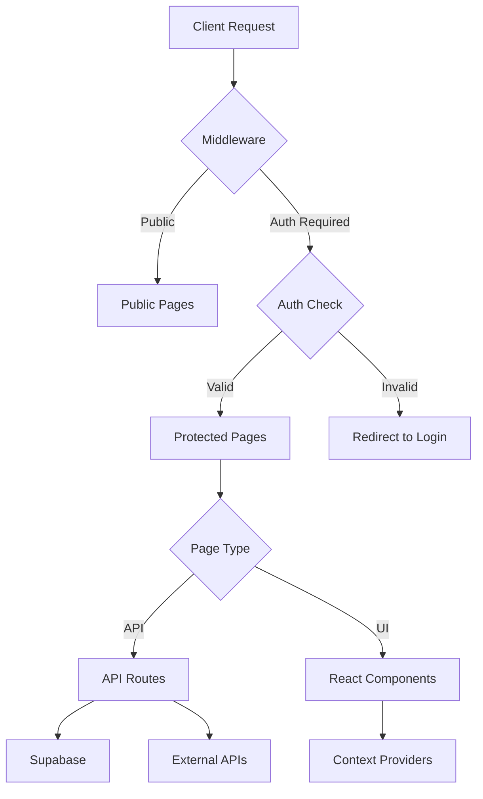

# Mikrostomart - Complete Project Context

> **Last Updated:** 2026-02-11  
> **Version:** Production (Vercel Deployment)  
> **Status:** Active Development

---

## 📋 Table of Contents
1. [Project Overview](#project-overview)
2. [Technology Stack](#technology-stack)
3. [Architecture](#architecture)
4. [Database Schema](#database-schema)
5. [Feature Catalog](#feature-catalog)
6. [API Endpoints](#api-endpoints)
7. [Integrations](#integrations)
8. [Cron Jobs & Automation](#cron-jobs--automation)
9. [Authentication & Authorization](#authentication--authorization)
10. [Deployment](#deployment)
11. [Recent Changes](#recent-changes)

---

## 🎯 Project Overview

**Mikrostomart** is a comprehensive web application for a dental clinic in Poland (Mikrostomart Gabinet Stomatologiczny). It combines:
- **Public Website** - Marketing, services, booking
- **Patient Portal** - Appointment management, medical history
- **Admin Panel** - Complete clinic management system
- **E-commerce** - Dental products shop with Stripe payment
- **Automated Communications** - SMS/Email reminders and notifications

**Target Users:**
- Patients (booking, appointments, purchasing products)
- Clinic Staff (admin panel, patient management, SMS coordination)
- Doctors (Marcin Nowosielski, Elżbieta Nowosielska, and team)

**Business Model:**
- Patient appointment booking (integrated with Prodentis calendaring system)
- Product sales (dental cosmetics, accessories)
- Deposit payments for appointments

---

## 🛠 Technology Stack

### Core Framework
- **Next.js 16.1.1** (App Router)
- **React 19.2.3**
- **TypeScript 5**
- **Tailwind CSS 4.1.18**

### Backend & Database
- **Supabase** (PostgreSQL database, authentication, storage)
  - Database: 14 migrations (003-016: email verification, appointment actions, SMS reminders, user_roles, etc.)
  - Auth: Email/password, magic links, JWT tokens
  - Storage: Product images, patient documents

### External Integrations
| Service | Purpose | Status |
|---------|---------|--------|
| **Prodentis API** | Appointment synchronization | ✅ Active |
| **SMSAPI.pl** | SMS notifications | ✅ Active (link blocking resolved) |
| **Resend** | Email notifications | ✅ Active |
| **Stripe** | Payment processing | ✅ Active |
| **OpenAI** | AI assistant (chat support) | ✅ Active |
| **Replicate** | AI image generation | ✅ Active |
| **YouTube Data API** | Video feed | ✅ Active |

### UI/UX Libraries
- **Framer Motion** - Animations
- **Lucide React** - Icons
- **React Hook Form + Zod** - Form validation
- **MediaPipe** - Face detection (selfie feature)

### Development Tools
- **ESLint** - Code linting
- **Autoprefixer** - CSS compatibility
- **Sharp/Jimp** - Image processing

---

## 🏗 Architecture

### Directory Structure

```
mikrostomart/
├── src/
│   ├── app/                    # Next.js App Router pages
│   │   ├── admin/              # Admin panel
│   │   │   ├── login/          # Admin login page
│   │   │   ├── update-password/ # Password reset landing page (verifyOtp flow)
│   │   │   └── page.tsx        # Main admin panel (186KB, 3311 lines, 14 tabs)
│   │   ├── pracownik/          # Employee Zone (schedule grid)
│   │   │   ├── login/          # Employee login page
│   │   │   ├── reset-haslo/    # Employee password reset page
│   │   │   └── page.tsx        # Weekly schedule grid (46KB)
│   │   ├── strefa-pacjenta/    # Patient portal
│   │   │   ├── login/          # Patient login (phone or email)
│   │   │   ├── register/       # Registration flow (confirm, password, verify, verify-email)
│   │   │   ├── reset-password/  # Password reset flow
│   │   │   ├── dashboard/      # Main patient dashboard (next appointment widget)
│   │   │   ├── historia/       # Visit history
│   │   │   └── profil/         # Patient profile
│   │   ├── api/                # API routes (25 directories)
│   │   ├── auth/               # Auth routes (callback for PKCE code exchange)
│   │   ├── cennik/             # Pricing page (AI chat assistant)
│   │   ├── aktualnosci/        # News/articles
│   │   ├── mapa-bolu/          # Pain Map (interactive dental map)
│   │   │   ├── editor/         # Zone position editor tool (debug)
│   │   │   ├── PainMapInteractive.tsx  # SVG overlay + modals + tooltips + doctor cards
│   │   │   └── SymptomData.ts  # 32 teeth + 3 soft tissue data (TipItem, DOCTORS)
│   │   ├── metamorfozy/        # Before/after gallery
│   │   ├── nowosielski/        # Dr Nowosielski's blog (Supabase-backed)
│   │   │   ├── [slug]/         # Dynamic blog post pages
│   │   │   ├── blog.v2.css     # Blog-specific styling
│   │   │   └── page.tsx        # Blog listing page
│   │   ├── porownywarka/       # Solution Comparator (7 categories, 73 methods)
│   │   ├── kalkulator-leczenia/ # Treatment Time Calculator (5 paths)
│   │   ├── oferta/             # Services
│   │   │   └── implantologia/  # Implantology subpage with pricing
│   │   ├── selfie/             # Selfie Booth page
│   │   ├── symulator/          # Smile Simulator page
│   │   ├── sklep/              # E-commerce shop
│   │   ├── kontakt/            # Contact page
│   │   ├── rezerwacja/         # Booking (query param: ?specialist=&reason=)
│   │   ├── wizyta/[type]/      # Appointment types
│   │   ├── baza-wiedzy/        # Knowledge base articles
│   │   ├── faq/                # FAQ page
│   │   └── zadatek/            # Deposit payment
│   ├── components/             # React components (33 files + 3 subdirs)
│   │   ├── modals/             # Appointment modals (Cancel, Confirm, Reschedule)
│   │   ├── scheduler/          # AppointmentScheduler (Prodentis live slots)
│   │   ├── simulator/          # Smile simulator studio (Capture, MaskEditor, Results)
│   │   ├── SplashScreen.tsx     # Cinematic intro animation (particles, logo, phases)
│   │   ├── AssistantTeaser.tsx  # AI chat assistant (full chat mode, suggestions, file upload)
│   │   ├── NovikCodeCredit.tsx  # Footer credit with fullscreen takeover animation
│   │   ├── OverlayEditor.tsx    # Image alignment/overlay editor (simulator)
│   │   ├── SimulatorModal.tsx   # Smile simulator main modal
│   │   └── ...                 # (+ 24 more components)
│   ├── context/                # React Context providers
│   │   ├── CartContext.tsx      # Shopping cart state
│   │   ├── AssistantContext.tsx # AI assistant open/close state
│   │   └── SimulatorContext.tsx # Smile simulator open/close state
│   ├── lib/                    # Utilities & services
│   │   ├── smsService.ts       # SMS integration
│   │   ├── productService.ts   # Product management
│   │   ├── githubService.ts    # GitHub blog integration
│   │   ├── knowledgeBase.ts    # AI assistant knowledge (20KB)
│   │   ├── roles.ts            # Role management (RBAC: admin/employee/patient)
│   │   ├── telegram.ts         # Telegram multi-bot notification routing
│   │   ├── appointmentTypeMapper.ts  # Maps Prodentis appointment types
│   │   ├── auth.ts             # Authentication helpers (verifyAdmin)
│   │   ├── jwt.ts              # JWT token utilities
│   │   └── supabaseClient.ts   # Browser Supabase client
│   ├── data/                   # Static data
│   │   ├── articles.ts         # Knowledge base articles
│   │   └── reviews.ts          # Google reviews data
│   ├── hooks/                  # Custom React hooks
│   │   └── useUserRoles.ts     # Fetch user roles from API
│   ├── helpers/                # Helper utilities
│   └── middleware.ts           # Request middleware (admin + employee route protection)
├── supabase_migrations/        # Database migrations (14 files: 003-016)
├── public/                     # Static assets
├── scripts/                    # Utility scripts (13 files)
└── vercel.json                 # Deployment configuration (3 cron jobs)
```

### Request Flow



---

## 🗄 Database Schema

### Supabase Tables (Primary)

#### 1. **sms_reminders**
SMS notification system for appointment reminders.
```sql
- id (uuid, PK)
- prodentis_id (text) - Appointment ID from Prodentis
- patient_phone (text)
- patient_name (text)
- doctor_name (text)
- appointment_date (timestamptz)
- appointment_time (text)
- appointment_type (text)
- sms_message (text)
- short_link_id (text, FK)
- status ('draft', 'sent', 'failed', 'cancelled')
- send_error (text)
- sent_at (timestamptz)
- created_at, updated_at
```

#### 2. **appointment_actions**
Tracks patient responses (confirm/cancel).
```sql
- id (uuid, PK)
- short_link_id (text, unique)
- patient_phone (text)
- patient_name (text)
- doctor_name (text)
- appointment_date (timestamptz)
- appointment_time (text)
- action ('confirmed', 'cancelled', null)
- action_timestamp (timestamptz)
- telegram_notified (boolean)
- email_sent (boolean)
- created_at
```

#### 3. **appointment_instructions**
Pre-appointment instructions by type.
```sql
- id (uuid, PK)
- appointment_type (text, unique)
- instructions (text)
- applicable_doctors (text[])
- created_at, updated_at
```

#### 4. **short_links**
URL shortener for SMS links.
```sql
- id (text, PK) - Short code (e.g., "RKACFo")
- full_url (text)
- appointment_action_id (uuid, FK)
- clicks (integer)
- created_at
```

#### 5. **email_verification_tokens**
Patient email verification for portal.
```sql
- id (uuid, PK)
- email (text)
- token (text, unique)
- used (boolean)
- expires_at (timestamptz)
- created_at
```

#### 6. **user_roles**
Role-based access control (RBAC) for admin/employee/patient roles.
```sql
- id (uuid, PK)
- user_id (uuid, FK → auth.users)
- email (text)
- role ('admin', 'employee', 'patient')
- granted_by (text)
- granted_at (timestamptz)
- UNIQUE(user_id, role)
```

#### 7. **sms_templates**
SMS message templates for appointment reminders.
```sql
- id (uuid, PK)
- name (text, unique)
- template (text)
- created_at, updated_at
```

#### 8. **patients**
Patient Portal registered users.
```sql
- id (uuid, PK)
- prodentis_id (text)
- phone (text)
- email (text)
- password_hash (text)
- first_name (text)
- last_name (text)
- account_status ('pending', 'approved', 'rejected')
- email_verified (boolean)
- promotion_dismissed (boolean)
- created_at, updated_at
```

#### 9. **products**
E-commerce products.

#### 10. **orders**
Customer orders.

#### 11. **news**
Clinic news/articles.

---

## ✨ Feature Catalog

### 🏥 Public Website Features

#### Homepage (`/`)
- Hero section with video background
- Services showcase (Precision, Aesthetics, Experience)
- YouTube video feed (latest clinic videos)
- Google Reviews carousel (`GoogleReviews.tsx` with data from `data/reviews.ts`)
- Metamorphoses preview
- Products carousel
- Contact CTA

#### Services (`/oferta`)
- Service categories:
  - Zachowawcza (Conservative dentistry)
  - Protetyka (Prosthodontics)
  - Chirurgia (Surgery)
  - ORTODONCJA (Orthodontics)
  - Higienizacja (Dental hygiene)
  - Endodoncja (Endodontics)
  - LASER
- **Implantology subpage** (`/oferta/implantologia`) — dedicated implant page with pricing, SEO-optimized

#### Metamorphoses (`/metamorfozy`)
- Before/after image gallery
- 15+ cases
- Swipe gestures (mobile)
- Glassmorphism speech bubble descriptions

#### News (`/aktualnosci`)
- Migrated articles from old website
- Carousel layout with snap scroll
- AI-generated unique graphics for key articles

#### Dr Nowosielski Blog (`/nowosielski`)
- Supabase-backed blog platform
- Dynamic slug routes (`/nowosielski/[slug]`)
- Custom blog CSS (`blog.v2.css`)
- Client-side rendering with `force-dynamic`
- Script to migrate blog posts (`scripts/migrate_nowosielski_blog.js`)

#### E-commerce (`/sklep`, `/koszyk`)
- Product browsing with `ProductModal.tsx`
- Shopping cart (`CartContext.tsx`)
- Stripe integration for payments (`StripePaymentForm.tsx`, `CheckoutForm.tsx`)
- Order confirmation emails

#### Booking (`/rezerwacja`, `/wizyta/[type]`)
- Appointment type selection
- Specialist pre-selection via URL params (`?specialist=`, `?reason=`)
- **AppointmentScheduler** — live slot picker from Prodentis API (week navigation, slot selection)
- Deposit payment option (`/zadatek`)
- Prodentis calendar integration

#### Treatment Time Calculator (`/kalkulator-leczenia`)
Interactive 3-step wizard for estimating treatment duration.
- **Step A**: Service tile selection (6 services + "Nie wiem" → Mapa Bólu)
- **Step B**: 3–5 questions per service (pill-button answers)
- **Step C**: Visual timeline with stages, summary pills (visits + duration), extending factors
- **5 paths**: Endodoncja, Implant, Protetyka, Bonding, Wybielanie
- **Lead capture**: "Wyślij do recepcji" form → Telegram + Email
- **Smart specialist pre-selection**: CTA passes `?specialist=ID&reason=TEXT` to booking form based on competencies
- **No prices** — only visits, time, and stages
- Data layer: `treatmentData.ts` with typed `TreatmentPath`, `Question`, `Stage`, `Variant`

#### Solution Comparator (`/porownywarka`)
Interactive comparison tool for dental treatment options.
- **Step 1**: Scenario selection (Missing tooth / Aesthetics)
- **Step 2**: Priority selection (balanced/durable/min_invasive/fast/easy_maintenance)
- **Step 3**: 3 questions per scenario
- **Step 4**: Comparison table (desktop) / cards (mobile) with scale bars, gating badges, recommendations
- **Scenario A**: Implant vs Most vs Proteza częściowa (3 methods)
- **Scenario B**: Bonding vs Licówki kompozytowe vs Licówki porcelanowe vs Korony (4 methods)
- **Scoring system**: weighted metrics (0-100) × priority weights + gating rules
- **Lead capture**: "Wyślij wynik do recepcji" → Telegram + Email
- **Smart specialist pre-selection**: CTA passes `?specialist=ID&reason=TEXT` to booking form
- **Cross-link**: "Zobacz etapy i czas leczenia" → /kalkulator-leczenia
- Data layer: `comparatorData.ts` with typed `Comparator`, `Method`, `GatingRule`, `ScoredMethod`

#### Pain Map (`/mapa-bolu`)
Interactive dental pain diagnostic tool.
- **Premium dental image** (`dental-map-premium.jpg`) as background
- **SVG overlay** with 35 interactive zones (32 teeth + 3 soft tissues: tongue, palate, throat)
- **Coordinates calibrated** by user via drag-and-drop editor (`/mapa-bolu/editor`)
- **Welcome popup** — intro text + disclaimer, glassmorphic design, dismissable with animation
- **Map/List toggle** — switch between interactive map and categorized list view
- **List view** — teeth grouped by quadrant (Q1-Q4 + soft tissues), subtitle display, glassmorphic cards
- **Detail modal** — bottom-sheet slide-up with severity toggle, urgency badge, symptoms, causes, doctor recommendations, specialist advice, CTA to book
- **Multi-severity system** — each zone has 3 levels (Łagodne / Umiarkowane / Zaawansowane) with independent symptoms, causes, advice, and recommended doctors
- **8 clinical templates** — incisor, canine, premolar, molar, wisdom tooth, tongue, palate, throat — each ×3 severity levels
- **Hover tooltips** — ⓘ icon on symptoms/causes; dark floating tooltip with expanded medical description on hover
- **Clickable causes** — each cause links to `/rezerwacja` with `?specialist=` and `?reason=` query params, pre-selecting the recommended specialist
- **Doctor recommendation cards** — each severity level shows recommended specialists with name, specialties, and "Umów →" CTA linking to booking
- **Booking integration** — `ReservationForm.tsx` reads `specialist` and `reason` query params from URL to pre-populate form
- **Symptom data** — `SymptomData.ts` with `TipItem` type (`text` + `tip`), `doctors` array per severity, `DOCTORS` constant mapping IDs → names/specialties, 216 tooltip descriptions
- **Zone editor** (`/mapa-bolu/editor`) — drag-and-drop tool to reposition zones, resize handles, keyboard nudging, export to clipboard
- **Popup suppression** — `AssistantTeaser` and `PWAInstallPrompt` hidden on `/mapa-bolu` paths

#### Smile Simulator (`/symulator`)
AI-powered smile transformation tool.
- **SimulatorModal.tsx** — main simulator modal (27KB)
- **Studio components** (`components/simulator/`):
  - `StudioCapture.tsx` — camera capture or image upload
  - `StudioMaskEditor.tsx` — mask editing for inpainting region
  - `StudioResults.tsx` — display AI-generated results
- **OverlayEditor.tsx** — drag/rotate/scale image alignment tool for composite generation
- **SimulatorContext.tsx** — global open/close state provider
- **AI Backend** — Flux Fill Dev (Replicate) for true inpainting
- **4 style variants** — Hollywood, Natural, Soft, Strong
- **Mask parameters** — guidance_scale 15, mask dilation 1.15×
- **Popup suppression** — `AssistantTeaser` and `PWAInstallPrompt` hidden on `/symulator`

#### Selfie Booth (`/selfie`)
- `SelfieBooth.tsx` component (12KB)
- Camera-based face capture
- MediaPipe face detection integration

#### AI Assistant (`AssistantTeaser.tsx`)
Full-featured AI chat assistant (441 lines, 22KB).
- **Chat mode** — expands from teaser bubble into full chat window
- **Conversation history** — scrollable message thread (user/assistant roles)
- **Quick suggestions** — predefined questions (godziny, mikroskop, zespół, wizyta)
- **Action shortcuts** — "📅 Rezerwacja" and "💰 Cennik" buttons navigate to pages
- **File attachments** — users can attach images to questions (📎 Paperclip icon)
- **Auto-hiding** — hidden on `/mapa-bolu` and `/symulator` paths (HIDDEN_PATHS)
- **Dismissable** — teaser can be closed, remembers state
- **Backend** — `/api/chat` (OpenAI GPT-4) with `knowledgeBase.ts`
- **Context** — `AssistantContext.tsx` for global open/close state

#### Ask Expert (`AskExpertButton.tsx`, `AskExpertModal.tsx`)
- "Zadaj Pytanie Ekspertowi" CTA button
- Modal form for submitting expert questions
- Backend: `/api/ask-expert` (Supabase storage)

#### Legal & Policy Pages (Premium Redesigned)
All legal pages share a premium design: hero section with radial gold gradient, Lucide icons, Playfair Display headings, RevealOnScroll animations, CSS variable-based styling.
- **RODO** (`/rodo`) — Klauzula informacyjna, 10 numbered sections with gold circle badges, PDF download button
- **Regulamin** (`/regulamin`) — Regulamin organizacyjny, 12 § sections with gold pill badges, PDF download
- **Polityka Prywatności** (`/polityka-prywatnosci`) — 4-card layout (Administrator, Cele, Prawa, Kontakt)
- **Polityka Cookies** (`/polityka-cookies`) — 4-card layout (Czym są, Do czego, Zarządzanie, Rodzaje)

#### Forms (RODO Compliance)
- **ContactForm.tsx** — Math captcha + honeypot antispam + required RODO consent checkbox
- **ReservationForm.tsx** — Required RODO consent checkbox with links to `/rodo` and `/polityka-prywatnosci`

#### Cennik / Pricing Assistant (`/cennik`)
AI-powered conversational pricing tool.
- **Chat interface** — full conversation history, scrollable thread
- **Quick questions** — preset pricing queries (plomba, implant, higienizacja, etc.)
- **Category tiles** — 8 categories (Zachowawcza, Protetyka, Chirurgia, Ortodoncja, Higienizacja, Dzieci, etc.)
- **Voice input** — Speech Recognition API (microphone button)
- **Text-to-speech** — AI responses can be read aloud (speaker button per message)
- **Backend** — `/api/cennik-chat` (OpenAI with complete 2026 price list, 70+ items)
- **Premium glassmorphic CSS** — `cennik.module.css` (8KB)

#### Splash Screen (`SplashScreen.tsx`)
Cinematic intro animation on first page load.
- **Particle field** — 80+ particles converging toward center
- **Logo reveal** — animated golden shimmer + glow pulse
- **Multi-phase sequence** — particles → convergence → logo → fade
- **No flicker** — children render hidden during animation, revealed after
- **Framer Motion** — AnimatePresence, motion.div with spring physics

#### Other Pages
- About Us (`/o-nas`)
- Contact (`/kontakt`) — Google Maps integration, `ContactForm.tsx`
- FAQ (`/faq`)
- Knowledge Base (`/baza-wiedzy`) — articles from `data/articles.ts`

---

### 👤 Patient Portal (`/strefa-pacjenta`)

**Authentication Required** (Custom JWT auth, separate from Supabase Auth)

Features:
1. **Registration** (`/register`)
   - Email/password signup
   - Email verification system (magic token)
   - Email verification page (`/register/verify-email/[token]`)
   - Prodentis patient matching (phone or PESEL)
   - Admin approval workflow (pending → approved/rejected)

2. **Login** (`/login`)
   - **Phone number OR email** authentication (both accepted)
   - JWT token management

3. **Password Reset** (`/reset-password`, `/reset-password/[token]`)
   - Magic link password recovery

4. **Dashboard** (main portal page)
   - **Next appointment widget** — fetched from Prodentis API (`/api/patients/[id]/next-appointment`)
   - Pending approval / rejected banners
   - Restricted data for non-approved accounts

5. **Appointment Management**
   - View appointments
   - Confirm/cancel via short links
   - Email confirmations
   - Pre-appointment instructions (e.g., "Don't eat 2h before surgery")
   - **Appointment Modals** (`components/modals/`):
     - `ConfirmAttendanceModal.tsx` — confirm appointment attendance
     - `CancelAppointmentModal.tsx` — cancel with optional reason
     - `RescheduleAppointmentModal.tsx` — request reschedule

6. **Novik Code Credit** (`NovikCodeCredit.tsx`)
   - "Designed and developed by Novik Code" at footer bottom
   - Epic full-page takeover animation on click (fullscreen logo background, Framer Motion)
   - Click or ESC to dismiss

### 👷 Employee Zone (`/pracownik`)

**Authentication Required** (Supabase Auth + `employee` or `admin` role)

**Purpose:** Weekly schedule view for clinic staff — shows all doctors' appointments in a grid format similar to Prodentis desktop app.

**Features:**
1. **Login** (`/pracownik/login`) — Supabase email/password login + "Zapomniałem hasła" link
2. **Password Reset** (`/pracownik/reset-haslo`) — sends reset email via `/api/auth/reset-password`
3. **Weekly Schedule Grid** (`/pracownik/page.tsx` — 46KB, 867 lines)
   - **Time slots**: 15-minute intervals, 7:00–20:00
   - **Multi-doctor columns**: one column per operator/doctor
   - **Operator toggle buttons**: show/hide individual doctors, "Pokaż wszystkich" / "Ukryj wszystkich"
   - **Prodentis color mapping**: appointment type → color (matching Prodentis desktop app)
     - 15+ type colors: Zachowawcza (yellow), Chirurgia (magenta), Protetyka (cyan), Endodoncja (purple), etc.
   - **Week navigation**: ◀ / ▶ buttons, "Dziś" button to jump to current week
   - **Duration inference**: calculated from gap between consecutive appointments per doctor
   - **Appointment tooltips**: hover to see patient name, phone, appointment type, time
   - **Skip weekends**: hides Sat/Sun if no appointments
   - **Horizontal scroll**: enabled for narrow screens
4. **API**: `/api/employee/schedule?weekStart=YYYY-MM-DD` — fetches 7 days of appointments from Prodentis
5. **Role check**: `hasRole(userId, 'employee') || hasRole(userId, 'admin')`
6. **Middleware protection**: unauthenticated → redirect to `/pracownik/login`

### 🛡 Admin Panel (`/admin`)

**Authentication Required** (Supabase Auth + admin email check)

**14 Tabs** (`page.tsx` — 186KB, 3311 lines):

#### 1. Dashboard
- Overview statistics
- Quick actions

#### 2. Products (`products` tab)
- CRUD operations
- Image upload
- Price management
- AI image generation (Replicate integration)

#### 3. Orders (`orders` tab)
- Order list
- Status tracking

#### 4. Patients (`patients` tab)
- Patient database (from Patient Portal registrations)
- Contact information
- Appointment history

#### 5. SMS Przypomnienia (`sms-reminders` tab)

**Tabs:**
- **📝 Szkice (Drafts):** Draft SMS ready to send
- **📤 Wysłane (Sent):** Sent/failed SMS history grouped by date, with date picker filter and resend button
- **✉️ Wyślij SMS ręcznie (Manual):** Send SMS directly to a patient — search by name, auto-fill phone, compose message

**Actions:**
- Generate SMS drafts for tomorrow's appointments (Cron job or manual trigger)
- Edit SMS message before sending
- Send individual SMS
- Send all SMS in bulk
- Resend previously sent/failed SMS
- Send manual SMS to any patient (search by name → phone auto-fill)
- Delete any SMS (draft or sent) — permanently removed from database
- View send errors
- Filter sent SMS by date

**Workflow:**
1. Cron job generates drafts daily at 7:00 AM UTC (8-9 AM Warsaw time)
2. Admin reviews/edits drafts in panel
3. **Skipped patients section** — yellow warning below drafts shows patients within working hours who were skipped (missing phone, wrong doctor) with "Wyślij ręcznie" CTA
4. Admin sends SMS (individually or bulk)
5. Sent SMS move to "Wysłane" tab, grouped by date
6. Admin can resend or delete any SMS from history
7. New drafts always regenerate regardless of previous sent status
8. Manual SMS can be sent anytime via "Wyślij SMS ręcznie" tab

#### 6. Reservations (`reservations` tab)
- Booking requests

#### 7. Questions (`questions` tab)
- FAQ management

#### 8. Articles (`articles` tab)
- Content management for knowledge base

#### 9. News (`news` tab)
- News/blog posts

#### 10. Blog (`blog` tab)
- GitHub-integrated blog posts
- **AI blog generation** — generates blog articles via `/api/admin/blog/generate` (OpenAI) with auto-image generation

#### 11. Appointment Instructions (`appointment-instructions` tab)
- Pre-appointment instruction templates by type
- Doctor applicability settings
- Rich WYSIWYG editor (`AppointmentInstructionsEditor.tsx`)
- Dark glassmorphic preview modal
- Used in patient emails before appointments

#### 12. Pracownicy — Employee Management (`employees` tab)
- **Accordion UI** — each staff member is a collapsed row, click to expand
- **Prodentis staff scan** — fetches ALL staff (doctors, hygienists, assistants) from 74-day appointment scan
- **Account status badges** — "✅ Ma konto" or "—" (no account)
- **Add account** — email input in expanded row, creates Supabase Auth account + `employee` role
- **Password reset** — button to send reset email for existing accounts
- **Manual add** — section for adding employees not found in Prodentis
- **Registered employees** — shows Supabase-registered employees not in Prodentis data
- **API**: `/api/admin/employees` (GET — Prodentis scan + Supabase cross-reference)

#### 13. Uprawnienia — Role Management (`roles` tab)
- **RBAC system** — 3 roles: `admin`, `employee`, `patient`
- **User list** — all Supabase Auth users with their assigned roles
- **Grant/revoke roles** — buttons to add/remove roles per user
- **Patient candidates** — Patient Portal users who can be promoted to admin/employee
  - Creates Supabase Auth account + sends password reset email
  - "Odrzuć" (dismiss) button — hides candidate from list (`promotion_dismissed` flag)
- **Self-protection** — cannot revoke own admin role
- **API**: `/api/admin/roles` (GET, POST, DELETE), `/api/admin/roles/promote`, `/api/admin/roles/dismiss`, `/api/admin/roles/delete`

#### 14. Password Reset Page (`/admin/update-password`)
- Landing page for password reset links
- Uses direct `verifyOtp` flow (no Supabase redirect)
- Token passed via `?token_hash=` URL parameter

---

## 🔌 API Endpoints

### Public APIs

| Endpoint | Method | Purpose |
|----------|--------|---------|
| `/api/chat` | POST | AI assistant (OpenAI GPT-4 + knowledgeBase) |
| `/api/cennik-chat` | POST | Pricing assistant (OpenAI + 2026 price list) |
| `/api/ask-expert` | POST | Expert Q&A form submission |
| `/api/contact` | POST | Contact form (→ Telegram messages channel) |
| `/api/products` | GET | Public product list |
| `/api/news` | GET | News articles |
| `/api/youtube` | GET | YouTube feed |
| `/api/create-payment-intent` | POST | Stripe payment |
| `/api/order-confirmation` | POST | Order confirmation emails (→ Telegram default) |
| `/api/simulate` | POST | Smile simulator (Replicate AI) |
| `/api/short-links/[id]` | GET | Short link resolver |
| `/api/prodentis` | GET | Prodentis API proxy |
| `/api/reservations` | POST | Reservation form submission (→ Telegram default) |
| `/api/treatment-lead` | POST | Treatment calculator lead form (→ Telegram + Email) |

### Auth APIs (`/api/auth/*`)

| Endpoint | Method | Purpose |
|----------|--------|---------|
| `/auth/reset-password` | POST | Server-side password reset via Admin API + Resend |
| `/auth/roles` | GET | Get current user's roles |
| `/auth/callback` | GET | PKCE code exchange callback (Supabase Auth) |

### Admin APIs (`/api/admin/*`)

| Endpoint | Method | Purpose |
|----------|--------|---------|
| `/admin/sms-reminders` | GET | Fetch SMS (all statuses by default) |
| `/admin/sms-reminders` | PUT | Edit draft SMS message |
| `/admin/sms-reminders` | DELETE | Permanently delete any SMS |
| `/admin/sms-reminders/generate` | POST | Generate drafts for tomorrow |
| `/admin/sms-reminders/send` | POST | Send SMS (single or bulk) |
| `/admin/sms-reminders/send-manual` | POST | Send manual SMS directly |
| `/admin/sms-templates` | GET, POST, PUT, DELETE | SMS template CRUD |
| `/admin/patients` | GET | Fetch patient list |
| `/admin/patients/search` | GET | Search patients by name via Prodentis |
| `/admin/patients/approve` | POST | Approve pending patient account |
| `/admin/patients/reject` | POST | Reject pending patient account |
| `/admin/employees` | GET | Fetch staff from 74-day Prodentis scan |
| `/admin/roles` | GET, POST, DELETE | User roles CRUD + patient candidates |
| `/admin/roles/promote` | POST | Promote patient to admin/employee |
| `/admin/roles/dismiss` | POST | Dismiss patient candidate |
| `/admin/roles/delete` | DELETE | Delete Supabase Auth user account |
| `/admin/products` | GET, POST, DELETE | Product CRUD |
| `/admin/orders` | GET | Fetch orders |
| `/admin/blog` | GET, POST, PUT, DELETE | Blog post CRUD |
| `/admin/blog/generate` | POST | AI blog article generation |
| `/admin/articles` | GET, POST, DELETE | Knowledge base article CRUD |
| `/admin/news` | GET, POST, DELETE | News article CRUD |
| `/admin/questions` | GET, DELETE | Expert questions management |
| `/admin/reservations` | GET | Booking requests list |
| `/admin/appointment-instructions` | GET, POST, PUT, DELETE | Instruction templates CRUD |

### Employee APIs (`/api/employee/*`)

| Endpoint | Method | Purpose |
|----------|--------|---------|
| `/employee/schedule` | GET | Weekly schedule from Prodentis (`?weekStart=`) |

### Appointment APIs (`/api/appointments/*`)

| Endpoint | Method | Purpose |
|----------|--------|---------|
| `/appointments/by-date` | GET | Fetch appointments for date (Prodentis proxy) |
| `/appointments/confirm` | POST | Patient confirms appointment |
| `/appointments/cancel` | POST | Patient cancels appointment |

### Patient Portal APIs (`/api/patients/*`)

| Endpoint | Method | Purpose |
|----------|--------|---------|
| `/patients/register` | POST | Patient signup |
| `/patients/verify-email` | POST | Verify email token |
| `/patients/verify` | POST | Verify patient identity (Prodentis match) |
| `/patients/login` | POST | Patient login (phone or email) |
| `/patients/me` | GET | Get current patient profile |
| `/patients/me/visits` | GET | Get patient visit history |
| `/patients/[id]/next-appointment` | GET | Next appointment from Prodentis |
| `/patients/reset-password/request` | POST | Initiate password reset |
| `/patients/reset-password/confirm` | POST | Confirm password reset with token |
| `/patients/appointments/[id]/confirm-attendance` | POST | Confirm attendance |
| `/patients/appointments/[id]/cancel` | POST | Cancel appointment |
| `/patients/appointments/[id]/reschedule` | POST | Request reschedule |
| `/patients/appointments/[id]/status` | GET | Get appointment action status |

### Cron Job APIs (`/api/cron/*`)

| Endpoint | Purpose | Schedule |
|----------|---------|----------|
| `/cron/appointment-reminders` | Generate SMS drafts for tomorrow | Daily 7:00 AM UTC |
| `/cron/sms-auto-send` | Auto-send approved drafts | Daily 9:00 AM UTC |
| `/cron/daily-article` | Daily article publishing | Daily 7:00 AM UTC |


---

## 🔗 Integrations

### 1. Prodentis API
**Purpose:** Appointment calendar synchronization + patient search

**Endpoints Used:**
- `GET /api/patients/search?q=&limit=` — **v5.0** Patient search by name (for manual SMS)
- `GET /api/appointments/by-date?date=` — Appointments by date
- `GET /api/patient/{id}/details` — Patient details by ID
- `GET /api/patient/verify?phone=&firstName=&pesel=` — Patient verification
- `GET /api/patient/{id}/next-appointment` — Next appointment
- `GET /api/patient/{id}/appointments?page=&limit=` — Appointment history
- `GET /api/slots/free?date=&duration=` — Free time slots

**Authentication:** Direct API access (no auth key required)

**Base URL:** Configured via `PRODENTIS_API_URL` env var (production: `http://83.230.40.14:3000`)

**Phone Format:** API returns phones with `+48` prefix; our system normalizes to `48XXXXXXXXX` (strips `+`)

**Integration Files:**
- `/api/admin/patients/search/route.ts` — Proxy to Prodentis patient search
- `/api/admin/employees/route.ts` — 74-day appointment scan to discover all staff
- `/api/cron/appointment-reminders/route.ts` — SMS draft generation
- `/api/appointments/by-date/route.ts` — Appointment lookup
- `/api/employee/schedule/route.ts` — Weekly schedule for Employee Zone

---

### 2. SMSAPI.pl
**Purpose:** SMS notifications for appointment reminders

**Current Status:** ✅ **Active**
- SMS sending works for messages with short links
- Link blocking issue resolved

**Configuration:**
- Token: `SMSAPI_TOKEN` env var
- Endpoint: `https://api.smsapi.pl/sms.do`
- Phone format: `48XXXXXXXXX` (no + prefix)

**Templates:** Stored in Supabase `sms_templates` table (managed via admin API, with defaults seeded on first access)

**Integration Files:**
- `src/lib/smsService.ts` — SMS sending, template matching, message formatting
- `/api/admin/sms-reminders/*` — CRUD for SMS drafts/history
- `/api/admin/sms-templates/*` — Template management (CRUD + default seeding)
- `/api/cron/appointment-reminders/*` — Draft generation cron

**Features:**
- Phone number normalization (removes `+` and whitespace)
- Template selection by appointment type (with `byType:` prefix matching)
- Fuzzy doctor name matching (handles `-`, `(I)`, multi-word variations)
- Short link integration for confirm/cancel actions
- SMS content optimized for 160-char GSM-7 limit
- Detailed error logging

**Resolved Issues:**
- ✅ Phone format validation
- ✅ Removed invalid `from` field
- ✅ Polish character encoding (switched to ASCII templates)
- ✅ Link detection bypass (resolved with SMSAPI support)
- ✅ SMS templates shortened to fit under 160 chars with link

---

### 3. Resend
**Purpose:** Transactional email notifications

**Configuration:**
- API Key: `RESEND_API_KEY`
- From email: `Mikrostomart <noreply@mikrostomart.pl>`

**Email Types:**
1. **Patient Email Verification** (registration)
2. **Password Reset** (magic link)
3. **Appointment Confirmation** (patient confirms via SMS link)
4. **Appointment Cancellation** (patient cancels)
5. **Order Confirmation** (product purchases)
6. **Pre-Appointment Instructions** (day before appointment)

**Email Features:**
- HTML templates
- Personalization (patient name, appointment details)
- Embedded appointment instructions
- Professional footer with clinic info

**Integration Files:**
- `/api/appointments/confirm/route.ts` (lines 168-186)
- `/api/appointments/cancel/route.ts` (lines 167-183)
- `/api/patients/*` (various email verification endpoints)
- `/api/order-confirmation/route.ts`

**Recent Additions:**
- ✅ Appointment confirmation emails with instructions
- ✅ Cancellation emails
- ✅ Removed "landing page" text from footers
- ✅ Added patient name and phone to Telegram notifications

---

### 4. Telegram Bot (Multi-Bot Architecture)
**Purpose:** Real-time admin notifications split across 3 bots

**Architecture:**
Centralized via `src/lib/telegram.ts` with `sendTelegramNotification(message, channel)` helper.

| Bot | Env Token | Env Chat ID | Notifications |
|-----|-----------|-------------|---------------|
| **Mikrostomart potwierdzenia** | `TELEGRAM_BOT_TOKEN_APPOINTMENTS` | `TELEGRAM_CHAT_ID_APPOINTMENTS` | Appointment confirm/cancel/reschedule |
| **Mikrostomart wiadomości** | `TELEGRAM_BOT_TOKEN_MESSAGES` | `TELEGRAM_CHAT_ID_MESSAGES` | Contact form messages |
| **Mikrostomart Powiadomienia** (original) | `TELEGRAM_BOT_TOKEN` | `TELEGRAM_CHAT_ID` | Reservations, orders, leads |

**Fallback:** If channel-specific env vars not set, uses original bot.
**Multi-recipient:** Each chat_id env var supports comma-separated IDs.

**Integration Files:**
- `src/lib/telegram.ts` — Central helper with channel routing
- `src/app/api/appointments/confirm/route.ts` → `appointments` channel
- `src/app/api/appointments/cancel/route.ts` → `appointments` channel
- `src/app/api/patients/appointments/[id]/confirm-attendance/route.ts` → `appointments` channel
- `src/app/api/patients/appointments/[id]/cancel/route.ts` → `appointments` channel
- `src/app/api/patients/appointments/[id]/reschedule/route.ts` → `appointments` channel
- `src/app/api/contact/route.ts` → `messages` (contact) / `default` (reservation)
- `src/app/api/reservations/route.ts` → `default` channel
- `src/app/api/order-confirmation/route.ts` → `default` channel
- `src/app/api/treatment-lead/route.ts` → `default` channel

**Message Format:**
```
✅ PACJENT POTWIERDZIŁ OBECNOŚĆ

👤 Pacjent: Jan Kowalski
📞 Telefon: +48790740770
📅 Data: 08.02.2026
⏰ Godzina: 15:00
🩺 Lekarz: Dr Nowosielski
```

---

### 5. Stripe
**Purpose:** Payment processing (products, deposits)

**Configuration:**
- Secret Key: `STRIPE_SECRET_KEY`
- Publishable Key: `NEXT_PUBLIC_STRIPE_PUBLISHABLE_KEY`

**Payment Flows:**
1. **Product Purchase** (`/sklep`, `/koszyk`)
2. **Appointment Deposit** (`/zadatek`)

**Integration Files:**
- `/api/create-payment-intent/route.ts`
- `src/context/CartContext.tsx`

---

### 6. OpenAI
**Purpose:** AI chat assistant

**Configuration:**
- API Key: `OPENAI_API_KEY`
- Model: GPT-4 (assumed)

**Knowledge Base:** `src/lib/knowledgeBase.ts` (11KB)
- Clinic information
- Services
- Pricing
- Contact details

**Integration Files:**
- `/api/chat/route.ts`
- `src/context/AssistantContext.tsx`
- `src/components/Assistant.tsx` (assumed)

---

### 7. Replicate
**Purpose:** AI image generation for products/content

**Configuration:**
- API Token: `REPLICATE_API_TOKEN`

**Integration Files:**
- `/api/admin/*` (product image generation)

---

### 8. YouTube Data API
**Purpose:** Fetch latest clinic videos

**Configuration:**
- API Key: `YOUTUBE_API_KEY`
- Channel ID: `YOUTUBE_CHANNEL_ID`

**Integration Files:**
- `/api/youtube/route.ts`
- `src/components/YouTubeFeed.tsx`

---

## ⏰ Cron Jobs & Automation

### 1. Generate SMS Reminders (appointment-reminders)
**Path:** `/api/cron/appointment-reminders`  
**Schedule:** Daily at 7:00 AM UTC (8-9 AM Warsaw time)  
**Trigger:** Vercel Cron (configured in `vercel.json`)

**Workflow:**
1. Fetch tomorrow's appointments from Prodentis API
2. Fetch free slots to confirm which doctors are working (informational logging only)
3. Clean up ALL old drafts (`draft`, `cancelled`, `failed` statuses)
4. For each appointment, apply filters (see below)
5. Generate personalized SMS from Supabase `sms_templates`
6. Create short link for confirm/cancel landing page
7. Save SMS draft with short link in `sms_reminders` table

**Filters (in order):**
1. **Nowosielska exception** — Elżbieta Nowosielska bypasses isWorkingHour + doctor list checks, uses custom hours 08:30-16:00
2. **isWorkingHour flag** — must be `true` (white field in Prodentis calendar)
3. **Business hours** — appointment must be between 8:00-20:00 (filters informational entries at 5:45, 6:45, 7:15 etc.)
4. **Phone number** — must exist
5. **Doctor list** — must be in `REMINDER_DOCTORS` env var (fuzzy matching)
6. **No sent-duplicate-check** — new drafts always regenerate regardless of previous sent status

**Environment Variables Used:**
- `NEXT_PUBLIC_SUPABASE_URL`
- `SUPABASE_SERVICE_ROLE_KEY`
- `PRODENTIS_API_URL` (not `PRODENTIS_API_BASE_URL`)
- `NEXT_PUBLIC_BASE_URL` (for short links)
- `REMINDER_DOCTORS` (comma-separated doctor names)

**Configuration:**
- Cleanup: Deletes ALL old drafts/cancelled/failed on each run
- Always regenerates drafts (no sent-status blocking)
- Working hours: 8:00-20:00 (standard) or 8:30-16:00 (Nowosielska)
- Uses Prodentis `isWorkingHour` flag for white-field validation

---

### 2. Auto-Send SMS (sms-auto-send)
**Path:** `/api/cron/sms-auto-send`  
**Schedule:** Daily at 9:00 AM UTC (10-11 AM Warsaw time)  
**Purpose:** Automatically send approved SMS drafts

---

### 3. Daily Article Publishing
**Path:** `/api/cron/daily-article`  
**Schedule:** Daily at 7:00 AM UTC  
**Purpose:** Auto-publish scheduled articles

---

### Vercel Cron Configuration (`vercel.json`)
```json
{
  "crons": [
    { "path": "/api/cron/daily-article", "schedule": "0 7 * * *" },
    { "path": "/api/cron/appointment-reminders", "schedule": "0 7 * * *" },
    { "path": "/api/cron/sms-auto-send", "schedule": "0 9 * * *" }
  ]
}
```

---

## 🔐 Authentication & Authorization

### Patient Authentication (Custom JWT)

**Method:** Custom JWT (separate from Supabase Auth)

**Flow:**
1. Patient registers → `/api/patients/register`
2. Verification email sent (Resend) → magic token
3. Patient clicks link → `/strefa-pacjenta/register/verify-email/[token]`
4. Token validated → email confirmed
5. Patient logs in (phone or email + password) → JWT issued
6. Protected routes check JWT via `src/lib/jwt.ts`
7. Admin approves account → full access granted

**Files:**
- `src/lib/jwt.ts` - JWT token utilities
- `src/lib/auth.ts` - Auth helpers (verifyAdmin)
- `supabase_migrations/003_email_verification_system.sql`

---

### Admin & Employee Authentication (Supabase Auth + RBAC)

**Method:** Supabase Auth (email/password) + Role-Based Access Control

**Admin Flow:**
1. Login at `/admin/login` → Supabase `signInWithPassword`
2. Middleware checks session — redirects to `/admin/login` if unauthenticated
3. Client-side admin email allowlist check in `page.tsx`

**Employee Flow:**
1. Admin creates employee account via "Pracownicy" tab → Supabase `createUser` + `employee` role
2. Password reset email sent via Resend (direct `token_hash` URL)
3. Employee sets password at `/admin/update-password?token_hash=...`
4. Employee logs in at `/pracownik/login` → Supabase `signInWithPassword`
5. Middleware checks session — redirects to `/pracownik/login` if unauthenticated
6. API checks `hasRole(userId, 'employee') || hasRole(userId, 'admin')`

**Password Reset:**
- Endpoint: `/api/auth/reset-password` — server-side, Admin API + Resend
- Generates recovery token via `supabase.auth.admin.generateLink({ type: 'recovery' })`
- Sends direct link to `/admin/update-password?token_hash=...` (no Supabase redirect)
- Landing page calls `verifyOtp({ type: 'recovery', token_hash })` directly
- Rate limiting: 3 requests per email per 5 minutes (in-memory)

**RBAC System:**
- 3 Roles: `admin`, `employee`, `patient`
- Database: `user_roles` table (Supabase)
- Library: `src/lib/roles.ts` — `getUserRoles()`, `hasRole()`, `grantRole()`, `revokeRole()`
- Hook: `src/hooks/useUserRoles.ts` — client-side role fetching
- Migrations: `015_user_roles.sql`, `016_promotion_dismissed.sql`

**Middleware** (`src/middleware.ts`):
- `/admin/*` → requires Supabase Auth session (except `/admin/login`, `/admin/update-password`)
- `/pracownik/*` → requires Supabase Auth session (except `/pracownik/login`, `/pracownik/reset-haslo`)
- All other routes → public

---

## 🚀 Deployment

**Platform:** Vercel  
**Domain:** `mikrostomart.pl` (assumed)  
**Repository:** GitHub (private - `novik-code/mikrostomart`)

**Environment Variables (Production):**
```bash
# Supabase
NEXT_PUBLIC_SUPABASE_URL=https://...
NEXT_PUBLIC_SUPABASE_ANON_KEY=...
SUPABASE_SERVICE_ROLE_KEY=...

# Prodentis
PRODENTIS_API_URL=http://83.230.40.14:3000

# SMS
SMSAPI_TOKEN=...
REMINDER_DOCTORS=Marcin Nowosielski,Ilona Piechaczek,Katarzyna Halupczok,...

# Email
RESEND_API_KEY=...

# Telegram (3-bot architecture)
TELEGRAM_BOT_TOKEN=...         # Default bot (Mikrostomart Powiadomienia)
TELEGRAM_CHAT_ID=...
TELEGRAM_BOT_TOKEN_APPOINTMENTS=...  # Appointments bot
TELEGRAM_CHAT_ID_APPOINTMENTS=...
TELEGRAM_BOT_TOKEN_MESSAGES=...      # Messages bot
TELEGRAM_CHAT_ID_MESSAGES=...

# Stripe
STRIPE_SECRET_KEY=...
NEXT_PUBLIC_STRIPE_PUBLISHABLE_KEY=...

# OpenAI
OPENAI_API_KEY=...

# Replicate
REPLICATE_API_TOKEN=...

# YouTube
YOUTUBE_API_KEY=...
YOUTUBE_CHANNEL_ID=...

# App
NEXT_PUBLIC_BASE_URL=https://mikrostomart.pl
NODE_ENV=production
```

**Build Command:** `npm run build`  
**Install Command:** `npm install`  
**Framework:** Next.js

---

## 📝 Recent Changes

### February 11, 2026
**Employee Management, Role System & Documentation Overhaul**

#### Major Changes:
1. **Employees Tab (Accordion UI)** — Admin panel "Pracownicy" tab redesigned with expandable accordion rows for each staff member. Click to expand → shows Prodentis ID, account status, email input for new accounts.
2. **Prodentis Staff Scan** — `/api/admin/employees` now scans 74 days (60 back + 14 forward) of appointments to discover ALL staff types (doctors, hygienists, assistants, receptionists). Cross-references with Supabase `user_roles` for account status.
3. **Employee Account Creation** — Email input in expanded accordion row → creates Supabase Auth account + `employee` role via `/api/admin/roles/promote`. Sends password reset email via Resend.
4. **Removed Native confirm()** — `addEmployee` function no longer uses `window.confirm()` which was auto-dismissed by React re-renders. Button click is now sufficient confirmation.
5. **Documentation Overhaul** — `mikrostomart_context.md` extensively updated: added Employee Zone, Role System, Cennik, Splash Screen, Password Reset Flow, all missing API endpoints (25+ admin, auth, employee APIs), RBAC system, updated Database Schema, Authentication section.

#### Files Modified:
- `src/app/admin/page.tsx` — New `renderEmployeesTab` with accordion UI, added `expandedStaffId` state, removed `confirm()` dialog, added `e.stopPropagation()` for expanded content
- `src/app/api/admin/employees/route.ts` — Full rewrite: 74-day Prodentis scan, Supabase cross-reference, registered employees section
- `mikrostomart_context.md` — Comprehensive documentation update (70+ lines added/modified)

---

### February 10, 2026
**Skipped Patients Reporting + Telegram 3-Bot Split**

#### Major Changes:
1. **Skipped Patients in Admin Panel** — Cron `appointment-reminders` now returns `skippedPatients` array (patients within working hours skipped due to missing phone or doctor not in list). Admin panel shows them in a yellow warning section below SMS drafts with "Wyślij ręcznie" button.
2. **Telegram 3-Bot Architecture** — Notifications split across 3 separate Telegram bots:
   - `@mikrostomart_appointments_bot` — appointment confirmations/cancellations/reschedules
   - `@mikrostomart_messages_bot` — contact form messages
   - Original bot — reservations, orders, leads
3. **Centralized Telegram Helper** — New `src/lib/telegram.ts` with `sendTelegramNotification(msg, channel)` replacing duplicated inline code in 8 API routes.

#### Files Added:
- `src/lib/telegram.ts` — Central Telegram multi-bot routing function

#### Files Modified:
- `src/app/api/cron/appointment-reminders/route.ts` — Added `skippedPatients` collection and return
- `src/app/admin/page.tsx` — Added skipped patients section below drafts
- `src/app/api/appointments/confirm/route.ts` — Uses `sendTelegramNotification('appointments')`
- `src/app/api/appointments/cancel/route.ts` — Uses `sendTelegramNotification('appointments')`
- `src/app/api/patients/appointments/[id]/confirm-attendance/route.ts` — Uses `sendTelegramNotification('appointments')`
- `src/app/api/patients/appointments/[id]/cancel/route.ts` — Uses `sendTelegramNotification('appointments')`
- `src/app/api/patients/appointments/[id]/reschedule/route.ts` — Uses `sendTelegramNotification('appointments')`
- `src/app/api/contact/route.ts` — Uses `sendTelegramNotification('messages'/'default')`
- `src/app/api/reservations/route.ts` — Uses `sendTelegramNotification('default')`
- `src/app/api/order-confirmation/route.ts` — Uses `sendTelegramNotification('default')`
- `src/app/api/treatment-lead/route.ts` — Uses `sendTelegramNotification('default')`

---

### February 9, 2026 (Evening)
**Admin SMS Panel Enhancements — Date Grouping, Manual Send, Patient Search**

#### Major Changes:
1. **Sent SMS Grouped by Date** — Sent tab now groups SMS by send date with collapsible date headers and a dropdown date picker for filtering
2. **Resend Button** — Every sent/failed SMS now has a "🔄 Wyślij ponownie" button for quick resend
3. **Manual SMS Tab** — New 3rd tab "✉️ Wyślij SMS ręcznie" with:
   - Patient name search via Prodentis API 5.0 (`/api/patients/search`)
   - Auto-fill phone number from Prodentis patient record
   - Message editor with character counter (160-char warning)
   - Direct send button
4. **Patient Search API** — Proxy to Prodentis `/api/patients/search?q=name` (v5.0)
5. **Manual Send API** — New `/api/admin/sms-reminders/send-manual` endpoint (sends + logs to sms_reminders with `appointment_type: 'manual'`)

#### Files Added:
- `src/app/api/admin/patients/search/route.ts` — Patient search by name
- `src/app/api/admin/sms-reminders/send-manual/route.ts` — Direct manual SMS send

#### Files Modified:
- `src/app/admin/page.tsx` — 3rd tab, date grouping, resend, patient search UI

---

### February 9, 2026 (Afternoon)
**SMS Cron Major Overhaul — Working Hours, Templates, Nowosielska Exception**

#### Commits:
- `4f9985a` - Nowosielska exception bypasses REMINDER_DOCTORS list check
- `e0cd437` - Special exception for Elżbieta Nowosielska (practice owner)
- `da4f205` - Enable SMS deletion for sent records + always regenerate drafts
- `8029bd0` - Replace per-doctor earliest-slot filter with global MIN_HOUR=8
- `eb01b9c` - Shorten SMS templates to fit 160 char GSM-7 limit
- `94d2c1d` - Filter informational entries using per-doctor earliest working hour
- `e4c4243` - Remove incorrect CET offset — Prodentis returns Polish local time
- `a811406` - White-field validation using isWorkingHour + business hours
- `e2889b5` - Unified SMS template wording
- `c6540cb` - Simplify SMS template matching — only byType, {doctor} as variable

#### Major Changes:
1. **Timezone Fix** — Removed incorrect CET/CEST offset. Prodentis returns Polish local time; when parsed as UTC on Vercel, hours are already correct
2. **Working Hours Filter** — Replaced slot-matching with `isWorkingHour` flag + 8:00-20:00 business hours window. Per-doctor earliest-slot approach was broken (earliest free slot ≠ earliest working hour when mornings are fully booked)
3. **Elżbieta Nowosielska Exception** — Practice owner books patients on any field (white/grey/red). Bypasses `isWorkingHour` and `REMINDER_DOCTORS` checks. Custom hours: 08:30-16:00
4. **SMS Delete** — DELETE endpoint now permanently removes SMS from database regardless of status (was only cancelling drafts)
5. **Draft Regeneration** — Removed sent-duplicate-check; new drafts always generate even if SMS was already sent for same appointment
6. **SMS Templates Shortened** — All templates optimized to stay under 160-char GSM-7 limit (template + 36 chars for short link URL)
7. **Template Matching Simplified** — Uses `byType:` prefix matching only, `{doctor}` as variable in template text

#### Files Modified:
- `src/app/api/cron/appointment-reminders/route.ts` — Major refactor: timezone, working hours, Nowosielska exception, no sent-duplicate-check
- `src/app/api/admin/sms-reminders/route.ts` — DELETE now permanently deletes any status
- `src/app/api/admin/sms-templates/route.ts` — Shortened default templates
- `src/lib/smsService.ts` — Updated fallback templates, simplified matching

---

### February 9, 2026 (Morning)
**Porównywarka Rozwiązań → Konsola Decyzji Pacjenta (/porownywarka)**

#### Expansion: Full Decision Console
- **7 categories** with tile-based selection: Estetyka, Braki zębowe, Kanałowe, Dziąsła i higiena, Chirurgia, Profilaktyka, Dzieci
- **29 comparators** (up from 2): each with 3 context-specific questions
- **73 methods** (up from 7): full clinical data including time, visits, durability, invasiveness, risk, hygiene, worksWhen, notIdealWhen, maintenance
- **59 gating rules** (up from 10): answer-dependent score modifiers and warning badges
- **5-step wizard**: Category → Scenario → Priority → Questions → Comparison table
- **Modular architecture**: 10 data files with category-specific method modules
- **Responsive**: Table (desktop) / cards (mobile), category tiles grid

#### Files Added:
- `src/app/porownywarka/comparatorTypes.ts` — Shared types
- `src/app/porownywarka/methodsEstetyka.ts` — 17 methods
- `src/app/porownywarka/methodsBraki.ts` — 16 methods
- `src/app/porownywarka/methodsKanalowe.ts` — 9 methods
- `src/app/porownywarka/methodsPerio.ts` — 9 methods
- `src/app/porownywarka/methodsChirurgia.ts` — 6 methods
- `src/app/porownywarka/methodsProfilaktyka.ts` — 8 methods
- `src/app/porownywarka/methodsDzieci.ts` — 8 methods
- `src/app/porownywarka/comparatorScenarios.ts` — 29 comparators
- `src/app/porownywarka/comparatorGating.ts` — 59 gating rules

#### Files Modified:
- `src/app/porownywarka/comparatorData.ts` — Refactored to hub with imports, scoring engine
- `src/app/porownywarka/page.tsx` — Added category selection step to wizard
- `src/lib/knowledgeBase.ts` — Updated for expanded comparator

---

### February 8, 2026 (Night)
**Kalkulator Czasu Leczenia (/kalkulator-leczenia)**

#### Commits:
- `ede7a82` - Complete Treatment Time Calculator with 5 paths, lead API, navbar links, AI knowledge
- `862f227` - Smart specialist pre-selection from calculator CTA

#### Features Added:
1. **3-step wizard**: Service tiles → questions → timeline results
2. **5 treatment paths**: Endodoncja, Implant, Protetyka, Bonding, Wybielanie + "Nie wiem" redirect to Mapa Bólu
3. **20 questions** with modifier logic creating variant timelines
4. **Visual timeline**: Numbered stage cards with duration badges, anesthesia/discomfort icons, gap indicators
5. **"Wyślij do recepcji"**: Lead form → POST `/api/treatment-lead` → Telegram + Email
6. **Navbar**: Added to Dodatki dropdown (desktop) and mobile menu
7. **AI assistant**: Updated `knowledgeBase.ts` so chatbot recommends the calculator
8. **Smart specialist pre-selection**: "Umów konsultację" CTA passes `?specialist=ID&reason=TEXT` to booking form based on treatment competencies (e.g. implant→Marcin, endo→Ilona, wybielanie→Małgorzata)

#### Files Added:
- `src/app/kalkulator-leczenia/treatmentData.ts` — Types, 5 paths, questions, variant logic
- `src/app/kalkulator-leczenia/page.tsx` — 3-step wizard component
- `src/app/kalkulator-leczenia/layout.tsx` — SEO metadata
- `src/app/api/treatment-lead/route.ts` — Lead endpoint (Telegram + Email)

#### Files Modified:
- `src/components/Navbar.tsx` — Added calculator link
- `src/lib/knowledgeBase.ts` — AI assistant knowledge

---

### February 8, 2026 (Evening)
**Website Audit Fixes (P1/P2) & Legal Pages Premium Redesign**

#### Commits:
- `33cff17` - All P1/P2 audit fixes (YouTube error, loading states, RODO compliance, antispam)
- `0309a0a` - Premium redesign of all 4 legal pages (RODO, Regulamin, Polityka Prywatności, Polityka Cookies)
- `996b067` - Fix: regulamin blank page (RevealOnScroll opacity issue)

#### Audit Fixes (P1/P2):
1. **YouTube Feed** — Removed user-visible technical message "*Wyświetlam wybrane filmy. Aby widzieć najnowsze, skonfiguruj API.*" from `YouTubeFeed.tsx`
2. **Loading States** — Replaced bare "Ładowanie..." text with animated gold spinners in `metamorfozy/page.tsx`, `sklep/page.tsx`, `aktualnosci/page.tsx`
3. **Strefa Pacjenta Redirect** — Added spinner + fallback links (appear after 3s) instead of bare "Przekierowanie..." text
4. **RODO Text** — Fixed copy-paste from law firm template: "doradztwo prawne" → "usługi stomatologiczne", "pisma procesowe" → "dokumentacja medyczna"
5. **RODO Consent Checkboxes** — Added required consent checkbox with links to `/rodo` and `/polityka-prywatnosci` in both `ReservationForm.tsx` and `ContactForm.tsx`
6. **Antispam Honeypot** — Added hidden honeypot field in `ContactForm.tsx` (bots fill → silent fake success)

#### Legal Pages Premium Redesign:
All 4 legal pages completely rewritten with consistent premium dark/gold aesthetic:
- **`/rodo`** — Hero with Shield icon + radial gradient, numbered sections with gold circle badges
- **`/regulamin`** — Hero with FileText icon, § badges in gold pills, 12 sections with subtle border separators
- **`/polityka-prywatnosci`** — Card-based layout with Lucide icons (Database, Shield, UserCheck, Mail)
- **`/polityka-cookies`** — Card-based layout + added new "Rodzaje cookies" section (was missing)

Shared design language:
- Radial gold gradient hero backgrounds
- Playfair Display headings, Inter body text
- RevealOnScroll staggered animations (except regulamin content — too tall for IntersectionObserver)
- CSS variable-based styling (removed all Tailwind-like classes)
- Gold dot bullets, `0.92rem` body text with `1.8` line-height

#### Files Modified:
- `src/components/YouTubeFeed.tsx` — Removed technical fallback message
- `src/app/metamorfozy/page.tsx` — Animated loading spinner
- `src/app/sklep/page.tsx` — Animated loading spinner
- `src/app/aktualnosci/page.tsx` — Animated loading spinner
- `src/app/strefa-pacjenta/page.tsx` — Spinner + 3s fallback links
- `src/app/rodo/page.tsx` — Complete premium redesign + RODO text fixes
- `src/app/regulamin/page.tsx` — Complete premium redesign
- `src/app/polityka-prywatnosci/page.tsx` — Complete premium redesign
- `src/app/polityka-cookies/page.tsx` — Complete premium redesign + added "Rodzaje cookies"
- `src/components/ReservationForm.tsx` — RODO consent checkbox
- `src/components/ContactForm.tsx` — RODO consent checkbox + honeypot antispam

---

### February 8, 2026 (Afternoon)
**Pain Map — Tooltips, Doctor Recommendations & Booking Integration**

#### Commits:
- `17e3bd1` - Tooltip structure, doctor recommendations, clickable causes, floating tooltip popup
- `76b77a3` - All 216 tooltip descriptions populated across 8 templates × 3 severity levels

#### Features Added:
1. **Hover Tooltips** — ⓘ icon on symptoms/causes; dark floating tooltip with expanded medical context
2. **Clickable Causes** — Each cause links to booking with `?specialist=X&reason=Y` query params
3. **Doctor Recommendation Cards** — Each severity level shows recommended specialists with specialties and "Umów →" CTA
4. **Booking Integration** — `ReservationForm.tsx` reads `specialist` and `reason` query params via `window.location`
5. **Data Model** — `TipItem` type (`{text, tip}`), `doctors` array per severity, `DOCTORS` constant
6. **Doctor Name Fix** — Dominika Walecko → Dominika Milicz

#### Files Modified:
- `src/app/mapa-bolu/SymptomData.ts` — TipItem type, DOCTORS constant, 216 tooltip descriptions
- `src/app/mapa-bolu/PainMapInteractive.tsx` — Tooltip UI, doctor cards, clickable causes, floating tooltip
- `src/components/ReservationForm.tsx` — Query param support, doctor name fix

---

### February 8, 2026
**Pain Map — Interactive Zone Alignment & Premium UI Redesign**

#### Commits:
- `8e5945e` - Premium UI redesign: intro popup, bottom-sheet modal, glassmorphic list view
- `e99c61f` - Multi-severity system: 7 templates × 3 levels (21 clinical profiles), severity toggle, causes section
- `5f688cb` - Applied user-calibrated zone coordinates from editor tool
- `79c1e23` - Built interactive drag-and-drop zone editor at `/mapa-bolu/editor`
- `9f8f02c` - Pushed teeth 4-7 outward, tucked 8s behind arch in gum tissue
- `05ea042` - Wisdom teeth (8s) placed behind visible 7s, fixed cascade misalignment

#### Features Added:
1. **Interactive Zone Editor** (`/mapa-bolu/editor`)
   - Drag-and-drop zones onto correct teeth
   - Resize handles (bottom-right corner)
   - Keyboard arrows for precision (Shift = ±0.5)
   - Labeled tooth numbers, soft tissue toggle
   - Export button copies ready-to-paste coordinates to clipboard

2. **Precise Zone Calibration**
   - User manually positioned all 35 zones in editor
   - 32 teeth (4 quadrants × 8 teeth) + tongue, palate, throat
   - Wisdom teeth (8s) positioned behind arch in gum tissue
   - Coordinates exported and applied directly to production code

3. **Premium UI Redesign**
   - **Welcome popup**: glassmorphic intro card, emoji, gradient CTA button, fade animations
   - **Bottom-sheet detail modal**: slides up from bottom, handle bar, urgency badges (🔴🟡🟢), symptom cards, advice cards, animated close
   - **List view**: teeth grouped by quadrant, urgency color dots, glassmorphic card grid
   - **View toggle**: gradient-highlighted active state, premium pill design
   - CSS keyframe animations: `fadeInUp`, `fadeIn`, `pulseGold`, `slideDown`

4. **Popup Suppression**
   - `AssistantTeaser` and `PWAInstallPrompt` hidden on `/mapa-bolu` and `/symulator` paths
   - Fixed React hooks violation in `AssistantTeaser.tsx` (early return before useState)

#### Files Modified/Added:
- `src/app/mapa-bolu/PainMapInteractive.tsx` - Complete rewrite: zone coordinates, intro popup, detail modal, list view, animations
- `src/app/mapa-bolu/page.tsx` - Simplified wrapper (text moved to popup)
- `src/app/mapa-bolu/editor/page.tsx` [NEW] - Interactive drag-and-drop zone editor
- `src/components/AssistantTeaser.tsx` - Path-based hiding + hooks fix

---

### February 7–8, 2026 (Night)
**Smile Simulator — AI Prompt & Parameter Overhaul**

#### Commits:
- `ee433c1` - Revert to Flux Fill Dev with improved prompt & params
- `e3dc727` - (reverted) OpenAI gpt-image-1 attempt — changed person's face

#### Problem:
Original Flux Fill Dev settings produced horse-like smiles, face distortion, and identity changes due to aggressive procedural prompt and guidance_scale 30.

#### Solution (final — `ee433c1`):
1. **Model:** Kept Flux Fill Dev (true inpainting, preserves identity better than gpt-image-1)
2. **Prompt Redesign:** Procedural → Descriptive
   - Was: `"CRITICAL: OPEN THE MOUTH... place porcelain veneers shade BL1"`
   - Now: `"Same person, same photo. Beautiful natural-looking smile with clean white teeth."`
3. **guidance_scale:** 30 → **15** (much less aggressive)
4. **Mask Dilation:** 1.4× → **1.15×** (less face area affected)
5. **4 Style Variants:** Hollywood, Natural, Soft, Strong

#### Lesson Learned:
OpenAI gpt-image-1 regenerates the entire masked area from scratch (+ forces 1024×1024 square), destroying identity. Flux Fill Dev does real context-aware inpainting.

#### Files Modified:
- `src/app/api/simulate/route.ts` — New prompt, guidance_scale 15
- `src/components/SimulatorModal.tsx` — Mask dilation 1.15
- `src/app/symulator/page.tsx` — Matching frontend changes

---

### February 7, 2026 (Evening — Late)
**Novik Code Credit — Epic Full-Page Takeover Animation**

#### Commits:
- `869b825` - Final: credit at bottom, fullscreen logo bg, removed text
- `64478cb` - Initial implementation with 8-layer animation

#### Features Added:
1. **Footer Credit Text (very bottom of page)**
   - "Designed and developed by Novik Code" at the very bottom of footer
   - Subtle hover effect: golden color, letter-spacing expansion
   - Positioned below copyright/links bar in Footer.tsx

2. **Fullscreen Cinematic Takeover Animation** (on click)
   - `clip-path: circle()` expanding from click position (vortex effect)
   - Logo displayed as **fullscreen background** (`background-size: cover`)
   - Blur→sharp + scale + brightness transition on reveal
   - Dark vignette overlay for depth
   - 3 golden shockwave rings
   - 50 particle explosion (golden/white/warm tones)
   - "Design · Development · Innovation" subtitle
   - "kliknij aby wrócić" close hint
   - ESC or click anywhere to return

#### Files Modified/Added:
- `src/components/NovikCodeCredit.tsx` [NEW] - Client component with Framer Motion animations
- `src/components/Footer.tsx` - Added NovikCodeCredit import and component
- `public/novik-code-logo.png` [NEW] - Novik Code logo image

---

### February 7, 2026 (Evening)
**Desktop Navigation Redesign — Animated Hamburger Menu**

#### Commits:
- `0311eb5` - Fixed nav link spacing to prevent logo overlap
- `f329053` - Premium desktop nav with animated hamburger burst (Framer Motion)

#### Features Added:
1. **Animated Desktop Hamburger Menu**
   - Replaced always-visible text links with centered hamburger icon (3 golden bars)
   - On hover: links **burst outward** from hamburger center left & right
   - Framer Motion staggered spring animations with blur-to-sharp effect
   - Hamburger icon dissolves (scale + rotate + fade) when expanded
   - Links collapse back smoothly when mouse leaves

2. **Premium Visual Effects**
   - Golden glow pulse animation on hamburger icon (CSS `@keyframes`)
   - Animated golden underlines on individual link hover
   - Hamburger bars "breathe" on initial hover (middle bar shrinks)
   - Dropdown "Dodatki" uses AnimatePresence for smooth enter/exit
   - Spring physics (damping: 20, stiffness: 250) for natural motion

3. **Layout: Logo [—] ☰ [—] Umów wizytę**
   - Logo stays left, "Umów wizytę" CTA stays right
   - Hamburger centered with `flex: 1` wrapper
   - Expanded links positioned absolutely (no layout shift)
   - Mobile hamburger + overlay completely unchanged

#### Files Modified:
- `src/components/Navbar.tsx` - Complete rewrite with Framer Motion (AnimatePresence, motion.div, spring variants)
- `src/components/Navbar.module.css` - New CSS: desktopMenuWrapper, desktopHamburger, linksLeft/Right, dropdownLink, pulseGlow keyframes

#### Technical Notes:
- Uses `framer-motion` (already in dependencies) for staggered AnimatePresence
- Links positioned absolutely (`right: calc(50% + 25px)` / `left: calc(50% + 25px)`) to avoid layout shifts
- No `overflow: hidden` — ensures dropdown "Dodatki" renders correctly
- TypeScript: `as const` used for Framer Motion transition types compatibility
- Font size reduced to `0.85rem` and gap to `1rem` to prevent logo overlap on smaller screens

---

### February 7, 2026
**SMS History Management System**

#### Commits:
- `ca17b1a` - Fixed fetch to load ALL SMS statuses (not just drafts)
- `8987b90` - Fixed SMS filter logic with proper parentheses
- `dd9c9ea` - Added SMS history with Wysłane tab
- `9648030` - Removed unsupported encoding parameter from SMSAPI
- `164c1b8` - SMS ASCII encoding + skip link detection
- `ac9f29e` - Various email notification improvements

#### Features Added:
1. **SMS "Wysłane" Tab in Admin Panel**
   - Separate tabs: "Szkice" (drafts) and "Wysłane" (sent/failed)
   - Tab counts show number of SMS in each category
   - Sent SMS now preserved in database (not deleted after sending)
   - Manual delete button for cleanup

2. **SMS Encoding Fixes**
   - Removed all Polish characters from SMS templates
   - Templates now ASCII-only to prevent "krzaki" (garbled text)
   - Removed `encoding: 'gsm'` parameter (unsupported by SMSAPI)

3. **SMS Link Detection**
   - Added `skip_link_detection: 1` parameter
   - ⚠️ Still blocked by account setting (error 94)
   - User will contact SMSAPI support to enable

4. **Email & Telegram Improvements**
   - Added patient name and phone to Telegram notifications
   - Removed "(Landing Page)" text from emails and notifications
   - Simplified email footers
   - Added appointment instructions to confirmation emails

#### Files Modified:
- `src/app/admin/page.tsx` - SMS tabs UI, filter logic
- `src/app/api/admin/sms-reminders/route.ts` - API default changed to fetch all
- `src/lib/smsService.ts` - Phone normalization, link detection, encoding
- `smsTemplates.json` - ASCII-only templates
- `src/app/api/appointments/confirm/route.ts` - Email and Telegram updates
- `src/app/api/appointments/cancel/route.ts` - Email and Telegram updates

---

### January-February 2026 (Previous Sessions)
- Metamorphoses gallery implementation
- News/articles migration
- Admin panel development
- Patient portal creation
- Prodentis API integration
- SMS reminder system foundation
- Short link system
- Appointment instructions system

---

## 🎯 Implementation Status

### ✅ Completed Features
- [x] Public website (all pages)
- [x] E-commerce (products, cart, payments)
- [x] Admin panel (all sections)
- [x] Patient portal (registration, login, dashboard)
- [x] Email notifications (all types)
- [x] Telegram notifications
- [x] SMS reminder system (generation, editing, sending)
- [x] SMS history management (Wysłane tab)
- [x] Appointment confirmation/cancellation workflow
- [x] Short link system
- [x] Appointment instructions
- [x] Cron jobs (SMS generation)
- [x] Prodentis API integration
- [x] YouTube feed
- [x] AI assistant
- [x] PWA capabilities
- [x] Pain Map — interactive dental diagnostic tool with premium UI
- [x] Smile Simulator — AI-powered smile transformation
- [x] Website audit fixes (P1/P2) — YouTube error, loading states, RODO text, Strefa Pacjenta redirect
- [x] RODO compliance — consent checkboxes in both forms, honeypot antispam
- [x] Legal pages premium redesign — RODO, Regulamin, Polityka Prywatności, Polityka Cookies
- [x] Treatment Time Calculator — 5 paths, 20 questions, timeline results, lead API
- [x] Solution Comparator (Konsola Decyzji Pacjenta) — 7 categories, 29 comparators, 73 methods
- [x] SMS link sending — resolved with SMSAPI.pl support
- [x] SMS working hour validation — isWorkingHour flag + 8-20 business hours
- [x] Elżbieta Nowosielska exception — custom 08:30-16:00, bypasses field type rules
- [x] SMS delete for sent records — permanent deletion from database
- [x] SMS draft regeneration — no longer blocked by previous sent status
- [x] SMS templates shortened — under 160-char GSM-7 limit

### ⚠️ Partial/Pending
- [ ] Comprehensive testing of all workflows
- [ ] Performance optimization
- [ ] SEO optimization

### 📋 Future Enhancements (Not Started)
- [ ] Mobile app (React Native)
- [ ] Advanced analytics dashboard
- [ ] Multi-language support
- [ ] Payment plan management
- [ ] Patient feedback system
- [ ] SMS date filters (last 7 days, 30 days, etc.)

---

## 📚 Documentation Files

- `README.md` - Basic setup instructions (outdated, from Dec 31)
- `PROJECT_STATUS.md` - Last status update (outdated, from Dec 31)
- `NOTATKI_Z_SESJI.md` - Session notes
- `previous_implementation_plan.md` - Old implementation plan
- **This file (`mikrostomart_context.md`)** - **COMPREHENSIVE CURRENT DOCUMENTATION**

---

## 🔧 Development Setup

```bash
# Clone repository
git clone <repo-url>
cd mikrostomart

# Install dependencies
npm install

# Copy environment variables
cp .env.example .env.local
# Edit .env.local with actual values

# Run development server
npm run dev

# Build for production
npm run build

# Start production server
npm start
```

**Requirements:**
- Node.js 20+
- npm/pnpm
- Supabase account
- All API keys configured

---

## 📞 Support & Maintenance

**Primary Developer:** AI Assistant (Antigravity - Google DeepMind)  
**Project Owner:** Marcin Nowosielski (marcinnowosielskimedit@gmail.com)  
**Clinic:** Mikrostomart Gabinet Stomatologiczny  
**Location:** Poland

**Critical Contacts:**
- SMSAPI.pl Support - For link blocking issue resolution
- Prodentis - For calendar API issues
- Vercel Support - For deployment issues

---

**End of Document**

---

# 🚨 CRITICAL: AI Documentation Update Protocol

> **MANDATORY FOR ALL AI ASSISTANTS**  
> **This section MUST be followed after EVERY task completion**

## 📝 Required Updates After Each Task

### When to Update Documentation

**UPDATE DOCUMENTATION IF:**
- ✅ You added new features
- ✅ You modified existing features
- ✅ You fixed bugs or issues
- ✅ You changed database schema
- ✅ You added/modified API endpoints
- ✅ You changed integrations or external services
- ✅ You updated dependencies
- ✅ You changed architecture or file structure
- ✅ You resolved known issues

**DO NOT UPDATE IF:**
- ❌ Only reading code/exploring
- ❌ Answering questions without code changes
- ❌ Making trivial formatting changes
- ❌ Running tests without changes

---

## 📋 Update Checklist (MANDATORY)

After completing ANY task that involves code changes, you MUST:

### 1. Update `mikrostomart_context.md`

**Section: Recent Changes**
- [ ] Add new entry with current date (YYYY-MM-DD format)
- [ ] List all commit hashes for changes
- [ ] Document features added/modified
- [ ] List all files modified with brief description
- [ ] Update "Last Updated" date at top of file

**Section: Feature Catalog**
- [ ] Add new features to appropriate section
- [ ] Update existing feature descriptions if changed
- [ ] Mark deprecated features

**Section: API Endpoints** (if API changed)
- [ ] Add new endpoints with method, purpose
- [ ] Update existing endpoint documentation
- [ ] Remove deprecated endpoints (mark as deprecated first)

**Section: Database Schema** (if schema changed)
- [ ] Document new tables/columns
- [ ] Update table structures
- [ ] Note migration file number

**Section: Integrations** (if integration changed)
- [ ] Update configuration details
- [ ] Update status (✅/⚠️/❌)
- [ ] Document new features/fixes

**Section: Known Issues**
- [ ] Remove resolved issues
- [ ] Add new known issues
- [ ] Update status of existing issues

**Section: Implementation Status**
- [ ] Move completed items to ✅ Completed
- [ ] Update partial items progress
- [ ] Add new pending items if applicable

---

### 2. Update `PROJECT_STATUS.md`

- [ ] Update "Last Updated" date and latest commit
- [ ] Add entry to "Latest Changes" section with:
  - Date
  - Feature/fix title
  - Commit hashes
  - Files changed
  - Brief description
- [ ] Update "Known Issues" if resolved
- [ ] Update "Next Steps" if priorities changed
- [ ] Update completion percentages if applicable

---

### 3. Update `README.md` (if applicable)

**Update ONLY if:**
- Setup process changed (new env vars, dependencies)
- Key features changed (major additions visible to end users)
- Quick start commands changed
- Known issues section needs update

---

### 4. Update Artifacts

**If in brain/ artifacts directory:**
- [ ] Update `task.md` - mark completed items
- [ ] Create/update `walkthrough.md` - document what was done

---

## 🔄 Update Workflow

### Step-by-Step Process:

1. **Complete your task** (code changes, testing, deployment)

2. **Open documentation files:**
   ```
   mikrostomart_context.md
   PROJECT_STATUS.md
   README.md (if needed)
   ```

3. **Update "Last Updated" dates** at top of files

4. **Add to "Recent Changes"** section:
   - Use current date as header
   - List commits chronologically
   - Group related changes
   - Be specific but concise

5. **Update relevant sections** based on checklist above

6. **Verify accuracy:**
   - Cross-reference code with documentation
   - Check all links work
   - Ensure no outdated information remains

7. **Commit documentation updates:**
   ```bash
   git add mikrostomart_context.md PROJECT_STATUS.md README.md
   git commit -m "docs: update documentation for [feature/fix name]"
   git push
   ```

---

## 📝 Documentation Format Standards

### Date Format
- Use `YYYY-MM-DD` (e.g., `2026-02-07`)
- Always use UTC or specify timezone

### Commit References
- Include full 7+ character hash (e.g., `ca17b1a`)
- Link format: `commit hash - brief description`

### File References
- Use relative paths from project root
- Backticks for file names: `` `src/app/admin/page.tsx` ``
- Include line numbers for specific changes if helpful

### Status Indicators
- ✅ = Completed/Working
- ⚠️ = Partial/Issues
- ❌ = Broken/Not working
- 📋 = Planned/Not started

### Section Organization
- Most recent changes at TOP of "Recent Changes"
- Chronological order (newest first)
- Group by date, then by feature

---

## ⚠️ Common Mistakes to Avoid

❌ **DON'T:**
- Forget to update "Last Updated" date
- Skip updating when making "small" changes
- Leave outdated information in docs
- Use vague descriptions ("updated files", "fixed bugs")
- Forget to update implementation status
- Leave resolved issues in "Known Issues"

✅ **DO:**
- Be specific about what changed
- Include commit hashes
- List all modified files
- Update all relevant sections
- Remove outdated info
- Test documentation links
- Keep "Recent Changes" to last 30 days (move old to archive if needed)

---

## 📚 Documentation Hierarchy Reminder

**Priority Order:**
1. `mikrostomart_context.md` - **ALWAYS UPDATE** - Master documentation
2. `PROJECT_STATUS.md` - **ALWAYS UPDATE** - Current status
3. `README.md` - Update if setup/major features changed
4. Other docs - Update as needed

---

## 🎯 Example Update Entry

### Good Example:

```markdown
### February 7, 2026
**SMS History Management System**

#### Commits:
- `ca17b1a` - Fixed fetch to load ALL SMS statuses
- `8987b90` - Fixed SMS filter logic with proper parentheses
- `dd9c9ea` - Added SMS history with Wysłane tab

#### Features Added:
1. **SMS "Wysłane" Tab in Admin Panel**
   - Separate tabs for drafts and sent SMS
   - Manual delete functionality for cleanup
   - Sent SMS preserved in database

2. **SMS Encoding Fixes**
   - Removed Polish characters (ASCII-only templates)
   - Fixed encoding parameter issue

#### Files Modified:
- `src/app/admin/page.tsx` - Added tabs UI and filter logic
- `src/app/api/admin/sms-reminders/route.ts` - Changed default fetch to 'all'
- `src/lib/smsService.ts` - Removed unsupported encoding param
- `smsTemplates.json` - ASCII-only templates
```

### Bad Example (DON'T DO THIS):

```markdown
### Feb 7
Updated some files for SMS. Fixed bugs.
```

---

## 🚨 FINAL REMINDER

**This is NOT optional.** Keeping documentation current is CRITICAL because:
- Future AI sessions rely on accurate context
- Project owner needs to understand changes
- Team members need current documentation
- Debugging requires accurate system state

**If you make code changes and DON'T update documentation:**
- Next AI session will have outdated context
- Bugs will be harder to diagnose
- Features will be "lost" or forgotten
- Project knowledge degrades over time

---

**ALWAYS update documentation. No exceptions.**

---

*This protocol was added on 2026-02-07 to ensure documentation stays current.*
