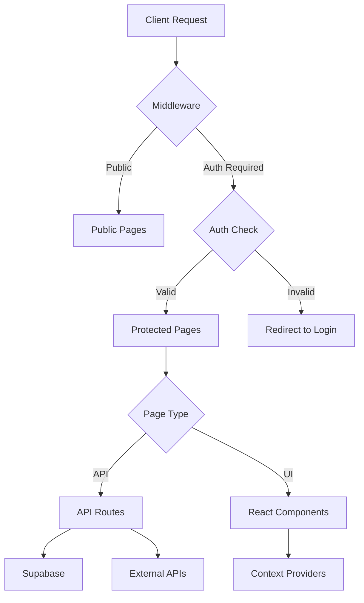

# Mikrostomart - Complete Project Context

> **Last Updated:** 2026-02-07  
> **Version:** Production (Vercel Deployment)  
> **Status:** Active Development

---

## 📋 Table of Contents
1. [Project Overview](#project-overview)
2. [Technology Stack](#technology-stack)
3. [Architecture](#architecture)
4. [Database Schema](#database-schema)
5. [Feature Catalog](#feature-catalog)
6. [API Endpoints](#api-endpoints)
7. [Integrations](#integrations)
8. [Cron Jobs & Automation](#cron-jobs--automation)
9. [Authentication & Authorization](#authentication--authorization)
10. [Deployment](#deployment)
11. [Recent Changes](#recent-changes)

---

## 🎯 Project Overview

**Mikrostomart** is a comprehensive web application for a dental clinic in Poland (Mikrostomart Gabinet Stomatologiczny). It combines:
- **Public Website** - Marketing, services, booking
- **Patient Portal** - Appointment management, medical history
- **Admin Panel** - Complete clinic management system
- **E-commerce** - Dental products shop with Stripe payment
- **Automated Communications** - SMS/Email reminders and notifications

**Target Users:**
- Patients (booking, appointments, purchasing products)
- Clinic Staff (admin panel, patient management, SMS coordination)
- Doctors (Marcin Nowosielski, Tomasz Nowosielski, and team)

**Business Model:**
- Patient appointment booking (integrated with Prodentis calendaring system)
- Product sales (dental cosmetics, accessories)
- Deposit payments for appointments

---

## 🛠 Technology Stack

### Core Framework
- **Next.js 16.1.1** (App Router)
- **React 19.2.3**
- **TypeScript 5**
- **Tailwind CSS 4.1.18**

### Backend & Database
- **Supabase** (PostgreSQL database, authentication, storage)
  - Database: 11 migrations (email verification, appointment actions, SMS reminders, etc.)
  - Auth: Email/password, magic links, JWT tokens
  - Storage: Product images, patient documents

### External Integrations
| Service | Purpose | Status |
|---------|---------|--------|
| **Prodentis API** | Appointment synchronization | ✅ Active |
| **SMSAPI.pl** | SMS notifications | ⚠️ Link blocking issue (awaiting support) |
| **Resend** | Email notifications | ✅ Active |
| **Stripe** | Payment processing | ✅ Active |
| **OpenAI** | AI assistant (chat support) | ✅ Active |
| **Replicate** | AI image generation | ✅ Active |
| **YouTube Data API** | Video feed | ✅ Active |

### UI/UX Libraries
- **Framer Motion** - Animations
- **Lucide React** - Icons
- **React Hook Form + Zod** - Form validation
- **MediaPipe** - Face detection (selfie feature)

### Development Tools
- **ESLint** - Code linting
- **Autoprefixer** - CSS compatibility
- **Sharp/Jimp** - Image processing

---

## 🏗 Architecture

### Directory Structure

```
mikrostomart/
├── src/
│   ├── app/                    # Next.js App Router pages
│   │   ├── admin/              # Admin panel
│   │   ├── strefa-pacjenta/    # Patient portal
│   │   ├── api/                # API routes (21 directories)
│   │   ├── aktualnosci/        # News/articles
│   │   ├── metamorfozy/        # Before/after gallery
│   │   ├── oferta/             # Services
│   │   ├── sklep/              # E-commerce shop
│   │   ├── kontakt/            # Contact page
│   │   ├── rezerwacja/         # Booking
│   │   └── wizyta/[type]/      # Appointment types
│   ├── components/             # React components (37 files)
│   ├── context/                # React Context (Cart, Assistant, Auth)
│   ├── lib/                    # Utilities & services
│   │   ├── smsService.ts       # SMS integration
│   │   ├── productService.ts   # Product management
│   │   ├── githubService.ts    # GitHub blog integration
│   │   ├── knowledgeBase.ts    # AI assistant knowledge
│   │   └── auth.ts             # Authentication helpers
│   ├── data/                   # Static data
│   ├── helpers/                # Helper utilities
│   └── middleware.ts           # Request middleware
├── supabase_migrations/        # Database migrations (11 files)
├── public/                     # Static assets
├── scripts/                    # Utility scripts (13 files)
├── smsTemplates.json           # SMS message templates
└── vercel.json                 # Deployment configuration
```

### Request Flow



---

## 🗄 Database Schema

### Supabase Tables (Primary)

#### 1. **sms_reminders**
SMS notification system for appointment reminders.
```sql
- id (uuid, PK)
- prodentis_id (text) - Appointment ID from Prodentis
- patient_phone (text)
- patient_name (text)
- doctor_name (text)
- appointment_date (timestamptz)
- appointment_time (text)
- appointment_type (text)
- sms_message (text)
- short_link_id (text, FK)
- status ('draft', 'sent', 'failed', 'cancelled')
- send_error (text)
- sent_at (timestamptz)
- created_at, updated_at
```

#### 2. **appointment_actions**
Tracks patient responses (confirm/cancel).
```sql
- id (uuid, PK)
- short_link_id (text, unique)
- patient_phone (text)
- patient_name (text)
- doctor_name (text)
- appointment_date (timestamptz)
- appointment_time (text)
- action ('confirmed', 'cancelled', null)
- action_timestamp (timestamptz)
- telegram_notified (boolean)
- email_sent (boolean)
- created_at
```

#### 3. **appointment_instructions**
Pre-appointment instructions by type.
```sql
- id (uuid, PK)
- appointment_type (text, unique)
- instructions (text)
- applicable_doctors (text[])
- created_at, updated_at
```

#### 4. **short_links**
URL shortener for SMS links.
```sql
- id (text, PK) - Short code (e.g., "RKACFo")
- full_url (text)
- appointment_action_id (uuid, FK)
- clicks (integer)
- created_at
```

#### 5. **email_verification_tokens**
Patient email verification for portal.
```sql
- id (uuid, PK)
- email (text)
- token (text, unique)
- used (boolean)
- expires_at (timestamptz)
- created_at
```

#### 6. **products** (assumed structure)
E-commerce products.

#### 7. **orders** (assumed structure)
Customer orders.

#### 8. **news** (assumed structure)
Clinic news/articles.

---

## ✨ Feature Catalog

### 🏥 Public Website Features

#### Homepage (`/`)
- Hero section with video background
- Services showcase (Precision, Aesthetics, Experience)
- YouTube video feed (latest clinic videos)
- Metamorphoses preview
- Products carousel
- Contact CTA

#### Services (`/oferta`)
- Service categories:
  - Zachowawcza (Conservative dentistry)
  - Protetyka (Prosthodontics)
  - Chirurgia (Surgery)
  - ORTODONCJA (Orthodontics)
  - Higienizacja (Dental hygiene)
  - Endodoncja (Endodontics)
  - LASER

#### Metamorphoses (`/metamorfozy`)
- Before/after image gallery
- 15+ cases
- Swipe gestures (mobile)
- Glassmorphism speech bubble descriptions

#### News (`/aktualnosci`)
- Migrated articles from old website
- Carousel layout with snap scroll
- AI-generated unique graphics for key articles

#### E-commerce (`/sklep`, `/koszyk`)
- Product browsing
- Shopping cart (CartContext)
- Stripe integration for payments
- Order confirmation emails

#### Booking (`/rezerwacja`, `/wizyta/[type]`)
- Appointment type selection
- Deposit payment option (`/zadatek`)
- Prodentis calendar integration

#### Other Pages
- About Us (`/o-nas`)
- Contact (`/kontakt`) - Google Maps integration
- FAQ (`/faq`)
- Knowledge Base (`/baza-wiedzy`)
- Pain Map (`/mapa-bolu`)
- Privacy Policy, RODO, Terms (`/polityka-*`, `/rodo`, `/regulamin`)

---

### 👤 Patient Portal (`/strefa-pacjenta`)

**Authentication Required** (Supabase Auth)

Features:
1. **Registration** (`/register`)
   - Email/password signup
   - Email verification system (magic token)
   - Email verification page (`/register/verify-email/[token]`)

2. **Login** (`/login`)
   - Email/password authentication
   - JWT token management

3. **Password Reset** (`/reset-password`, `/reset-password/[token]`)
   - Magic link password recovery

4. **Dashboard** (main portal page)
   - Upcoming appointments (fetched from Prodentis API)
   - Medical history
   - Personal information management

5. **Appointment Management**
   - View appointments
   - Confirm/cancel via short links
   - Email confirmations
   - Pre-appointment instructions (e.g., "Don't eat 2h before surgery")

---

### 🛡 Admin Panel (`/admin`)

**Authentication Required** (Admin email check)

**Sections:**

#### 1. Dashboard
- Overview statistics
- Quick actions

#### 2. Products (`products` tab)
- CRUD operations
- Image upload
- Price management
- AI image generation (Replicate integration)

#### 3. Orders (`orders` tab)
- Order list
- Status tracking

#### 4. Patients (`patients` tab)
- Patient database
- Contact information
- Appointment history

#### 5. SMS Przypomnienia (`sms-reminders` tab)
**NEW FEATURE - Recently Implemented**

**Tabs:**
- **📝 Szkice (Drafts):** Draft SMS ready to send
- **📤 Wysłane (Sent):** Sent/failed SMS history with manual delete option

**Actions:**
- Generate SMS drafts for tomorrow's appointments (Cron job)
- Edit SMS message before sending
- Send individual SMS
- Send all SMS in bulk
- Delete sent SMS (manual cleanup
- View send errors

**Workflow:**
1. Cron job generates drafts daily (5:00 AM UTC)
2. Admin reviews/edits drafts
3. Admin sends SMS (manually or bulk)
4. Sent SMS move to "Wysłane" tab
5. Admin can delete old SMS manually

#### 6. Reservations (`reservations` tab)
- Booking requests

#### 7. Questions (`questions` tab)
- FAQ management

#### 8. Articles (`articles` tab)
- Content management for knowledge base

#### 9. News (`news` tab)
- News/blog posts

#### 10. Blog (`blog` tab)
- GitHub-integrated blog posts

#### 11. Appointment Instructions (`appointment-instructions` tab)
- Pre-appointment instruction templates by type
- Doctor applicability settings
- Used in patient emails before appointments

---

## 🔌 API Endpoints

### Admin APIs (`/api/admin/*`)

| Endpoint | Method | Purpose |
|----------|--------|---------|
| `/admin/sms-reminders` | GET | Fetch SMS (all statuses by default) |
| `/admin/sms-reminders` | PUT | Edit draft SMS message |
| `/admin/sms-reminders` | DELETE | Cancel draft SMS |
| `/admin/sms-reminders/generate` | POST | Generate drafts for tomorrow |
| `/admin/sms-reminders/send` | POST | Send SMS (single or bulk) |
| `/admin/products` | GET, POST, DELETE | Product CRUD |
| `/admin/orders` | GET | Fetch orders |
| `/admin/patients` | GET | Fetch patient list |
| ... | ... | (14 admin API directories total) |

### Appointment APIs (`/api/appointments/*`)

| Endpoint | Method | Purpose |
|----------|--------|---------|
| `/appointments/by-date` | GET | Fetch appointments for date (Prodentis proxy) |
| `/appointments/confirm` | POST | Patient confirms appointment |
| `/appointments/cancel` | POST | Patient cancels appointment |

### Patient Portal APIs (`/api/patients/*`)

| Endpoint | Method | Purpose |
|----------|--------|---------|
| `/patients/register` | POST | Patient signup |
| `/patients/verify-email` | POST | Verify email token |
| `/patients/login` | POST | Patient login |
| `/patients/reset-password` | POST | Initiate password reset |
| ... | ... | (16 patient API directories) |

### Cron Job APIs (`/api/cron/*`)

| Endpoint | Purpose | Schedule |
|----------|---------|----------|
| `/cron/generate-sms-reminders` | Generate SMS drafts | Daily 5:00 AM UTC |
| `/cron/send-sms-reminders` | Auto-send SMS (if enabled) | Not currently scheduled |
| `/cron/daily-stats` | Statistics aggregation | Daily |
| ... | ... | (5 cron directories) |

### Other APIs
- `/api/prodentis` - Prodentis API proxy
- `/api/short-links/*` - URL shortener (create, resolve)
- `/api/contact` - Contact form
- `/api/create-payment-intent` - Stripe payment
- `/api/order-confirmation` - Order emails
- `/api/chat` - AI assistant (OpenAI)
- `/api/products` - Public product list
- `/api/youtube` - YouTube feed
- `/api/simulate` - Test/simulation endpoint
- `/api/news` - News articles

---

## 🔗 Integrations

### 1. Prodentis API
**Purpose:** Appointment calendar synchronization

**Endpoints Used:**
- Get appointments by date
- Patient lookup (potentially)

**Authentication:** API key stored in `PRODENTIS_API_KEY` env var

**Base URL:** `http://83.230.40.14:3000/api/appointments/*`

**Integration Files:**
- `/api/prodentis/route.ts`
- `/api/appointments/by-date/route.ts`

---

### 2. SMSAPI.pl
**Purpose:** SMS notifications for appointment reminders

**Current Status:** ⚠️ **Partial - Link Blocking Issue**
- SMS sending works for basic messages
- Error 94: "Not allowed to send messages with link"
- `skip_link_detection: 1` parameter added but requires account setting change
- User will call SMSAPI support on Monday to enable link sending

**Configuration:**
- Token: `SMSAPI_TOKEN` env var
- Endpoint: `https://api.smsapi.pl/sms.do`
- Phone format: `48XXXXXXXXX` (no + prefix)

**Templates:** `smsTemplates.json` (ASCII-only to avoid encoding issues)

**Integration Files:**
- `src/lib/smsService.ts`
- `/api/admin/sms-reminders/*`
- `/api/cron/generate-sms-reminders/*`

**Features:**
- Phone number normalization (removes `+` and whitespace)
- Template selection by doctor and appointment type
- Short link integration for confirm/cancel actions
- Detailed error logging

**Recent Fixes:**
- ✅ Phone format validation
- ✅ Removed invalid `from` field
- ✅ Polish character encoding (switched to ASCII templates)
- ⚠️ Link detection bypass (pending SMSAPI account setting)

---

### 3. Resend
**Purpose:** Transactional email notifications

**Configuration:**
- API Key: `RESEND_API_KEY`
- From email: `Mikrostomart <noreply@mikrostomart.pl>`

**Email Types:**
1. **Patient Email Verification** (registration)
2. **Password Reset** (magic link)
3. **Appointment Confirmation** (patient confirms via SMS link)
4. **Appointment Cancellation** (patient cancels)
5. **Order Confirmation** (product purchases)
6. **Pre-Appointment Instructions** (day before appointment)

**Email Features:**
- HTML templates
- Personalization (patient name, appointment details)
- Embedded appointment instructions
- Professional footer with clinic info

**Integration Files:**
- `/api/appointments/confirm/route.ts` (lines 168-186)
- `/api/appointments/cancel/route.ts` (lines 167-183)
- `/api/patients/*` (various email verification endpoints)
- `/api/order-confirmation/route.ts`

**Recent Additions:**
- ✅ Appointment confirmation emails with instructions
- ✅ Cancellation emails
- ✅ Removed "landing page" text from footers
- ✅ Added patient name and phone to Telegram notifications

---

### 4. Telegram Bot
**Purpose:** Real-time admin notifications

**Configuration:**
- Bot Token: `TELEGRAM_BOT_TOKEN`
- Chat ID: `TELEGRAM_CHAT_ID`

**Notification Types:**
1. **Appointment Confirmed** - Patient confirms via SMS link
2. **Appointment Cancelled** - Patient cancels

**Message Format:**
```
✅ PACJENT POTWIERDZIŁ OBECNOŚĆ

👤 Pacjent: Jan Kowalski
📞 Telefon: +48790740770
📅 Data: 08.02.2026
⏰ Godzina: 15:00
🩺 Lekarz: Dr Nowosielski
```

**Integration Files:**
- `/api/appointments/confirm/route.ts` (lines 122-127)
- `/api/appointments/cancel/route.ts` (lines 122-132)

**Recent Updates:**
- ✅ Added patient name to notifications
- ✅ Added clickable phone number link
- ✅ Removed "(Landing Page)" text
- ✅ Improved formatting with emojis

---

### 5. Stripe
**Purpose:** Payment processing (products, deposits)

**Configuration:**
- Secret Key: `STRIPE_SECRET_KEY`
- Publishable Key: `NEXT_PUBLIC_STRIPE_PUBLISHABLE_KEY`

**Payment Flows:**
1. **Product Purchase** (`/sklep`, `/koszyk`)
2. **Appointment Deposit** (`/zadatek`)

**Integration Files:**
- `/api/create-payment-intent/route.ts`
- `src/context/CartContext.tsx`

---

### 6. OpenAI
**Purpose:** AI chat assistant

**Configuration:**
- API Key: `OPENAI_API_KEY`
- Model: GPT-4 (assumed)

**Knowledge Base:** `src/lib/knowledgeBase.ts` (11KB)
- Clinic information
- Services
- Pricing
- Contact details

**Integration Files:**
- `/api/chat/route.ts`
- `src/context/AssistantContext.tsx`
- `src/components/Assistant.tsx` (assumed)

---

### 7. Replicate
**Purpose:** AI image generation for products/content

**Configuration:**
- API Token: `REPLICATE_API_TOKEN`

**Integration Files:**
- `/api/admin/*` (product image generation)

---

### 8. YouTube Data API
**Purpose:** Fetch latest clinic videos

**Configuration:**
- API Key: `YOUTUBE_API_KEY`
- Channel ID: `YOUTUBE_CHANNEL_ID`

**Integration Files:**
- `/api/youtube/route.ts`
- `src/components/YouTubeFeed.tsx`

---

## ⏰ Cron Jobs & Automation

### 1. Generate SMS Reminders
**Path:** `/api/cron/generate-sms-reminders`  
**Schedule:** Daily at 5:00 AM UTC  
**Trigger:** Vercel Cron (configured in `vercel.json`)

**Workflow:**
1. Fetch tomorrow's appointments from Prodentis
2. Check if SMS already exists (skip if sent)
3. Generate short link for confirm/cancel actions
4. Create SMS draft in database with template message
5. Log results

**Environment Variables Used:**
- `NEXT_PUBLIC_SUPABASE_URL`
- `SUPABASE_SERVICE_ROLE_KEY`
- `PRODENTIS_API_BASE_URL`
- `NEXT_PUBLIC_BASE_URL` (for short links)

**Configuration:**
- Cleanup: Deletes old drafts (only `status='draft'`)
- Preserves: `sent`, `failed`, `cancelled` SMS for history
- Working hours check: Only appointments between 8:00-20:00

---

### 2. Daily Stats (assumed)
**Path:** `/api/cron/daily-stats`  
**Purpose:** Aggregate daily statistics

---

### Vercel Cron Configuration (`vercel.json`)
```json
{
  "crons": [{
    "path": "/api/cron/generate-sms-reminders",
    "schedule": "0 5 * * *"
  }]
}
```

---

## 🔐 Authentication & Authorization

### Patient Authentication (Supabase Auth)

**Method:** Email/Password + JWT

**Flow:**
1. Patient registers → `/api/patients/register`
2. Verification email sent (Resend) → magic token
3. Patient clicks link → `/strefa-pacjenta/register/verify-email/[token]`
4. Token validated → email confirmed
5. Patient logs in → JWT issued
6. Protected routes check JWT via middleware

**Files:**
- `src/middleware.ts` - Route protection
- `src/lib/auth.ts` - Auth helpers
- `src/lib/jwt.ts` - JWT utilities
- `supabase_migrations/003_email_verification_system.sql`

---

### Admin Authentication

**Method:** Email allowlist check

**Allowed Admins:**
- `marcinnowosielskimedit@gmail.com`
- (others in code)

**Check:** `src/app/admin/page.tsx` (client-side Supabase auth check)

---

## 🚀 Deployment

**Platform:** Vercel  
**Domain:** `mikrostomart.pl` (assumed)  
**Repository:** GitHub (private - `novik-code/mikrostomart`)

**Environment Variables (Production):**
```bash
# Supabase
NEXT_PUBLIC_SUPABASE_URL=https://...
NEXT_PUBLIC_SUPABASE_ANON_KEY=...
SUPABASE_SERVICE_ROLE_KEY=...

# Prodentis
PRODENTIS_API_KEY=...
PRODENTIS_API_BASE_URL=http://83.230.40.14:3000

# SMS
SMSAPI_TOKEN=...

# Email
RESEND_API_KEY=...

# Telegram
TELEGRAM_BOT_TOKEN=...
TELEGRAM_CHAT_ID=...

# Stripe
STRIPE_SECRET_KEY=...
NEXT_PUBLIC_STRIPE_PUBLISHABLE_KEY=...

# OpenAI
OPENAI_API_KEY=...

# Replicate
REPLICATE_API_TOKEN=...

# YouTube
YOUTUBE_API_KEY=...
YOUTUBE_CHANNEL_ID=...

# App
NEXT_PUBLIC_BASE_URL=https://mikrostomart.pl
NODE_ENV=production
```

**Build Command:** `npm run build`  
**Install Command:** `npm install`  
**Framework:** Next.js

---

## 📝 Recent Changes

### February 7, 2026
**SMS History Management System**

#### Commits:
- `ca17b1a` - Fixed fetch to load ALL SMS statuses (not just drafts)
- `8987b90` - Fixed SMS filter logic with proper parentheses
- `dd9c9ea` - Added SMS history with Wysłane tab
- `9648030` - Removed unsupported encoding parameter from SMSAPI
- `164c1b8` - SMS ASCII encoding + skip link detection
- `ac9f29e` - Various email notification improvements

#### Features Added:
1. **SMS "Wysłane" Tab in Admin Panel**
   - Separate tabs: "Szkice" (drafts) and "Wysłane" (sent/failed)
   - Tab counts show number of SMS in each category
   - Sent SMS now preserved in database (not deleted after sending)
   - Manual delete button for cleanup

2. **SMS Encoding Fixes**
   - Removed all Polish characters from SMS templates
   - Templates now ASCII-only to prevent "krzaki" (garbled text)
   - Removed `encoding: 'gsm'` parameter (unsupported by SMSAPI)

3. **SMS Link Detection**
   - Added `skip_link_detection: 1` parameter
   - ⚠️ Still blocked by account setting (error 94)
   - User will contact SMSAPI support to enable

4. **Email & Telegram Improvements**
   - Added patient name and phone to Telegram notifications
   - Removed "(Landing Page)" text from emails and notifications
   - Simplified email footers
   - Added appointment instructions to confirmation emails

#### Files Modified:
- `src/app/admin/page.tsx` - SMS tabs UI, filter logic
- `src/app/api/admin/sms-reminders/route.ts` - API default changed to fetch all
- `src/lib/smsService.ts` - Phone normalization, link detection, encoding
- `smsTemplates.json` - ASCII-only templates
- `src/app/api/appointments/confirm/route.ts` - Email and Telegram updates
- `src/app/api/appointments/cancel/route.ts` - Email and Telegram updates

---

### January-February 2026 (Previous Sessions)
- Metamorphoses gallery implementation
- News/articles migration
- Admin panel development
- Patient portal creation
- Prodentis API integration
- SMS reminder system foundation
- Short link system
- Appointment instructions system

---

## 🎯 Implementation Status

### ✅ Completed Features
- [x] Public website (all pages)
- [x] E-commerce (products, cart, payments)
- [x] Admin panel (all sections)
- [x] Patient portal (registration, login, dashboard)
- [x] Email notifications (all types)
- [x] Telegram notifications
- [x] SMS reminder system (generation, editing, sending)
- [x] SMS history management (Wysłane tab)
- [x] Appointment confirmation/cancellation workflow
- [x] Short link system
- [x] Appointment instructions
- [x] Cron jobs (SMS generation)
- [x] Prodentis API integration
- [x] YouTube feed
- [x] AI assistant
- [x] PWA capabilities

### ⚠️ Partial/Pending
- [ ] SMS link sending (blocked by SMSAPI.pl account setting - awaiting Monday support call)
- [ ] Comprehensive testing of all workflows
- [ ] Performance optimization
- [ ] SEO optimization

### 📋 Future Enhancements (Not Started)
- [ ] Mobile app (React Native)
- [ ] Advanced analytics dashboard
- [ ] Multi-language support
- [ ] Payment plan management
- [ ] Patient feedback system
- [ ] Automated appointment reminders (auto-send SMS)
- [ ] Bulk SMS delete for admin
- [ ] SMS date filters (last 7 days, 30 days, etc.)

---

## 📚 Documentation Files

- `README.md` - Basic setup instructions (outdated, from Dec 31)
- `PROJECT_STATUS.md` - Last status update (outdated, from Dec 31)
- `NOTATKI_Z_SESJI.md` - Session notes
- `previous_implementation_plan.md` - Old implementation plan
- **This file (`mikrostomart_context.md`)** - **COMPREHENSIVE CURRENT DOCUMENTATION**

---

## 🔧 Development Setup

```bash
# Clone repository
git clone <repo-url>
cd mikrostomart

# Install dependencies
npm install

# Copy environment variables
cp .env.example .env.local
# Edit .env.local with actual values

# Run development server
npm run dev

# Build for production
npm run build

# Start production server
npm start
```

**Requirements:**
- Node.js 20+
- npm/pnpm
- Supabase account
- All API keys configured

---

## 📞 Support & Maintenance

**Primary Developer:** AI Assistant (Antigravity - Google DeepMind)  
**Project Owner:** Marcin Nowosielski (marcinnowosielskimedit@gmail.com)  
**Clinic:** Mikrostomart Gabinet Stomatologiczny  
**Location:** Poland

**Critical Contacts:**
- SMSAPI.pl Support - For link blocking issue resolution
- Prodentis - For calendar API issues
- Vercel Support - For deployment issues

---

**End of Document**

---

# 🚨 CRITICAL: AI Documentation Update Protocol

> **MANDATORY FOR ALL AI ASSISTANTS**  
> **This section MUST be followed after EVERY task completion**

## 📝 Required Updates After Each Task

### When to Update Documentation

**UPDATE DOCUMENTATION IF:**
- ✅ You added new features
- ✅ You modified existing features
- ✅ You fixed bugs or issues
- ✅ You changed database schema
- ✅ You added/modified API endpoints
- ✅ You changed integrations or external services
- ✅ You updated dependencies
- ✅ You changed architecture or file structure
- ✅ You resolved known issues

**DO NOT UPDATE IF:**
- ❌ Only reading code/exploring
- ❌ Answering questions without code changes
- ❌ Making trivial formatting changes
- ❌ Running tests without changes

---

## 📋 Update Checklist (MANDATORY)

After completing ANY task that involves code changes, you MUST:

### 1. Update `mikrostomart_context.md`

**Section: Recent Changes**
- [ ] Add new entry with current date (YYYY-MM-DD format)
- [ ] List all commit hashes for changes
- [ ] Document features added/modified
- [ ] List all files modified with brief description
- [ ] Update "Last Updated" date at top of file

**Section: Feature Catalog**
- [ ] Add new features to appropriate section
- [ ] Update existing feature descriptions if changed
- [ ] Mark deprecated features

**Section: API Endpoints** (if API changed)
- [ ] Add new endpoints with method, purpose
- [ ] Update existing endpoint documentation
- [ ] Remove deprecated endpoints (mark as deprecated first)

**Section: Database Schema** (if schema changed)
- [ ] Document new tables/columns
- [ ] Update table structures
- [ ] Note migration file number

**Section: Integrations** (if integration changed)
- [ ] Update configuration details
- [ ] Update status (✅/⚠️/❌)
- [ ] Document new features/fixes

**Section: Known Issues**
- [ ] Remove resolved issues
- [ ] Add new known issues
- [ ] Update status of existing issues

**Section: Implementation Status**
- [ ] Move completed items to ✅ Completed
- [ ] Update partial items progress
- [ ] Add new pending items if applicable

---

### 2. Update `PROJECT_STATUS.md`

- [ ] Update "Last Updated" date and latest commit
- [ ] Add entry to "Latest Changes" section with:
  - Date
  - Feature/fix title
  - Commit hashes
  - Files changed
  - Brief description
- [ ] Update "Known Issues" if resolved
- [ ] Update "Next Steps" if priorities changed
- [ ] Update completion percentages if applicable

---

### 3. Update `README.md` (if applicable)

**Update ONLY if:**
- Setup process changed (new env vars, dependencies)
- Key features changed (major additions visible to end users)
- Quick start commands changed
- Known issues section needs update

---

### 4. Update Artifacts

**If in brain/ artifacts directory:**
- [ ] Update `task.md` - mark completed items
- [ ] Create/update `walkthrough.md` - document what was done

---

## 🔄 Update Workflow

### Step-by-Step Process:

1. **Complete your task** (code changes, testing, deployment)

2. **Open documentation files:**
   ```
   mikrostomart_context.md
   PROJECT_STATUS.md
   README.md (if needed)
   ```

3. **Update "Last Updated" dates** at top of files

4. **Add to "Recent Changes"** section:
   - Use current date as header
   - List commits chronologically
   - Group related changes
   - Be specific but concise

5. **Update relevant sections** based on checklist above

6. **Verify accuracy:**
   - Cross-reference code with documentation
   - Check all links work
   - Ensure no outdated information remains

7. **Commit documentation updates:**
   ```bash
   git add mikrostomart_context.md PROJECT_STATUS.md README.md
   git commit -m "docs: update documentation for [feature/fix name]"
   git push
   ```

---

## 📝 Documentation Format Standards

### Date Format
- Use `YYYY-MM-DD` (e.g., `2026-02-07`)
- Always use UTC or specify timezone

### Commit References
- Include full 7+ character hash (e.g., `ca17b1a`)
- Link format: `commit hash - brief description`

### File References
- Use relative paths from project root
- Backticks for file names: `` `src/app/admin/page.tsx` ``
- Include line numbers for specific changes if helpful

### Status Indicators
- ✅ = Completed/Working
- ⚠️ = Partial/Issues
- ❌ = Broken/Not working
- 📋 = Planned/Not started

### Section Organization
- Most recent changes at TOP of "Recent Changes"
- Chronological order (newest first)
- Group by date, then by feature

---

## ⚠️ Common Mistakes to Avoid

❌ **DON'T:**
- Forget to update "Last Updated" date
- Skip updating when making "small" changes
- Leave outdated information in docs
- Use vague descriptions ("updated files", "fixed bugs")
- Forget to update implementation status
- Leave resolved issues in "Known Issues"

✅ **DO:**
- Be specific about what changed
- Include commit hashes
- List all modified files
- Update all relevant sections
- Remove outdated info
- Test documentation links
- Keep "Recent Changes" to last 30 days (move old to archive if needed)

---

## 📚 Documentation Hierarchy Reminder

**Priority Order:**
1. `mikrostomart_context.md` - **ALWAYS UPDATE** - Master documentation
2. `PROJECT_STATUS.md` - **ALWAYS UPDATE** - Current status
3. `README.md` - Update if setup/major features changed
4. Other docs - Update as needed

---

## 🎯 Example Update Entry

### Good Example:

```markdown
### February 7, 2026
**SMS History Management System**

#### Commits:
- `ca17b1a` - Fixed fetch to load ALL SMS statuses
- `8987b90` - Fixed SMS filter logic with proper parentheses
- `dd9c9ea` - Added SMS history with Wysłane tab

#### Features Added:
1. **SMS "Wysłane" Tab in Admin Panel**
   - Separate tabs for drafts and sent SMS
   - Manual delete functionality for cleanup
   - Sent SMS preserved in database

2. **SMS Encoding Fixes**
   - Removed Polish characters (ASCII-only templates)
   - Fixed encoding parameter issue

#### Files Modified:
- `src/app/admin/page.tsx` - Added tabs UI and filter logic
- `src/app/api/admin/sms-reminders/route.ts` - Changed default fetch to 'all'
- `src/lib/smsService.ts` - Removed unsupported encoding param
- `smsTemplates.json` - ASCII-only templates
```

### Bad Example (DON'T DO THIS):

```markdown
### Feb 7
Updated some files for SMS. Fixed bugs.
```

---

## 🚨 FINAL REMINDER

**This is NOT optional.** Keeping documentation current is CRITICAL because:
- Future AI sessions rely on accurate context
- Project owner needs to understand changes
- Team members need current documentation
- Debugging requires accurate system state

**If you make code changes and DON'T update documentation:**
- Next AI session will have outdated context
- Bugs will be harder to diagnose
- Features will be "lost" or forgotten
- Project knowledge degrades over time

---

**ALWAYS update documentation. No exceptions.**

---

*This protocol was added on 2026-02-07 to ensure documentation stays current.*
