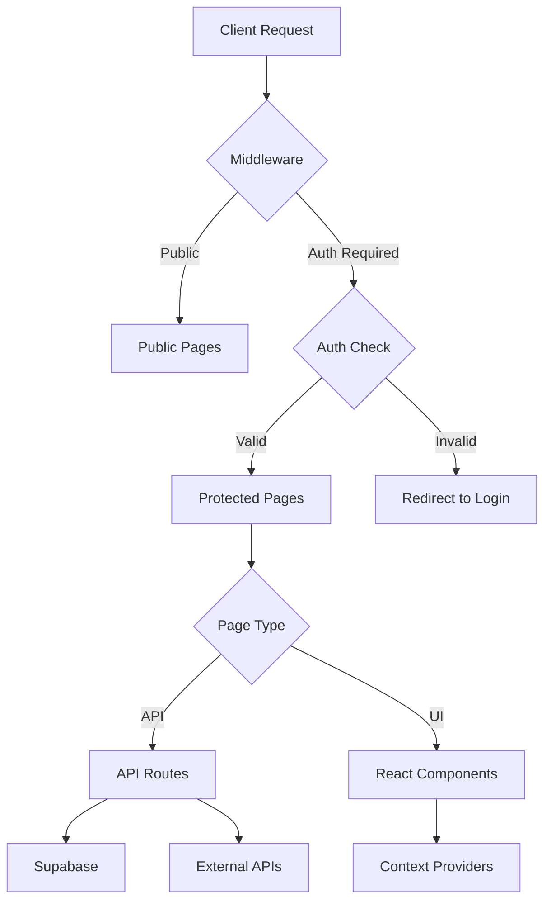

# Mikrostomart - Complete Project Context

> **Last Updated:** 2026-02-23  
> **Version:** Production (Vercel Deployment)  
> **Status:** Active Development

---

## 📋 Table of Contents
1. [Project Overview](#project-overview)
2. [Technology Stack](#technology-stack)
3. [Architecture](#architecture)
4. [Database Schema](#database-schema)
5. [Feature Catalog](#feature-catalog)
6. [API Endpoints](#api-endpoints)
7. [Integrations](#integrations)
8. [Cron Jobs & Automation](#cron-jobs--automation)
9. [Authentication & Authorization](#authentication--authorization)
10. [Deployment](#deployment)
11. [Recent Changes](#recent-changes)

---

## 🎯 Project Overview

**Mikrostomart** is a comprehensive web application for a dental clinic in Poland (Mikrostomart Gabinet Stomatologiczny). It combines:
- **Public Website** - Marketing, services, booking
- **Patient Portal** - Appointment management, medical history
- **Admin Panel** - Complete clinic management system
- **E-commerce** - Dental products shop with Stripe payment
- **Automated Communications** - SMS/Email reminders and notifications

**Target Users:**
- Patients (booking, appointments, purchasing products)
- Clinic Staff (admin panel, patient management, SMS coordination)
- Doctors (Marcin Nowosielski, Elżbieta Nowosielska, and team)

**Business Model:**
- Patient appointment booking (integrated with Prodentis calendaring system)
- Product sales (dental cosmetics, accessories)
- Deposit payments for appointments

---

## 🛠 Technology Stack

### Core Framework
- **Next.js 16.1.1** (App Router)
- **React 19.2.3**
- **TypeScript 5**
- **Tailwind CSS 4.1.18**

### Backend & Database
- **Supabase** (PostgreSQL database, authentication, storage)
  - Database: 49 migrations (003-049: email verification, appointment actions, SMS reminders, user_roles, employee tasks, task history, comments, labels, status fix, google reviews cache, chat, push subscriptions, employee_group, push_notification_config, employee_groups array, news/articles/blog/products i18n, calendar tokens, private tasks + reminders, SMS post-visit/week-after-visit, SMS unique constraint fix, task multi-images, **push_notifications_log**, **google_event_id on employee_tasks**)
  - Auth: Email/password, magic links, JWT tokens
  - Storage: Product images, patient documents, task images

### External Integrations
| Service | Purpose | Status |
|---------|---------|--------|
| **Prodentis API** | Appointment synchronization | ✅ Active |
| **SMSAPI.pl** | SMS notifications | ✅ Active (link blocking resolved) |
| **Resend** | Email notifications | ✅ Active |
| **Stripe** | Payment processing | ✅ Active |
| **OpenAI** | AI assistant (chat support) | ✅ Active |
| **Replicate** | AI image generation | ✅ Active |
| **YouTube Data API** | Video feed | ✅ Active |
| **Google Places API** | Real Google Reviews (New + Legacy) | ✅ Active |
| **Web Push (VAPID)** | Browser push notifications (patients + employees) | ✅ Active |

### UI/UX Libraries
- **Framer Motion** - Animations
- **Lucide React** - Icons
- **React Hook Form + Zod** - Form validation
- **MediaPipe** - Face detection (selfie feature)

### Internationalization (i18n)
- **next-intl** — Client-side translations via `useTranslations()` hook
- **4 supported locales:** `pl` (default), `en`, `de`, `ua`
- **Locale files:** `messages/{pl,en,de,ua}/common.json` — flat namespace structure
- **Middleware:** `createMiddleware` from `next-intl/middleware` handles locale detection (cookie → Accept-Language → default `pl`) and URL prefixing (`/en/oferta`, `/de/kontakt`, etc.)
- **LanguageSwitcher component:** Compact flag + locale code in Navbar, hidden when mobile menu is open
- **Translated namespaces:**
  | Namespace | Component(s) | Keys |
  |-----------|-------------|------|
  | `nav` | Navbar | Navigation links, CTA |
  | `hero` | Homepage hero | Title, subtitle, CTA |
  | `oferta` | Oferta page | Page chrome (tagline, title, description, contactCta) |
  | `offerItems` | OfferCarousel | 8 offers × (title, short, full) + section label, bookVisit, expand/collapse |
  | `contact` | ContactForm | Form fields, validation, submit |
  | `reservation` | ReservationForm | Booking form labels |
  | `porownywarka` | Comparator tool | ~29 UI strings |
  | `kalkulatorUI` | Treatment calculator | ~29 UI strings |
  | `mapaBoluUI` | Pain Map interactive | ~22 UI strings + metaTitle/metaDescription |
  | `contactForm` | ContactForm | Form fields, validation, RODO consent, submit |
  | `metamorphosisUI` | MetamorphosisGallery | Before/after labels, CTA |
  | `reviews` | GoogleReviews | Section heading |
  | `youtube` | YouTubeFeed | Section heading |
  | `bazaWiedzy` | Knowledge Base | ~7 UI strings (readMore, backToList, notFound, metaSuffix) |
  | `sklep` | Shop page | title, cart, loading, noImage, added, addToCart |
  | `koszyk` | Cart page | empty, backToShop, checkout, title, perUnit, removeTitle, total, clearCart, goToCheckout, backToCart, orderSuccess |
  | `productModal` | ProductModal | depositPaid, thankYou, depositConfirmation, orderConfirmation, backToHome, closeWindow, backToProduct, yourCart, total, checkoutTitle, voucherAmount, minimum, inCart, cartTotal, goToCart, quantity, addToCart, buyNow, safePurchase |
  | `checkoutForm` | CheckoutForm | shippingAddress, editDetails, noPaymentConfig, noPaymentDesc, deliveryData, fullName, email, phone, city, zipCode, street, houseNumber, apartment, total, proceedToPayment |
  | `stripePayment` | StripePaymentForm | payment, paymentError, toPay, back, processing, payNow |
  | `simulatorModal` | SimulatorModal | title, preparing, slogan, downloadError, cameraError, optimizing, searchingSmile, designingSmile, processingError, mouthDetectionError, serverError, timeoutError, aiError, instructionTitle, instructionSubtitle, instructionFront/Mouth/Light/Avoid, understood, startCamera, uploadPhoto, repeat, download, backToStart |
  | `beforeAfter` | BeforeAfterSlider | before, after |

  **`reservationForm` (common.json):** Extended with 22 new keys: services (konsultacja, bol, implanty, licowki), validation messages, availableSlots, duration, selectedSlot, nameFieldLabel, dataAdmin, rodoConsent, rodoClause, rodoAnd, privacyPolicy, bookAnother, submitError.

  **`rodo` (pages.json):** Extended from 3 keys (tagline/title/downloadPdf) to 38 keys covering all 10 legal GDPR sections (greeting, intro, sec1–sec10 titles and body text). Uses dangerouslySetInnerHTML for HTML content (br, strong, links).

  **`assistant` (common.json):** 17 keys for AssistantTeaser chat component — greeting, 4 suggestion prompts, bookAppointment, pricing, sendingPhoto, errorTechnical, errorConnection, ariaOpenAssistant, tooltipAI, headerTitle, headerSubtitle, imageAdded, inputPlaceholder.

  **`selfieBooth` (common.json):** 11 keys for SelfieBooth component — title, cameraError, goBack, retake, download, pose1–pose5 names.

  **`opinionSurvey` (common.json):** ~50 keys for OpinionSurvey component — 8 question titles, answer options (q0–q7), 10 procedure options (proc1–proc10), subtitles, placeholders, UI labels (back, next, close, generateReview, loading), result screen (resultTitle, resultSubtitle, submitGoogle, pasteHint, copiedOpening, copied, copyManual), negative sentiment (negativeTitle, negativeBody, negativeFooter).

  **Pain Map SymptomData i18n**: Medical content (symptoms, causes, advice for 35 zones × 3 severity levels) is translated via per-locale files: `SymptomData.ts` (PL, default), `SymptomData.en.ts`, `SymptomData.de.ts`, `SymptomData.ua.ts`. The helper `getSymptomData.ts` returns locale-aware data using `useLocale()`.

  **Comparator data i18n**: Treatment method data (73 methods across 7 categories), comparator scenarios, priorities, gating rules, and table row labels are translated via per-locale files (`methodsEstetyka.en.ts`, `comparatorScenarios.en.ts`, etc.). The helper `getComparatorData.ts` returns locale-aware data with fallback to Polish.

  **Treatment Calculator data i18n**: Treatment paths (5 paths with questions, options, stages, and extending factors) are translated via per-locale files (`treatmentData.en.ts`, `treatmentData.de.ts`, `treatmentData.ua.ts`). The helper `getTreatmentData.ts` returns locale-aware data with fallback to Polish.

  **Knowledge Base article i18n**: Articles in the `articles` Supabase table have `locale` (TEXT, default 'pl') and `group_id` (UUID) columns. Each translated article is a separate row linked by `group_id`. AI generation (`/api/cron/daily-article`) produces PL content first, then translates to EN/DE/UA via GPT-4o. DELETE cascades via `group_id`. Public pages filter by user locale with PL fallback.

  **Blog post i18n**: Blog posts in `blog_posts` table have `locale` (TEXT, default 'pl') and `group_id` (UUID) columns. Admin API auto-translates new posts to EN/DE/UA via GPT-4o on creation. DELETE cascades via `group_id`. Public pages (`/nowosielski`) filter by locale with PL fallback.

  **Shop/Product i18n**: Products in `products` table have JSONB columns `name_translations`, `description_translations`, `category_translations` (format: `{"en": "...", "de": "...", "ua": "..."}`). Polish stays in original `name`/`description`/`category` columns. Admin API auto-translates product text when saving via GPT-4o. Shop page and ProductModal use `getTranslated()` helper with locale fallback to Polish.

### Development Tools
- **ESLint** - Code linting
- **Autoprefixer** - CSS compatibility
- **Sharp/Jimp** - Image processing

---

## 🏗 Architecture

### Directory Structure

```
mikrostomart/
├── src/
│   ├── app/                    # Next.js App Router pages
│   │   ├── admin/              # Admin panel
│   │   │   ├── login/          # Admin login page
│   │   │   ├── update-password/ # Password reset landing page (verifyOtp flow)
│   │   │   └── page.tsx        # Main admin panel (186KB, 3311 lines, 14 tabs)
│   │   ├── pracownik/          # Employee Zone (schedule grid + task management)
│   │   │   ├── login/          # Employee login page
│   │   │   ├── reset-haslo/    # Employee password reset page
│   │   │   └── page.tsx        # Weekly schedule grid + task management (~220KB)
│   │   ├── strefa-pacjenta/    # Patient portal
│   │   │   ├── login/          # Patient login (phone or email)
│   │   │   ├── register/       # Registration flow (confirm, password, verify, verify-email)
│   │   │   ├── reset-password/  # Password reset flow
│   │   │   ├── dashboard/      # Main patient dashboard (next appointment widget)
│   │   │   ├── historia/       # Visit history
│   │   │   ├── profil/         # Patient profile
│   │   │   ├── wiadomosci/     # Patient ↔ Reception real-time chat
│   │   │   └── ocen-nas/       # Rate Us page (QR code → Google Reviews)
│   │   ├── api/                # API routes (30+ directories)
│   │   ├── auth/               # Auth routes (callback for PKCE code exchange)
│   │   ├── cennik/             # Pricing page (AI chat assistant)
│   │   ├── aktualnosci/        # News/articles
│   │   ├── mapa-bolu/          # Pain Map (interactive dental map)
│   │   │   ├── editor/         # Zone position editor tool (debug)
│   │   │   ├── PainMapInteractive.tsx  # SVG overlay + modals + tooltips + doctor cards
│   │   │   └── SymptomData.ts  # 32 teeth + 3 soft tissue data (TipItem, DOCTORS)
│   │   ├── metamorfozy/        # Before/after gallery
│   │   ├── nowosielski/        # Dr Nowosielski's blog (Supabase-backed)
│   │   │   ├── [slug]/         # Dynamic blog post pages
│   │   │   ├── blog.v2.css     # Blog-specific styling
│   │   │   └── page.tsx        # Blog listing page
│   │   ├── porownywarka/       # Solution Comparator (7 categories, 73 methods)
│   │   ├── kalkulator-leczenia/ # Treatment Time Calculator (5 paths)
│   │   ├── oferta/             # Services
│   │   │   └── implantologia/  # Implantology subpage with pricing
│   │   ├── selfie/             # Selfie Booth page
│   │   ├── symulator/          # Smile Simulator page
│   │   ├── sklep/              # E-commerce shop
│   │   ├── kontakt/            # Contact page
│   │   ├── rezerwacja/         # Booking (query param: ?specialist=&reason=)
│   │   ├── wizyta/[type]/      # Appointment types
│   │   ├── baza-wiedzy/        # Knowledge base articles
│   │   ├── faq/                # FAQ page
│   │   └── zadatek/            # Deposit payment
│   ├── components/             # React components (33 files + 3 subdirs)
│   │   ├── modals/             # Appointment modals (Cancel, Confirm, Reschedule)
│   │   ├── scheduler/          # AppointmentScheduler (Prodentis live slots)
│   │   ├── simulator/          # Smile simulator studio (Capture, MaskEditor, Results)
│   │   ├── SplashScreen.tsx     # Cinematic intro animation (particles, logo, phases)
│   │   ├── AssistantTeaser.tsx  # AI chat assistant (full chat mode, suggestions, file upload)
│   │   ├── NovikCodeCredit.tsx  # Footer credit with fullscreen takeover animation
│   │   ├── OverlayEditor.tsx    # Image alignment/overlay editor (simulator)
│   │   ├── SimulatorModal.tsx   # Smile simulator main modal
│   │   └── ...                 # (+ 24 more components)
│   ├── context/                # React Context providers
│   │   ├── CartContext.tsx      # Shopping cart state
│   │   ├── AssistantContext.tsx # AI assistant open/close state
│   │   ├── SimulatorContext.tsx # Smile simulator open/close state
│   │   └── OpinionContext.tsx  # Review survey popup state + timed trigger
│   ├── lib/                    # Utilities & services
│   │   ├── smsService.ts       # SMS integration
│   │   ├── productService.ts   # Product management
│   │   ├── githubService.ts    # GitHub blog integration
│   │   ├── knowledgeBase.ts    # AI assistant knowledge (20KB)
│   │   ├── roles.ts            # Role management (RBAC: admin/employee/patient)
│   │   ├── telegram.ts         # Telegram multi-bot notification routing
│   │   ├── appointmentTypeMapper.ts  # Maps Prodentis appointment types
│   │   ├── auth.ts             # Authentication helpers (verifyAdmin)
│   │   ├── jwt.ts              # JWT token utilities
│   │   └── supabaseClient.ts   # Browser Supabase client
│   ├── data/                   # Static data
│   │   ├── articles.ts         # Knowledge base articles
│   │   └── reviews.ts          # Google reviews fallback data
│   ├── hooks/                  # Custom React hooks
│   │   └── useUserRoles.ts     # Fetch user roles from API
│   ├── helpers/                # Helper utilities
│   └── middleware.ts           # Request middleware (i18n locale routing + admin/employee route protection)
├── messages/                   # i18n translation files (next-intl)
│   ├── pl/common.json          # Polish (default locale)
│   ├── en/common.json          # English
│   ├── de/common.json          # German
│   └── ua/common.json          # Ukrainian
├── supabase_migrations/        # Database migrations (40 files: 003-043, some gaps)
├── public/                     # Static assets (incl. qr-ocen-nas.png)
├── scripts/                    # Utility scripts (13 files)
└── vercel.json                 # Deployment configuration (6 cron jobs: 3 daily + 2 Friday-only + 1 task reminders)
```

### Request Flow


```mermaid
graph TD
    A[Client Request] --> B{Middleware}
    B -->|Public| C[Public Pages]
    B -->|Auth Required| D{Auth Check}
    D -->|Valid| E[Protected Pages]
    D -->|Invalid| F[Redirect to Login]
    E --> G{Page Type}
    G -->|API| H[API Routes]
    G -->|UI| I[React Components]
    H --> J[Supabase]
    H --> K[External APIs]
    I --> L[Context Providers]
```

---

## 🗄 Database Schema

### Supabase Tables (Primary)

#### 1. **sms_reminders**
SMS notification system for appointment reminders.
```sql
- id (uuid, PK)
- prodentis_id (text) - Appointment ID from Prodentis
- patient_phone (text)
- patient_name (text)
- doctor_name (text)
- appointment_date (timestamptz)
- appointment_time (text)
- appointment_type (text)
- sms_message (text)
- short_link_id (text, FK)
- status ('draft', 'sent', 'failed', 'cancelled')
- send_error (text)
- sent_at (timestamptz)
- created_at, updated_at
```

#### 2. **appointment_actions**
Tracks patient responses (confirm/cancel).
```sql
- id (uuid, PK)
- short_link_id (text, unique)
- patient_phone (text)
- patient_name (text)
- doctor_name (text)
- appointment_date (timestamptz)
- appointment_time (text)
- action ('confirmed', 'cancelled', null)
- action_timestamp (timestamptz)
- telegram_notified (boolean)
- email_sent (boolean)
- created_at
```

#### 3. **appointment_instructions**
Pre-appointment instructions by type.
```sql
- id (uuid, PK)
- appointment_type (text, unique)
- instructions (text)
- applicable_doctors (text[])
- created_at, updated_at
```

#### 4. **short_links**
URL shortener for SMS links.
```sql
- id (text, PK) - Short code (e.g., "RKACFo")
- full_url (text)
- appointment_action_id (uuid, FK)
- clicks (integer)
- created_at
```

#### 5. **email_verification_tokens**
Patient email verification for portal.
```sql
- id (uuid, PK)
- email (text)
- token (text, unique)
- used (boolean)
- expires_at (timestamptz)
- created_at
```

#### 6. **user_roles**
Role-based access control (RBAC) for admin/employee/patient roles.
```sql
- id (uuid, PK)
- user_id (uuid, FK → auth.users)
- email (text)
- role ('admin', 'employee', 'patient')
- granted_by (text)
- granted_at (timestamptz)
- UNIQUE(user_id, role)
```

#### 7. **sms_templates**
SMS message templates for appointment reminders.
```sql
- id (uuid, PK)
- name (text, unique)
- template (text)
- created_at, updated_at
```

#### 8. **patients**
Patient Portal registered users.
```sql
- id (uuid, PK)
- prodentis_id (text)
- phone (text)
- email (text)
- password_hash (text)
- first_name (text)
- last_name (text)
- account_status ('pending', 'approved', 'rejected')
- email_verified (boolean)
- promotion_dismissed (boolean)
- created_at, updated_at
```

#### 9. **products**
E-commerce products.
```sql
- id (uuid, PK)
- name (text) — Polish product name
- price (numeric)
- description (text) — Polish description
- category (text) — Polish category
- image (text) — Main image URL
- gallery (text[]) — Additional images
- is_visible (boolean, DEFAULT true)
- is_variable_price (boolean, DEFAULT false)
- min_price (numeric, DEFAULT 0)
- name_translations (JSONB, DEFAULT '{}') — {"en": "...", "de": "...", "ua": "..."}
- description_translations (JSONB, DEFAULT '{}') — same format
- category_translations (JSONB, DEFAULT '{}') — same format
- created_at (timestamptz)
```
Admin API auto-translates Polish text to EN/DE/UA via GPT-4o on product save.

#### 10. **orders**
Customer orders.

#### 11. **news**
Clinic news/articles.

#### 12. **employee_tasks**
Task management system for clinic staff.
```sql
- id (uuid, PK)
- title (text, NOT NULL)
- description (text)
- status ('todo', 'in_progress', 'done', 'archived')
- priority ('low', 'medium', 'high')
- task_type (varchar(100)) -- e.g. 'Laboratorium', 'Zamówienia', 'Recepcja'
- due_date (date)
- due_time (time)                        -- ← NEW (migration 043): specific time of day
- is_private (boolean, DEFAULT false)     -- ← NEW (migration 043): only visible to owner
- owner_user_id (uuid, FK → auth.users)  -- ← NEW (migration 043): creator of private task
- patient_name (text)
- patient_id (text) -- Prodentis patient ID
- assigned_to_doctor_id (text) -- legacy single assignment
- assigned_to_doctor_name (text) -- legacy single assignment
- assigned_to (jsonb, DEFAULT '[]') -- [{id, name}] multi-employee assignment
- checklist_items (jsonb, DEFAULT '[]') -- [{label, done, checked_by?, checked_at?}]
- image_url (text) -- uploaded image from Supabase Storage
- created_by (uuid)
- created_by_email (text)
- created_at, updated_at
```
Note: Private tasks (`is_private=true`) are only visible to `owner_user_id` — filtered server-side in GET /api/employee/tasks. Telegram/push notifications are skipped for private tasks.

#### 13. **task_reminders** ← NEW (migration 043)
Scheduler for individual push notification reminders (AI voice private tasks).
```sql
- id (uuid, PK, DEFAULT gen_random_uuid())
- task_id (uuid, FK → employee_tasks ON DELETE CASCADE)
- user_id (uuid, NOT NULL)  -- recipient of the push
- remind_at (timestamptz, NOT NULL)  -- when to fire the push
- reminded (boolean, DEFAULT false)  -- true after push sent
- remind_type (text, DEFAULT 'push') -- 'push' only for now
- created_at (timestamptz)
```
Indexes: `idx_task_reminders_pending ON remind_at WHERE NOT reminded`, `idx_task_reminders_task ON task_id`
Processed by: `GET /api/cron/task-reminders` (Part 3 — runs alongside daily group reminders)


#### 13. **task_history**
Audit log for task edits, status changes, and checklist toggles.
```sql
- id (uuid, PK)
- task_id (uuid, FK → employee_tasks, CASCADE)
- changed_by (text)
- changed_at (timestamptz)
- change_type (text) -- 'edit' | 'status' | 'checklist'
- changes (jsonb) -- { field: { old, new } }
```

#### 14. **task_comments**
Comments/discussion on employee tasks.
```sql
- id (uuid, PK)
- task_id (uuid, FK → employee_tasks, CASCADE)
- author_id (text)
- author_email (text)
- author_name (text)
- content (text)
- created_at (timestamptz)
```

#### 15. **task_labels**
Custom colored labels/tags for tasks.
```sql
- id (uuid, PK)
- name (text)
- color (text, DEFAULT '#38bdf8')
- created_at (timestamptz)
```
Default labels: Pilne (red), Laboratorium (purple), Oczekuje (amber), Zamówienie (blue), Gotowe do odbioru (green)

#### 16. **task_label_assignments**
Many-to-many junction between tasks and labels.
```sql
- task_id (uuid, FK → employee_tasks, CASCADE)
- label_id (uuid, FK → task_labels, CASCADE)
- PRIMARY KEY (task_id, label_id)
```

#### 17. **google_reviews**
Persistent cache for Google Reviews (accumulates over time from API fetches).
```sql
- id (uuid, PK)
- google_author_name (text, NOT NULL)
- author_photo_url (text)
- rating (integer, CHECK 1-5)
- review_text (text, NOT NULL)
- relative_date (text)
- publish_time (timestamptz)
- google_maps_uri (text)
- fetched_at (timestamptz)
- created_at (timestamptz)
- UNIQUE (google_author_name, review_text)
```

#### 18. **chat_conversations**
Patient-reception chat conversations.
```sql
- id (uuid, PK)
- patient_id (text, NOT NULL)
- patient_name (text)
- patient_phone (text)
- status (text, DEFAULT 'open', CHECK IN ('open', 'closed'))
- last_message_at (timestamptz)
- unread_by_patient (boolean, DEFAULT false)
- unread_by_admin (boolean, DEFAULT false)
- created_at (timestamptz)
```

#### 19. **chat_messages**
Individual messages in chat conversations.
```sql
- id (uuid, PK)
- conversation_id (uuid, FK -> chat_conversations, CASCADE)
- sender_role (text, NOT NULL, CHECK IN ('patient', 'reception'))
- content (text, NOT NULL)
- read (boolean, DEFAULT false)
- created_at (timestamptz)
```

#### 20. **push_subscriptions**
Web Push API subscription metadata for patients, employees, and admins.
```sql
- id (uuid, PK)
- user_type (text, NOT NULL, CHECK IN ('patient', 'employee', 'admin'))
- user_id (text, NOT NULL)
- endpoint (text, NOT NULL)
- p256dh (text, NOT NULL)
- auth (text, NOT NULL)
- locale (text, DEFAULT 'pl')
- employee_group (text, CHECK IN ('doctor','hygienist','reception','assistant')) -- legacy single group
- employee_groups (text[], DEFAULT NULL) -- multi-group array (GIN indexed)
- created_at (timestamptz)
- UNIQUE(endpoint)
- INDEX idx_push_subs_user (user_type, user_id)
- INDEX idx_push_subs_employee_groups (employee_groups) -- GIN index for array containment
```

#### 21. **employees**
Employee account data (linked to Supabase Auth users).
```sql
- id (uuid, PK)
- user_id (uuid, FK → auth.users)
- name (text)
- email (text)
- position (text) -- HR position from Prodentis (e.g. 'Lekarz', 'Higienistka')
- employee_group (text) -- legacy single push group
- push_groups (text[], DEFAULT NULL) -- canonical multi-groups for push routing (configurable from admin panel)
- created_at (timestamptz)
```

#### 22. **push_notification_config**
Per-notification-type configuration for automated push notifications (configurable from Admin Panel Push tab).
```sql
- id (uuid, PK)
- key (text, UNIQUE) -- e.g. 'task-no-date', 'appointment-confirmed'
- label (text) -- human-readable name for admin panel
- description (text) -- short description for admin panel
- groups (text[]) -- employee groups that receive this notification
- recipient_types (text[], DEFAULT ARRAY['employees']) -- 'employees' | 'patients'
- enabled (boolean, DEFAULT true)
- created_at (timestamptz)
```
Seeded with 15 notification types: 13 employee-targeted (task events, appointment events, orders, registrations, chat), 2 patient-targeted (appointment-24h, appointment-1h reminders).


## ✨ Feature Catalog

### 🏥 Public Website Features

#### Homepage (`/`)
- Hero section with video background
- Services showcase (Precision, Aesthetics, Experience)
- YouTube video feed (latest clinic videos)
- Google Reviews carousel (`GoogleReviews.tsx`) — **real reviews** from Google Places API via `/api/google-reviews`, accumulated in Supabase `google_reviews` table, shuffled randomly on each load, only 4★+ reviews shown, with static fallback
- Metamorphoses preview
- Products carousel
- Contact CTA

#### Services (`/oferta`)
- Service categories:
  - Zachowawcza (Conservative dentistry)
  - Protetyka (Prosthodontics)
  - Chirurgia (Surgery)
  - ORTODONCJA (Orthodontics)
  - Higienizacja (Dental hygiene)
  - Endodoncja (Endodontics)
  - LASER
- **Implantology subpage** (`/oferta/implantologia`) — dedicated implant page with pricing, SEO-optimized

#### Metamorphoses (`/metamorfozy`)
- Before/after image gallery
- 15+ cases
- Swipe gestures (mobile)
- Glassmorphism speech bubble descriptions

#### News (`/aktualnosci`)
- Migrated articles from old website
- Carousel layout with snap scroll
- AI-generated unique graphics for key articles

#### Dr Nowosielski Blog (`/nowosielski`)
- Supabase-backed blog platform
- Dynamic slug routes (`/nowosielski/[slug]`)
- Custom blog CSS (`blog.v2.css`)
- Client-side rendering with `force-dynamic`
- Script to migrate blog posts (`scripts/migrate_nowosielski_blog.js`)
- **Blog i18n**: `blog_posts` table has `locale` + `group_id` columns. List/detail pages filter by locale with PL fallback. Admin POST auto-translates to EN/DE/UA via GPT-4o. Admin DELETE cascades via `group_id`. One-time translation script: `scripts/translate-blog-posts.ts`

#### E-commerce (`/sklep`, `/koszyk`)
- Product browsing with `ProductModal.tsx`
- Shopping cart (`CartContext.tsx`)
- Stripe integration for payments (`StripePaymentForm.tsx`, `CheckoutForm.tsx`)
- Order confirmation emails

#### Booking (`/rezerwacja`, `/wizyta/[type]`)
- Appointment type selection
- Specialist pre-selection via URL params (`?specialist=`, `?reason=`)
- **AppointmentScheduler** — live slot picker from Prodentis API (week navigation, slot selection)
- Deposit payment option (`/zadatek`)
- Prodentis calendar integration

#### Treatment Time Calculator (`/kalkulator-leczenia`)
Interactive 3-step wizard for estimating treatment duration.
- **Step A**: Service tile selection (6 services + "Nie wiem" → Mapa Bólu)
- **Step B**: 3–5 questions per service (pill-button answers)
- **Step C**: Visual timeline with stages, summary pills (visits + duration), extending factors
- **5 paths**: Endodoncja, Implant, Protetyka, Bonding, Wybielanie
- **Lead capture**: "Wyślij do recepcji" form → Telegram + Email
- **Smart specialist pre-selection**: CTA passes `?specialist=ID&reason=TEXT` to booking form based on competencies
- **No prices** — only visits, time, and stages
- Data layer: `treatmentData.ts` with typed `TreatmentPath`, `Question`, `Stage`, `Variant`

#### Solution Comparator (`/porownywarka`)
Interactive comparison tool for dental treatment options.
- **Step 1**: Scenario selection (Missing tooth / Aesthetics)
- **Step 2**: Priority selection (balanced/durable/min_invasive/fast/easy_maintenance)
- **Step 3**: 3 questions per scenario
- **Step 4**: Comparison table (desktop) / cards (mobile) with scale bars, gating badges, recommendations
- **Scenario A**: Implant vs Most vs Proteza częściowa (3 methods)
- **Scenario B**: Bonding vs Licówki kompozytowe vs Licówki porcelanowe vs Korony (4 methods)
- **Scoring system**: weighted metrics (0-100) × priority weights + gating rules
- **Lead capture**: "Wyślij wynik do recepcji" → Telegram + Email
- **Smart specialist pre-selection**: CTA passes `?specialist=ID&reason=TEXT` to booking form
- **Cross-link**: "Zobacz etapy i czas leczenia" → /kalkulator-leczenia
- Data layer: `comparatorData.ts` with typed `Comparator`, `Method`, `GatingRule`, `ScoredMethod`

#### Pain Map (`/mapa-bolu`)
Interactive dental pain diagnostic tool.
- **Premium dental image** (`dental-map-premium.jpg`) as background
- **SVG overlay** with 35 interactive zones (32 teeth + 3 soft tissues: tongue, palate, throat)
- **Coordinates calibrated** by user via drag-and-drop editor (`/mapa-bolu/editor`)
- **Welcome popup** — intro text + disclaimer, glassmorphic design, dismissable with animation
- **Map/List toggle** — switch between interactive map and categorized list view
- **List view** — teeth grouped by quadrant (Q1-Q4 + soft tissues), subtitle display, glassmorphic cards
- **Detail modal** — bottom-sheet slide-up with severity toggle, urgency badge, symptoms, causes, doctor recommendations, specialist advice, CTA to book
- **Multi-severity system** — each zone has 3 levels (Łagodne / Umiarkowane / Zaawansowane) with independent symptoms, causes, advice, and recommended doctors
- **8 clinical templates** — incisor, canine, premolar, molar, wisdom tooth, tongue, palate, throat — each ×3 severity levels
- **Hover tooltips** — ⓘ icon on symptoms/causes; dark floating tooltip with expanded medical description on hover
- **Clickable causes** — each cause links to `/rezerwacja` with `?specialist=` and `?reason=` query params, pre-selecting the recommended specialist
- **Doctor recommendation cards** — each severity level shows recommended specialists with name, specialties, and "Umów →" CTA linking to booking
- **Booking integration** — `ReservationForm.tsx` reads `specialist` and `reason` query params from URL to pre-populate form
- **Symptom data** — `SymptomData.ts` with `TipItem` type (`text` + `tip`), `doctors` array per severity, `DOCTORS` constant mapping IDs → names/specialties, 216 tooltip descriptions
- **Zone editor** (`/mapa-bolu/editor`) — drag-and-drop tool to reposition zones, resize handles, keyboard nudging, export to clipboard
- **Popup suppression** — `AssistantTeaser` and `PWAInstallPrompt` hidden on `/mapa-bolu` paths

#### Smile Simulator (`/symulator`)
AI-powered smile transformation tool.
- **SimulatorModal.tsx** — main simulator modal (27KB)
- **Studio components** (`components/simulator/`):
  - `StudioCapture.tsx` — camera capture or image upload
  - `StudioMaskEditor.tsx` — mask editing for inpainting region
  - `StudioResults.tsx` — display AI-generated results
- **OverlayEditor.tsx** — drag/rotate/scale image alignment tool for composite generation
- **SimulatorContext.tsx** — global open/close state provider
- **AI Backend** — Flux Fill Dev (Replicate) for true inpainting
- **4 style variants** — Hollywood, Natural, Soft, Strong
- **Mask parameters** — guidance_scale 15, mask dilation 1.15×
- **Popup suppression** — `AssistantTeaser` and `PWAInstallPrompt` hidden on `/symulator`

#### Selfie Booth (`/selfie`)
- `SelfieBooth.tsx` component (12KB)
- Camera-based face capture
- MediaPipe face detection integration

#### AI Assistant (`AssistantTeaser.tsx`)
Full-featured AI chat assistant (441 lines, 22KB).
- **Chat mode** — expands from teaser bubble into full chat window
- **Conversation history** — scrollable message thread (user/assistant roles)
- **Quick suggestions** — predefined questions (godziny, mikroskop, zespół, wizyta)
- **Action shortcuts** — "📅 Rezerwacja" and "💰 Cennik" buttons navigate to pages
- **File attachments** — users can attach images to questions (📎 Paperclip icon)
- **Auto-hiding** — hidden on `/mapa-bolu` and `/symulator` paths (HIDDEN_PATHS)
- **Dismissable** — teaser can be closed, remembers state
- **Backend** — `/api/chat` (OpenAI GPT-4) with `knowledgeBase.ts`
- **Context** — `AssistantContext.tsx` for global open/close state

#### Ask Expert (`AskExpertButton.tsx`, `AskExpertModal.tsx`)
- "Zadaj Pytanie Ekspertowi" CTA button
- Modal form for submitting expert questions
- Backend: `/api/ask-expert` (Supabase storage)

#### Legal & Policy Pages (Premium Redesigned)
All legal pages share a premium design: hero section with radial gold gradient, Lucide icons, Playfair Display headings, RevealOnScroll animations, CSS variable-based styling.
- **RODO** (`/rodo`) — Klauzula informacyjna, 10 numbered sections with gold circle badges, PDF download button
- **Regulamin** (`/regulamin`) — Regulamin organizacyjny, 12 § sections with gold pill badges, PDF download
- **Polityka Prywatności** (`/polityka-prywatnosci`) — 4-card layout (Administrator, Cele, Prawa, Kontakt)
- **Polityka Cookies** (`/polityka-cookies`) — 4-card layout (Czym są, Do czego, Zarządzanie, Rodzaje)

#### Forms (RODO Compliance)
- **ContactForm.tsx** — Math captcha + honeypot antispam + required RODO consent checkbox
- **ReservationForm.tsx** — Required RODO consent checkbox with links to `/rodo` and `/polityka-prywatnosci`

#### Cennik / Pricing Assistant (`/cennik`)
AI-powered conversational pricing tool.
- **Chat interface** — full conversation history, scrollable thread
- **Quick questions** — preset pricing queries (plomba, implant, higienizacja, etc.)
- **Category tiles** — 8 categories (Zachowawcza, Protetyka, Chirurgia, Ortodoncja, Higienizacja, Dzieci, etc.)
- **Voice input** — Speech Recognition API (microphone button)
- **Text-to-speech** — AI responses can be read aloud (speaker button per message)
- **Backend** — `/api/cennik-chat` (OpenAI with complete 2026 price list, 70+ items)
- **Premium glassmorphic CSS** — `cennik.module.css` (8KB)

#### Splash Screen (`SplashScreen.tsx`)
Cinematic intro animation on first page load.
- **Particle field** — 80+ particles converging toward center
- **Logo reveal** — animated golden shimmer + glow pulse
- **Multi-phase sequence** — particles → convergence → logo → fade
- **No flicker** — children render hidden during animation, revealed after
- **Framer Motion** — AnimatePresence, motion.div with spring physics

#### Opinion Survey & Review Generator (`OpinionSurvey.tsx`)
AI-powered patient satisfaction survey that generates Google Reviews.
- **9-step survey**: isPatient → duration → procedures → staffRating → comfortRating → whatYouLike → improvements → recommend → result
- **Procedure selection**: 10 dental procedure types (chip-based multi-select)
- **Star ratings**: custom `StarRating` component for staff and comfort (1-5)
- **AI review generation**: positive sentiment → OpenAI generates 3-5 sentence Polish Google review
- **Negative sentiment handling**: if avg rating < 4 or negative recommendation → shows thank you message without review (no negative reviews posted)
- **Copy & redirect**: copy generated review to clipboard → redirect to `https://g.page/r/CSYarbrDoYcDEAE/review`
- **Timed popup**: `OpinionContext.tsx` manages auto-popup after 2-5 min delay on public pages
  - 50% probability gate
  - 30-day cooldown (localStorage)
  - Skipped on `/pracownik`, `/admin`, `/rezerwacja` paths
- **Backend**: `/api/generate-review` (OpenAI `gpt-4o-mini`, temperature 0.8)

#### Other Pages
- About Us (`/o-nas`)
- Contact (`/kontakt`) — Google Maps integration, `ContactForm.tsx`
- FAQ (`/faq`)
- Knowledge Base (`/baza-wiedzy`) — articles from `data/articles.ts`

---

### 👤 Patient Portal (`/strefa-pacjenta`)

**Authentication Required** (Custom JWT auth, separate from Supabase Auth)

**Navigation Tabs:** Panel główny | Historia wizyt | Mój profil | ⭐ Oceń nas

Features:
1. **Registration** (`/register`)
   - Email/password signup
   - Email verification system (magic token)
   - Email verification page (`/register/verify-email/[token]`)
   - Prodentis patient matching (phone or PESEL)
   - Admin approval workflow (pending → approved/rejected)

2. **Login** (`/login`)
   - **Phone number OR email** authentication (both accepted)
   - JWT token management

3. **Password Reset** (`/reset-password`, `/reset-password/[token]`)
   - Magic link password recovery

4. **Dashboard** (main portal page)
   - **Next appointment widget** — fetched from Prodentis API (`/api/patients/[id]/next-appointment`)
   - Pending approval / rejected banners
   - Restricted data for non-approved accounts

5. **Appointment Management**
   - View appointments
   - Confirm/cancel via short links
   - Email confirmations
   - Pre-appointment instructions (e.g., "Don't eat 2h before surgery")
   - **Appointment Modals** (`components/modals/`):
     - `ConfirmAttendanceModal.tsx` — confirm appointment attendance
     - `CancelAppointmentModal.tsx` — cancel with optional reason
     - `RescheduleAppointmentModal.tsx` — request reschedule

6. **Oceń nas / Rate Us** (`/ocen-nas`)
   - QR code linking to Google Reviews (`https://g.page/r/CSYarbrDoYcDEAE/review`)
   - Personalized greeting with patient's first name
   - CTA button to leave Google review
   - "Dlaczego Twoja opinia jest ważna?" section (3 reasons)
   - Thank you note
   - QR code image: `public/qr-ocen-nas.png`

7. **Novik Code Credit** (`NovikCodeCredit.tsx`)
   - "Designed and developed by Novik Code" at footer bottom
   - Epic full-page takeover animation on click (fullscreen logo background, Framer Motion)
   - Click or ESC to dismiss

### 👷 Employee Zone (`/pracownik`)

**Authentication Required** (Supabase Auth + `employee` or `admin` role)

**Purpose:** Weekly schedule view + full task management system for clinic staff.

**Features:**
1. **Login** (`/pracownik/login`) — Supabase email/password login + "Zapomniałem hasła" link
2. **Password Reset** (`/pracownik/reset-haslo`) — sends reset email via `/api/auth/reset-password`
3. **Tab Navigation** — responsive: **top bar on desktop (≥768px)** | **fixed bottom nav on mobile (<768px)**
   - 4 tabs: 📅 Grafik | ✅ Zadania | 🤖 AI (Asystent AI) | 🔔 Alerty (Powiadomienia)
   - CSS class `.pw-tab-bar` / `.pw-tab-btn` — no inline styles, media query driven
   - Bottom bar: equal-width flex columns, icon stack, env(safe-area-inset-bottom) iPhone support
4. **Weekly Schedule Grid** (Grafik tab, `/pracownik/page.tsx` — ~220KB, 3500+ lines)
   - **Time slots**: 15-minute intervals, 7:00–20:00
   - **Multi-doctor columns**: one column per operator/doctor
   - **Operator toggle buttons**: show/hide individual doctors, "Pokaż wszystkich" / "Ukryj wszystkich"
   - **Day-of-week toggle buttons** ← NEW: Pn Wt Śr Cz Pt Sb Nd row above operator toggles; click hides/shows that day's column; state persisted via `localStorage('schedule-hidden-days')` — restored on page reload
   - **Prodentis color mapping**: appointment type → color (matching Prodentis desktop app)
     - 15+ type colors: Zachowawcza (yellow), Chirurgia (magenta), Protetyka (cyan), Endodoncja (purple), etc.
   - **Week navigation**: ◀ / ▶ buttons, "Dziś" button to jump to current week
   - **Duration**: real value from Prodentis API (fallback: inferred from gap between appointments)
   - **Appointment tooltips**: hover to see patient name, phone, appointment type, time
   - **Notes icon (ℹ️)**: top-right corner of cell — visible only when notes exist; hover → dark tooltip with multi-line note text
   - **Badge icons**: bottom-left corner of cell — colored rounded-square icons with letter abbreviations; hover → tooltip listing all badges by name
     - 11 badge types: VIP (V), WAŻNE (!), AWARIA (A), Pacjent potwierdzony (;)), Pacjent z bólem (B), Pierwszorazowy (P), Plan leczenia (PL), CBCT (TK), KASA, NIE potwierdzony (?), MGR
   - **Skip weekends**: hides Sat/Sun if no appointments
   - **Horizontal scroll**: enabled for narrow screens
5. **API**: `/api/employee/schedule?weekStart=YYYY-MM-DD` — fetches 7 days of appointments from Prodentis (with notes, badges, duration, patientId)
6. **Patient History Popup**: click any appointment cell → full-screen modal with patient's visit history (diagnosis, opis wizyty, procedury with tooth + price, zalecenia, leki). Data from `/api/employee/patient-history?patientId={prodentisId}`
7. **Task Management System** (Zadania tab) — full Trello-style task management:
   - **Task CRUD**: create, edit, delete, archive tasks with title, description, priority, due date, task type, patient name
   - **Task Types**: custom types (Laboratorium, Zamówienia, Recepcja, etc.)
   - **Checklists**: add/remove checklist items per task, toggle done state with checked_by tracking
   - **Multi-employee assignment**: assign tasks to one or more employees (`assigned_to` JSONB array)
   - **Patient linking**: link task to Prodentis patient, fetch future appointments to suggest due dates
   - **Image attachments**: upload images to Supabase Storage (`task-images` bucket)
   - **Status workflow**: Todo → In Progress → Done → Archived, with filter tabs
   - **Priority levels**: Low, Medium, High — color-coded badges
   - **Search & filters**: text search + filter by assignee, task type, priority
   - **View modes**: Lista (list) | Kanban (3-column board, default) | Kalendarz (monthly calendar)
   - **Kanban board**: drag tasks between Todo/In Progress/Done columns via `onDragStart`/`onDragOver`/`onDrop`
   - **Calendar view**: monthly grid showing task counts per day, due date dots. Bug fixed: `tasksForDate()` now uses `.slice(0,10)` to compare `due_date` timestamps correctly
   - **Private tasks** ← NEW: tasks with `is_private=true` visible only to creator (`owner_user_id`); filtered server-side; 🔒 badge planned for UI
   - **AI Voice Task Creation** ← NEW: Asystent AI tab → voice/text input → `POST /api/employee/tasks/ai-parse` → GPT-4o-mini extracts tasks with dates, times, checklist items → creates private tasks + schedules push reminders in `task_reminders` table
   - **Task comments**: threaded comments per task (author name, timestamps, post new comment)
   - **Task history**: audit log of all edits, status changes, checklist toggles with timestamps
   - **Labels/tags**: custom colored labels (5 defaults seeded), assignable per task
   - **Browser notifications**: push notification permission request on load
    - **Push notifications (Web Push)**: broadcasts to all subscribed employees via `sendPushToAllEmployees()`:
      - New task created -> push to all employees (except creator)
      - Task status changed -> push (except updater)
      - Task assigned/reassigned -> push (except assigner)
      - Checklist item toggled -> push (except toggler)
      - New comment on task -> push (except commenter)
      - Daily cron reminder for tasks without due dates -> push to all
    - Compact `PushNotificationPrompt` toggle in header (subscribe/unsubscribe)
8. **Powiadomienia tab** (🔔) — push notification history for last 7 days, grouped by day with relative timestamps, tag-based emoji icons (📋 task / 📅 appointment / 🤖 assistant / 📣 manual), loading skeleton, empty state, Refresh button. Clicking a row performs deep-link navigation.
9. **Push deep links** — all push notifications now send `url: /pracownik?tab=zadania&taskId={id}`. On load, `useSearchParams` reads `?tab=` and `?taskId=` params: auto-switches active tab and opens task modal after tasks load.
    - **Task reminders cron**: daily Telegram + push notification for tasks without due dates (`/api/cron/task-reminders`)
    - **DB Migrations**: 019 (task_type + checklists), 020 (image_url), 021 (task_history), 022 (multi_assign), 023 (task_comments), 024 (task_labels), 025 (push_subscriptions), 026 (chat_messages), 027 (notification_history), 028 (task_reminders)
10. **Role check**: `hasRole(userId, 'employee') || hasRole(userId, 'admin')`
11. **Middleware protection**: unauthenticated → redirect to `/pracownik/login`

### 🛡 Admin Panel (`/admin`)

**Authentication Required** (Supabase Auth + admin email check)

**15 Tabs** (`page.tsx` — ~216KB, 3750+ lines):

#### 1. Dashboard
- Overview statistics
- Quick actions

#### 2. Products (`products` tab)
- CRUD operations
- Image upload
- Price management
- AI image generation (Replicate integration)

#### 3. Orders (`orders` tab)
- Order list
- Status tracking

#### 4. Patients (`patients` tab)
- Patient database (from Patient Portal registrations)
- Contact information
- Appointment history

#### 5. SMS Przypomnienia (`sms-reminders` tab)

**Tabs:**
- **📝 Szkice (Drafts):** Draft SMS ready to send
- **📤 Wysłane (Sent):** Sent/failed SMS history grouped by date, with date picker filter and resend button
- **✉️ Wyślij SMS ręcznie (Manual):** Send SMS directly to a patient — search by name, auto-fill phone, compose message

**Actions:**
- Generate SMS drafts for tomorrow's appointments (Cron job or manual trigger)
- Edit SMS message before sending
- Send individual SMS
- Send all SMS in bulk
- Resend previously sent/failed SMS
- Send manual SMS to any patient (search by name → phone auto-fill)
- Delete any SMS (draft or sent) — permanently removed from database
- View send errors
- Filter sent SMS by date

**Workflow:**
1. Cron job generates drafts daily at 7:00 AM UTC (8-9 AM Warsaw time)
2. Admin reviews/edits drafts in panel
3. **Skipped patients section** — yellow warning below drafts shows patients within working hours who were skipped (missing phone, wrong doctor) with "Wyślij ręcznie" CTA
4. Admin sends SMS (individually or bulk)
5. Sent SMS move to "Wysłane" tab, grouped by date
6. Admin can resend or delete any SMS from history
7. New drafts always regenerate regardless of previous sent status
8. Manual SMS can be sent anytime via "Wyślij SMS ręcznie" tab

#### 6. Reservations (`reservations` tab)
- Booking requests

#### 7. Questions (`questions` tab)
- FAQ management

#### 8. Articles (`articles` tab)
- Content management for knowledge base

#### 9. News (`news` tab)
- News/blog posts

#### 10. Blog (`blog` tab)
- GitHub-integrated blog posts
- **AI blog generation** — generates blog articles via `/api/admin/blog/generate` (OpenAI) with auto-image generation

#### 11. Appointment Instructions (`appointment-instructions` tab)
- Pre-appointment instruction templates by type
- Doctor applicability settings
- Rich WYSIWYG editor (`AppointmentInstructionsEditor.tsx`)
- Dark glassmorphic preview modal
- Used in patient emails before appointments

#### 12. Pracownicy — Employee Management (`employees` tab)
- **Accordion UI** — each staff member is a collapsed row, click to expand
- **Prodentis staff scan** — fetches ALL staff (doctors, hygienists, assistants) from 74-day appointment scan
- **Account status badges** — "✅ Ma konto" or "—" (no account)
- **Add account** — email input in expanded row, creates Supabase Auth account + `employee` role
- **Password reset** — button to send reset email for existing accounts
- **Manual add** — section for adding employees not found in Prodentis
- **Registered employees** — shows Supabase-registered employees not in Prodentis data
- **API**: `/api/admin/employees` (GET — Prodentis scan + Supabase cross-reference)

#### 13. Uprawnienia — Role Management (`roles` tab)
- **RBAC system** — 3 roles: `admin`, `employee`, `patient`
- **User list** — all Supabase Auth users with their assigned roles
- **Grant/revoke roles** — buttons to add/remove roles per user
- **Push groups (multi-chip)** — each employee row shows chip buttons (🦷 Lekarz / 💉 Higienistka / 📞 Recepcja / 🔧 Asysta); clicking a chip toggles the group and auto-saves immediately to `employees.push_groups` and `push_subscriptions.employee_groups`
- **Patient candidates** — Patient Portal users who can be promoted to admin/employee
  - Creates Supabase Auth account + sends password reset email
  - "Odrzuć" (dismiss) button — hides candidate from list (`promotion_dismissed` flag)
- **Self-protection** — cannot revoke own admin role
- **API**: `/api/admin/roles` (GET, POST, DELETE), `/api/admin/roles/promote`, `/api/admin/roles/dismiss`, `/api/admin/roles/delete`

#### 14. Push Notifications (`push` tab)
- **Stats bar** — subscription counts per group (🦷 Lekarze, 💉 Higienistki, 📞 Recepcja, 🔧 Asysta, 👑 Admin, 👥 Pacjenci, ⚠️ Bez grupy)

- **Powiadomienia automatyczne — dla pracowników** — configuration for all 13 employee-targeted notification types:
  - Each notification: label, description, enable/disable toggle, group chip multi-selector
  - Groups: Lekarze, Higienistki, Recepcja, Asysta, Admin — toggleable per notification type
  - „💾 Zapisz" button persists to `push_notification_config` via `/api/admin/push/config` PATCH
  - Cron jobs and live event handlers read from this config at runtime

- **Powiadomienia automatyczne — dla pacjentów** — separate section for 2 patient-targeted types:
  - `appointment-24h` and `appointment-1h` — enable/disable toggle only (no group selector)

- **Wyślij powiadomienie jednorazowe** — manual one-time push broadcast:
  - Title, Body, URL inputs; target group multi-chip selector; success/error feedback

- **Pracownicy i grupy powiadomień** — subscriptions management:
  - Shows ALL employees from `employees` table (even those without active subscriptions)
  - Per employee: name, email, 📱 N badge (subscription count) or „brak sub.", multi-chip group editor
  - „💾 Zapisz" button appears only when local state differs from server
  - Patient subscriptions: shown as summary stat only

- **API**: `/api/admin/push` (GET, POST, DELETE), `/api/admin/push/config` (GET, PATCH)

#### 15. Password Reset Page (`/admin/update-password`)
- Landing page for password reset links
- Uses direct `verifyOtp` flow (no Supabase redirect)
- Token passed via `?token_hash=` URL parameter


---

## 🔌 API Endpoints

### Public APIs

| Endpoint | Method | Purpose |
|----------|--------|---------|
| `/api/chat` | POST | AI assistant (OpenAI GPT-4 + knowledgeBase) |
| `/api/cennik-chat` | POST | Pricing assistant (OpenAI + 2026 price list) |
| `/api/ask-expert` | POST | Expert Q&A form submission |
| `/api/contact` | POST | Contact form (→ Telegram messages channel) |
| `/api/products` | GET | Public product list |
| `/api/news` | GET | News articles |
| `/api/youtube` | GET | YouTube feed |
| `/api/create-payment-intent` | POST | Stripe payment |
| `/api/order-confirmation` | POST | Order confirmation emails (→ Telegram default) |
| `/api/simulate` | POST | Smile simulator (Replicate AI) |
| `/api/short-links/[id]` | GET | Short link resolver |
| `/api/prodentis` | GET | Prodentis API proxy |
| `/api/reservations` | POST | Reservation form submission (→ Telegram default) |
| `/api/treatment-lead` | POST | Treatment calculator lead form (→ Telegram + Email) |
| `/api/generate-review` | POST | AI-generated Google review from survey (OpenAI gpt-4o-mini) |
| `/api/google-reviews` | GET | Real Google reviews from Places API (cached in Supabase, shuffled, 4★+ only) |

### Auth APIs (`/api/auth/*`)

| Endpoint | Method | Purpose |
|----------|--------|---------|
| `/auth/reset-password` | POST | Server-side password reset via Admin API + Resend |
| `/auth/roles` | GET | Get current user's roles |
| `/auth/callback` | GET | PKCE code exchange callback (Supabase Auth) |

### Admin APIs (`/api/admin/*`)

| Endpoint | Method | Purpose |
|----------|--------|---------|
| `/admin/sms-reminders` | GET | Fetch SMS (all statuses by default) |
| `/admin/sms-reminders` | PUT | Edit draft SMS message |
| `/admin/sms-reminders` | DELETE | Permanently delete any SMS |
| `/admin/sms-reminders/generate` | POST | Generate drafts for tomorrow |
| `/admin/sms-reminders/send` | POST | Send SMS (single or bulk) |
| `/admin/sms-reminders/send-manual` | POST | Send manual SMS directly |
| `/admin/sms-templates` | GET, POST, PUT, DELETE | SMS template CRUD |
| `/admin/patients` | GET | Fetch patient list |
| `/admin/patients/search` | GET | Search patients by name via Prodentis |
| `/admin/patients/approve` | POST | Approve pending patient account |
| `/admin/patients/reject` | POST | Reject pending patient account |
| `/admin/employees` | GET | Fetch staff from 74-day Prodentis scan |
| `/admin/roles` | GET, POST, DELETE | User roles CRUD + patient candidates |
| `/admin/roles/promote` | POST | Promote patient to admin/employee |
| `/admin/roles/dismiss` | POST | Dismiss patient candidate |
| `/admin/roles/delete` | DELETE | Delete Supabase Auth user account |
| `/admin/products` | GET, POST, DELETE | Product CRUD |
| `/admin/orders` | GET | Fetch orders |
| `/admin/blog` | GET, POST, PUT, DELETE | Blog post CRUD |
| `/admin/blog/generate` | POST | AI blog article generation |
| `/admin/articles` | GET, POST, DELETE | Knowledge base article CRUD |
| `/admin/news` | GET, POST, DELETE | News article CRUD |
| `/admin/questions` | GET, DELETE | Expert questions management |
| `/admin/reservations` | GET | Booking requests list |
| `/admin/appointment-instructions` | GET, POST, PUT, DELETE | Instruction templates CRUD |
| `/admin/push` | GET | All employees with push_groups + subscription counts + stats |
| `/admin/push` | POST | Send manual push to selected groups |
| `/admin/push` | DELETE | Remove a push subscription by ID |
| `/admin/push/config` | GET | Get all push notification type configurations |
| `/admin/push/config` | PATCH | Update groups/enabled for a notification type |
| `/admin/employees/position` | PATCH | Set employee push groups `{ userId, groups: string[] }` (updates employees + push_subscriptions) |

### Employee APIs (`/api/employee/*`)

| Endpoint | Method | Purpose |
|----------|--------|---------|
| `/employee/schedule` | GET | Weekly schedule from Prodentis (`?weekStart=`) |
| `/employee/patient-history` | GET | Patient visit history from Prodentis (`?patientId=&limit=`) |
| `/employee/patient-appointments` | GET | Future appointments for patient from Prodentis (`?patientId=`) — used for task due date suggestions |
| `/employee/staff` | GET | Registered employees list from `user_roles` table (fast, no Prodentis scan) |
| `/employee/tasks` | GET, POST, PUT, DELETE | Task CRUD. GET filters private tasks by `owner_user_id`; POST accepts `is_private`, `due_time`; private tasks skip Telegram/push |
| `/employee/tasks/[id]` | GET, PUT, DELETE | Individual task operations (get details, update, archive) |
| `/employee/tasks/[id]/comments` | GET, POST | Task comments (list comments, add new comment) |
| `/employee/tasks/ai-parse` | POST | **NEW** — GPT-4o-mini parses natural-language text → creates private tasks + schedules task_reminders |
| `/employee/tasks/labels` | GET, POST | Task labels CRUD (list all labels, create new label) |
| `/employee/tasks/upload-image` | POST | Upload task image to Supabase Storage (`task-images` bucket) |
| `/employee/tts` | POST | **NEW** — OpenAI TTS proxy (`tts-1` model). `{ text, voice? }` → returns `audio/mpeg`. Voices: nova (default), alloy, shimmer. Auth: employee/admin only. |
| `/employee/assistant` | POST | AI Voice Assistant (GPT-4o function-calling). System prompt: **proactive** — acts immediately, suggests improvements after. Supports: createTask, addCalendarEvent, addReminder, dictateDocumentation, searchPatient, checkSchedule. |

### Push Notification APIs (`/api/push/*`)

| Endpoint | Method | Purpose |
|----------|--------|---------|
| `/push/subscribe` | POST | Subscribe to push notifications (upserts into `push_subscriptions`) |
| `/push/subscribe` | DELETE | Unsubscribe from push notifications |
| `/push/test` | POST | Send test push notification to verify delivery |
| `/push/resubscribe` | POST | **NEW** — SW `pushsubscriptionchange` handler: updates rotated endpoint in DB (no auth required, for service worker use) |
| `/employee/push/history` | GET | **NEW** — Last 7 days of push notifications for logged-in employee from `push_notifications_log` |
| `/cron/push-cleanup` | GET | **NEW** — Deletes `push_notifications_log` entries older than 7 days. Protected by `CRON_SECRET`. Runs daily at 03:15 UTC (vercel.json cron). |

### Appointment APIs (`/api/appointments/*`)

| Endpoint | Method | Purpose |
|----------|--------|---------|
| `/appointments/by-date` | GET | Fetch appointments for date (Prodentis proxy) |
| `/appointments/confirm` | POST | Patient confirms appointment |
| `/appointments/cancel` | POST | Patient cancels appointment |

### Patient Portal APIs (`/api/patients/*`)

| Endpoint | Method | Purpose |
|----------|--------|---------|
| `/patients/register` | POST | Patient signup |
| `/patients/verify-email` | POST | Verify email token |
| `/patients/verify` | POST | Verify patient identity (Prodentis match) |
| `/patients/login` | POST | Patient login (phone or email) |
| `/patients/me` | GET | Get current patient profile |
| `/patients/me/visits` | GET | Get patient visit history |
| `/patients/[id]/next-appointment` | GET | Next appointment from Prodentis |
| `/patients/reset-password/request` | POST | Initiate password reset |
| `/patients/reset-password/confirm` | POST | Confirm password reset with token |
| `/patients/appointments/[id]/confirm-attendance` | POST | Confirm attendance |
| `/patients/appointments/[id]/cancel` | POST | Cancel appointment |
| `/patients/appointments/[id]/reschedule` | POST | Request reschedule |
| `/patients/appointments/[id]/status` | GET | Get appointment action status |
| `/patients/appointments/create` | POST | Create appointment action record |
| `/patients/appointments/by-date` | GET | Fetch appointment action by date |

### Cron Job APIs (`/api/cron/*`)

| Endpoint | Purpose | Schedule |
|----------|---------|----------|
| `/cron/appointment-reminders` | Generate SMS drafts for tomorrow | Daily 7:00 AM UTC |
| `/cron/appointment-reminders?targetDate=monday` | Generate SMS drafts for Monday (Fri only) | Friday 8:15 AM UTC |
| `/cron/sms-auto-send` | Auto-send approved drafts | Daily 8:00 AM UTC |
| `/cron/sms-auto-send?targetDate=monday` | Auto-send Monday drafts (Fri only) | Friday 9:00 AM UTC |
| `/cron/daily-article` | Daily article publishing | Daily 7:00 AM UTC |
| `/cron/task-reminders` | (1) Telegram + push for tasks without due dates; (2) push for deposit keyword tasks; (3) individual push from `task_reminders` scheduler table | Daily 8:30 AM UTC |


---

## 🔗 Integrations

### 1. Prodentis API
**Purpose:** Appointment calendar synchronization + patient search

**Endpoints Used:**
- `GET /api/patients/search?q=&limit=` — **v5.0** Patient search by name (for manual SMS)
- `GET /api/appointments/by-date?date=` — Appointments by date
- `GET /api/patient/{id}/details` — Patient details by ID
- `GET /api/patient/verify?phone=&firstName=&pesel=` — Patient verification
- `GET /api/patient/{id}/next-appointment` — Next appointment
- `GET /api/patient/{id}/appointments?page=&limit=` — Appointment history
- `GET /api/slots/free?date=&duration=` — Free time slots

**Authentication:** Direct API access (no auth key required)

**Base URL:** Configured via `PRODENTIS_API_URL` env var (production: `http://83.230.40.14:3000`)

**Phone Format:** API returns phones with `+48` prefix; our system normalizes to `48XXXXXXXXX` (strips `+`)

**Integration Files:**
- `/api/admin/patients/search/route.ts` — Proxy to Prodentis patient search
- `/api/admin/employees/route.ts` — 74-day appointment scan to discover all staff
- `/api/cron/appointment-reminders/route.ts` — SMS draft generation
- `/api/appointments/by-date/route.ts` — Appointment lookup
- `/api/employee/schedule/route.ts` — Weekly schedule for Employee Zone

---

### 2. SMSAPI.pl
**Purpose:** SMS notifications for appointment reminders

**Current Status:** ✅ **Active**
- SMS sending works for messages with short links
- Link blocking issue resolved

**Configuration:**
- Token: `SMSAPI_TOKEN` env var
- Endpoint: `https://api.smsapi.pl/sms.do`
- Phone format: `48XXXXXXXXX` (no + prefix)

**Templates:** Stored in Supabase `sms_templates` table (managed via admin API, with defaults seeded on first access)

**Integration Files:**
- `src/lib/smsService.ts` — SMS sending, template matching, message formatting
- `/api/admin/sms-reminders/*` — CRUD for SMS drafts/history
- `/api/admin/sms-templates/*` — Template management (CRUD + default seeding)
- `/api/cron/appointment-reminders/*` — Draft generation cron

**Features:**
- Phone number normalization (removes `+` and whitespace)
- Template selection by appointment type (with `byType:` prefix matching)
- Fuzzy doctor name matching (handles `-`, `(I)`, multi-word variations)
- Short link integration for confirm/cancel actions
- SMS content optimized for 160-char GSM-7 limit
- Detailed error logging

**Resolved Issues:**
- ✅ Phone format validation
- ✅ Removed invalid `from` field
- ✅ Polish character encoding (switched to ASCII templates)
- ✅ Link detection bypass (resolved with SMSAPI support)
- ✅ SMS templates shortened to fit under 160 chars with link

---

### 3. Resend
**Purpose:** Transactional email notifications

**Configuration:**
- API Key: `RESEND_API_KEY`
- From email: `Mikrostomart <noreply@mikrostomart.pl>`

**Email Types:**
1. **Patient Email Verification** (registration)
2. **Password Reset** (magic link)
3. **Appointment Confirmation** (patient confirms via SMS link)
4. **Appointment Cancellation** (patient cancels)
5. **Order Confirmation** (product purchases)
6. **Pre-Appointment Instructions** (day before appointment)

**Email Features:**
- HTML templates
- Personalization (patient name, appointment details)
- Embedded appointment instructions
- Professional footer with clinic info

**Integration Files:**
- `/api/appointments/confirm/route.ts` (lines 168-186)
- `/api/appointments/cancel/route.ts` (lines 167-183)
- `/api/patients/*` (various email verification endpoints)
- `/api/order-confirmation/route.ts`

**Recent Additions:**
- ✅ Appointment confirmation emails with instructions
- ✅ Cancellation emails
- ✅ Removed "landing page" text from footers
- ✅ Added patient name and phone to Telegram notifications

---

### 4. Telegram Bot (Multi-Bot Architecture)
**Purpose:** Real-time admin notifications split across 3 bots

**Architecture:**
Centralized via `src/lib/telegram.ts` with `sendTelegramNotification(message, channel)` helper.

| Bot | Env Token | Env Chat ID | Notifications |
|-----|-----------|-------------|---------------|
| **Mikrostomart potwierdzenia** | `TELEGRAM_BOT_TOKEN_APPOINTMENTS` | `TELEGRAM_CHAT_ID_APPOINTMENTS` | Appointment confirm/cancel/reschedule |
| **Mikrostomart wiadomości** | `TELEGRAM_BOT_TOKEN_MESSAGES` | `TELEGRAM_CHAT_ID_MESSAGES` | Contact form messages |
| **Mikrostomart Powiadomienia** (original) | `TELEGRAM_BOT_TOKEN` | `TELEGRAM_CHAT_ID` | Reservations, orders, leads |

**Fallback:** If channel-specific env vars not set, uses original bot.
**Multi-recipient:** Each chat_id env var supports comma-separated IDs.

**Integration Files:**
- `src/lib/telegram.ts` — Central helper with channel routing
- `src/app/api/appointments/confirm/route.ts` → `appointments` channel
- `src/app/api/appointments/cancel/route.ts` → `appointments` channel
- `src/app/api/patients/appointments/[id]/confirm-attendance/route.ts` → `appointments` channel
- `src/app/api/patients/appointments/[id]/cancel/route.ts` → `appointments` channel
- `src/app/api/patients/appointments/[id]/reschedule/route.ts` → `appointments` channel
- `src/app/api/contact/route.ts` → `messages` (contact) / `default` (reservation)
- `src/app/api/reservations/route.ts` → `default` channel
- `src/app/api/order-confirmation/route.ts` → `default` channel
- `src/app/api/treatment-lead/route.ts` → `default` channel

**Message Format:**
```
✅ PACJENT POTWIERDZIŁ OBECNOŚĆ

👤 Pacjent: Jan Kowalski
📞 Telefon: +48790740770
📅 Data: 08.02.2026
⏰ Godzina: 15:00
🩺 Lekarz: Dr Nowosielski
```

---

### 5. Stripe
**Purpose:** Payment processing (products, deposits)

**Configuration:**
- Secret Key: `STRIPE_SECRET_KEY`
- Publishable Key: `NEXT_PUBLIC_STRIPE_PUBLISHABLE_KEY`

**Payment Flows:**
1. **Product Purchase** (`/sklep`, `/koszyk`)
2. **Appointment Deposit** (`/zadatek`)

**Integration Files:**
- `/api/create-payment-intent/route.ts`
- `src/context/CartContext.tsx`

---

### 6. OpenAI
**Purpose:** AI chat assistant

**Configuration:**
- API Key: `OPENAI_API_KEY`
- Model: GPT-4 (assumed)

**Knowledge Base:** `src/lib/knowledgeBase.ts` (11KB)
- Clinic information
- Services
- Pricing
- Contact details

**Integration Files:**
- `/api/chat/route.ts`
- `src/context/AssistantContext.tsx`
- `src/components/Assistant.tsx` (assumed)

---

### 7. Replicate
**Purpose:** AI image generation for products/content

**Configuration:**
- API Token: `REPLICATE_API_TOKEN`

**Integration Files:**
- `/api/admin/*` (product image generation)

---

### 8. YouTube Data API
**Purpose:** Fetch latest clinic videos

**Configuration:**
- API Key: `YOUTUBE_API_KEY`
- Channel ID: `YOUTUBE_CHANNEL_ID`

**Integration Files:**
- `/api/youtube/route.ts`
- `src/components/YouTubeFeed.tsx`

---

### 9. Google Places API
**Purpose:** Real Google Reviews on homepage

**Configuration:**
- API Key: `GOOGLE_PLACES_API_KEY`
- Place ID: `ChIJ-5k3xu5SEEcRJhqtusOhhwM` (Mikrostomart)

**Architecture:**
- **3 API endpoints queried** per fetch cycle (hourly):
  1. Places API (New) — `places.googleapis.com/v1/places/{id}` with `X-Goog-FieldMask`
  2. Legacy API (newest sort) — `maps.googleapis.com/maps/api/place/details/json?reviews_sort=newest`
  3. Legacy API (most relevant sort) — `reviews_sort=most_relevant`
- **Supabase `google_reviews` table** — reviews upserted on each fetch (collection grows over time)
- **Deduplication** — UNIQUE constraint on `(google_author_name, review_text)`
- **Filtering** — only 4★+ reviews stored and displayed
- **Randomization** — Fisher-Yates shuffle on each request
- **Fallback** — static reviews from `src/data/reviews.ts` if API/DB unavailable
- **Rate limiting** — background fetch runs max once per hour (in-memory timestamp)

**Integration Files:**
- `src/app/api/google-reviews/route.ts` — API route (fetch from Google, upsert to Supabase, return shuffled)
- `src/components/GoogleReviews.tsx` — Frontend carousel component
- `src/data/reviews.ts` — Static fallback reviews
- `supabase_migrations/027_google_reviews_cache.sql` — Database table

---

### 10. Web Push Notifications (VAPID)
**Purpose:** Browser push notifications for patients and employees

**Technology:** Web Push API with VAPID (Voluntary Application Server Identification)

**Configuration:**
- Public Key: `NEXT_PUBLIC_VAPID_PUBLIC_KEY`
- Private Key: `VAPID_PRIVATE_KEY`
- Email: `VAPID_EMAIL`

**Architecture:**
- **Service Worker**: Push logic merged into main Workbox SW via `@ducanh2912/next-pwa` `customWorkerSrc` (`worker/index.ts`)
- **iOS Support**: Requires PWA (Add to Home Screen) — `PushNotificationPrompt` detects Safari vs PWA and shows appropriate UI
- **Subscription Storage**: `push_subscriptions` table (user_type, user_id, endpoint, keys, locale, employee_group [legacy], employee_groups [])
- **Sending**: `web-push` npm library via `src/lib/webpush.ts`
- **Multi-group routing**: employees can belong to multiple push groups simultaneously (e.g. `['reception', 'assistant']`). Stored in `push_subscriptions.employee_groups TEXT[]` (GIN indexed) and `employees.push_groups TEXT[]`. Configurable from Admin Panel Push tab.
- **Runtime config**: `push_notification_config` table drives which groups receive each automated notification type — editable via Admin Panel without code changes.

**Employee Group Keys:**

| Config/API group | DB value in employee_groups | Admin label |
|---|---|---|
| `doctors` | `doctor` | 🦷 Lekarze |
| `hygienists` | `hygienist` | 💉 Higienistki |
| `reception` | `reception` | 📞 Recepcja |
| `assistant` | `assistant` | 🔧 Asysta |
| `admin` | (admin user_type) | 👑 Admin |
| `patients` | (patient user_type) | 👥 Pacjenci |

**Push Notification Types** (`src/lib/pushTranslations.ts` — 4 locales pl/en/de/ua):
| Type key | Trigger | Target | Config key |
|----------|---------|--------|------------|
| `task_new` | New task created | Employees (by group) | `task-new` |
| `task_status` | Task status changed | Employees (by group) | `task-status` |
| `task_assigned` | Task assigned/reassigned | Employees (by group) | — |
| `task_comment` | New comment on task | Employees (by group) | `task-comment` |
| `task_checklist` | Checklist item toggled | Employees (by group) | — |
| `task_reminder` | Daily cron — tasks without due date | Employees (configurable) | `task-no-date` |
| `task_deposit` | Daily cron — unchecked deposit tasks | Employees (configurable) | `task-deposit` |
| `chat_patient_to_admin` | Patient sends chat message | Employees (configurable) | `chat-patient-to-admin` |
| `chat_admin_to_patient` | Reception replies to chat | Patient (specific user) | — |
| `appointment_confirmed` | Patient confirms appointment | Employees (configurable) | `appointment-confirmed` |
| `appointment_cancelled` | Patient cancels appointment | Employees (configurable) | `appointment-cancelled` |
| `appointment_rescheduled` | Patient requests reschedule | Employees (configurable) | `appointment-rescheduled` |
| `patient_registered` | New patient registers | Employees (configurable) | `new-registration` |
| `new_order` | New shop order placed | Employees (configurable) | `new-order` |
| `new_reservation` | New appointment reservation | Employees (configurable) | `new-reservation` |
| `new_contact_message` | Contact form submission | Employees (configurable) | `new-contact-message` |
| `new_treatment_lead` | Treatment calculator lead | Employees | — |
| `order_status_update` | Order status changed | Patient (specific user) | — |
| `appointment_24h` | 24h before appointment | Patient (specific user) | `appointment-24h` |
| `appointment_1h` | 1h before appointment | Patient (specific user) | `appointment-1h` |
| `new_blog_post` | Blog post published | All subscribers | — |

**Key Functions** (`src/lib/webpush.ts`):
- `sendPushToUser(userId, userType, payload)` — send to specific user (all their devices)
- `sendTranslatedPushToUser(userId, userType, notifType, params, url?)` — localized push using `pushTranslations.ts`
- `sendPushToAllEmployees(payload, excludeUserId?)` — broadcast to all subscribed employees
- `broadcastPush(userType, notifType, params, url?)` — broadcast to all subscribers of a type
- `sendPushToGroups(groups: PushGroup[], payload)` — send to specific employee groups; uses `.or('employee_groups.cs.{"group"},employee_group.eq.group')` array containment with legacy fallback

**UI Component**: `PushNotificationPrompt` — compact mode (toggle button for employee header) and full banner mode (patient chat page)

**Integration Files:**
- `src/lib/webpush.ts` — Core push sending logic (5 send functions)
- `src/lib/pushTranslations.ts` — Localized push templates (20 types × 4 locales)
- `src/components/PushNotificationPrompt.tsx` — Subscribe/unsubscribe UI
- `worker/index.ts` — Service worker push + notificationclick handlers
- `src/app/api/push/subscribe/route.ts` — Subscription management (reads employees.push_groups, stores employee_groups[])
- `src/app/api/push/test/route.ts` — Test push endpoint
- `src/app/api/admin/push/route.ts` — Admin push: GET all employees+stats, POST send to groups, DELETE remove sub
- `src/app/api/admin/push/config/route.ts` — GET/PATCH push_notification_config table
- `src/app/api/admin/employees/position/route.ts` — PATCH: set employee push groups[] (updates both tables)
- `supabase_migrations/033_push_subscriptions.sql` — Base push subscriptions table
- `supabase_migrations/034_push_employee_group.sql` — Added employee_group TEXT column
- `supabase_migrations/035_push_notification_config.sql` — push_notification_config table (initial 2 rows)
- `supabase_migrations/036_push_config_full.sql` — Full 15-type config + recipient_types column ⚠️ **RUN IN SUPABASE**
- `supabase_migrations/037_employee_groups_array.sql` — employee_groups TEXT[] (GIN indexed) + employees.push_groups ⚠️ **RUN IN SUPABASE**


---

## ⏰ Cron Jobs & Automation

### 1. Generate SMS Reminders (appointment-reminders)
**Path:** `/api/cron/appointment-reminders`  
**Schedule:** Daily at 7:00 AM UTC (8:00 AM Warsaw)  
**Trigger:** Vercel Cron (configured in `vercel.json`)

**Query Params:**
- `?manual=true` — bypass cron auth (admin panel trigger)
- `?targetDate=monday` — generate drafts for next Monday instead of tomorrow (Friday-only cron)

**Workflow:**
1. Fetch target date appointments from Prodentis API (tomorrow by default, Monday if `targetDate=monday`)
2. Fetch free slots to confirm which doctors are working (informational logging only)
3. Clean up old drafts:
   - **Normal mode**: delete ALL old drafts (`draft`, `cancelled`, `failed` statuses)
   - **Monday mode**: only delete drafts for Monday's date (preserves Saturday drafts)
4. For each appointment, apply filters (see below)
5. Generate personalized SMS from Supabase `sms_templates`
6. Create short link for confirm/cancel landing page
7. Save SMS draft with short link in `sms_reminders` table

**Filters (in order):**
1. **Nowosielska exception** — Elżbieta Nowosielska bypasses isWorkingHour + doctor list checks, uses custom hours 08:30-16:00
2. **isWorkingHour flag** — must be `true` (white field in Prodentis calendar)
3. **Business hours** — appointment must be between 8:00-20:00 (filters informational entries at 5:45, 6:45, 7:15 etc.)
4. **Phone number** — must exist
5. **Doctor list** — must be in `REMINDER_DOCTORS` env var (fuzzy matching)
6. **No sent-duplicate-check** — new drafts always regenerate regardless of previous sent status

**Environment Variables Used:**
- `NEXT_PUBLIC_SUPABASE_URL`
- `SUPABASE_SERVICE_ROLE_KEY`
- `PRODENTIS_API_URL` (not `PRODENTIS_API_BASE_URL`)
- `NEXT_PUBLIC_BASE_URL` (for short links)
- `REMINDER_DOCTORS` (comma-separated doctor names)

**Configuration:**
- Cleanup: Deletes ALL old drafts/cancelled/failed (normal) or only Monday drafts (Monday mode)
- Always regenerates drafts (no sent-status blocking)
- Working hours: 8:00-20:00 (standard) or 8:30-16:00 (Nowosielska)
- Uses Prodentis `isWorkingHour` flag for white-field validation

---

### 2. Auto-Send SMS (sms-auto-send)
**Path:** `/api/cron/sms-auto-send`  
**Schedule:** Daily at 8:00 AM UTC (9:00 AM Warsaw)  
**Query Params:** `?targetDate=monday` — only send drafts for Monday appointments (Friday-only cron)  
**Purpose:** Automatically send approved SMS drafts. In Monday mode: filters by `appointment_date` to only send Monday drafts.

---

### 3. Daily Article Publishing
**Path:** `/api/cron/daily-article`  
**Schedule:** Daily at 7:00 AM UTC  
**Purpose:** Auto-publish scheduled articles

---

### 4. Task Reminders
**Path:** `/api/cron/task-reminders`  
**Schedule:** Daily at 8:30 AM UTC (9:30–10:30 AM Warsaw)  
**Purpose:** Send Telegram + push reminders for undated tasks and unchecked deposit tasks

**Workflow:**
1. Read `push_notification_config` from DB to get enabled status and target groups for `task-no-date` and `task-deposit` keys
2. Query `employee_tasks` for tasks where `due_date IS NULL` and `status NOT IN ('done','archived')`
3. Build Telegram message listing undated tasks with title, patient, assigned person, age in days
4. Send push via `sendPushToGroups()` (only if config enabled + groups set)
5. Query tasks with deposit checklist items unchecked → separate push for `task-deposit` config
6. Repeats daily — target groups configurable from Admin Panel Push tab without code changes

**Auth:** Vercel `CRON_SECRET` or `?manual=true` bypass


---

### Friday→Monday Workflow
On Fridays, the system runs a **second pass** for Monday appointments:

| Time (Warsaw) | What |
|---|---|
| 8:00 | Generate Saturday drafts (normal daily run) |
| 9:00 | Send Saturday SMS (normal daily auto-send) |
| **9:15** | **Generate Monday drafts** (`?targetDate=monday`) |
| **10:00** | **Send Monday SMS** (`?targetDate=monday`) |

This ensures Saturday and Monday templates don't mix in the admin panel.

---

### Vercel Cron Configuration (`vercel.json`)
```json
{
  "crons": [
    { "path": "/api/cron/daily-article", "schedule": "0 7 * * *" },
    { "path": "/api/cron/appointment-reminders", "schedule": "0 7 * * *" },
    { "path": "/api/cron/sms-auto-send", "schedule": "0 8 * * *" },
    { "path": "/api/cron/appointment-reminders?targetDate=monday", "schedule": "15 8 * * 5" },
    { "path": "/api/cron/sms-auto-send?targetDate=monday", "schedule": "0 9 * * 5" },
    { "path": "/api/cron/task-reminders", "schedule": "30 8 * * *" }
  ]
}
```

---

## 🔐 Authentication & Authorization

### Patient Authentication (Custom JWT)

**Method:** Custom JWT (separate from Supabase Auth)

**Flow:**
1. Patient registers → `/api/patients/register`
2. Verification email sent (Resend) → magic token
3. Patient clicks link → `/strefa-pacjenta/register/verify-email/[token]`
4. Token validated → email confirmed
5. Patient logs in (phone or email + password) → JWT issued
6. Protected routes check JWT via `src/lib/jwt.ts`
7. Admin approves account → full access granted

**Files:**
- `src/lib/jwt.ts` - JWT token utilities
- `src/lib/auth.ts` - Auth helpers (verifyAdmin)
- `supabase_migrations/003_email_verification_system.sql`

---

### Admin & Employee Authentication (Supabase Auth + RBAC)

**Method:** Supabase Auth (email/password) + Role-Based Access Control

**Admin Flow:**
1. Login at `/admin/login` → Supabase `signInWithPassword`
2. Middleware checks session — redirects to `/admin/login` if unauthenticated
3. Client-side admin email allowlist check in `page.tsx`

**Employee Flow:**
1. Admin creates employee account via "Pracownicy" tab → Supabase `createUser` + `employee` role
2. Password reset email sent via Resend (direct `token_hash` URL)
3. Employee sets password at `/admin/update-password?token_hash=...`
4. Employee logs in at `/pracownik/login` → Supabase `signInWithPassword`
5. Middleware checks session — redirects to `/pracownik/login` if unauthenticated
6. API checks `hasRole(userId, 'employee') || hasRole(userId, 'admin')`

**Password Reset:**
- Endpoint: `/api/auth/reset-password` — server-side, Admin API + Resend
- Generates recovery token via `supabase.auth.admin.generateLink({ type: 'recovery' })`
- Sends direct link to `/admin/update-password?token_hash=...` (no Supabase redirect)
- Landing page calls `verifyOtp({ type: 'recovery', token_hash })` directly
- Rate limiting: 3 requests per email per 5 minutes (in-memory)

**RBAC System:**
- 3 Roles: `admin`, `employee`, `patient`
- Database: `user_roles` table (Supabase)
- Library: `src/lib/roles.ts` — `getUserRoles()`, `hasRole()`, `grantRole()`, `revokeRole()`
- Hook: `src/hooks/useUserRoles.ts` — client-side role fetching
- Migrations: `015_user_roles.sql`, `016_promotion_dismissed.sql`

**Middleware** (`src/middleware.ts`):
- `/admin/*` → requires Supabase Auth session (except `/admin/login`, `/admin/update-password`)
- `/pracownik/*` → requires Supabase Auth session (except `/pracownik/login`, `/pracownik/reset-haslo`)
- All other routes → public

---

## 🚀 Deployment

**Platform:** Vercel  
**Domain:** `mikrostomart.pl` (assumed)  
**Repository:** GitHub (private - `novik-code/mikrostomart`)

**Environment Variables (Production):**
```bash
# Supabase
NEXT_PUBLIC_SUPABASE_URL=https://...
NEXT_PUBLIC_SUPABASE_ANON_KEY=...
SUPABASE_SERVICE_ROLE_KEY=...

# Prodentis
PRODENTIS_API_URL=http://83.230.40.14:3000

# SMS
SMSAPI_TOKEN=...
REMINDER_DOCTORS=Marcin Nowosielski,Ilona Piechaczek,Katarzyna Halupczok,...

# Email
RESEND_API_KEY=...

# Telegram (3-bot architecture)
TELEGRAM_BOT_TOKEN=...         # Default bot (Mikrostomart Powiadomienia)
TELEGRAM_CHAT_ID=...
TELEGRAM_BOT_TOKEN_APPOINTMENTS=...  # Appointments bot
TELEGRAM_CHAT_ID_APPOINTMENTS=...
TELEGRAM_BOT_TOKEN_MESSAGES=...      # Messages bot
TELEGRAM_CHAT_ID_MESSAGES=...

# Stripe
STRIPE_SECRET_KEY=...
NEXT_PUBLIC_STRIPE_PUBLISHABLE_KEY=...

# OpenAI
OPENAI_API_KEY=...

# Replicate
REPLICATE_API_TOKEN=...

# YouTube
YOUTUBE_API_KEY=...
YOUTUBE_CHANNEL_ID=...

# Google Reviews
GOOGLE_PLACES_API_KEY=...

# App
NEXT_PUBLIC_BASE_URL=https://mikrostomart.pl
NODE_ENV=production
```

**Build Command:** `npm run build`  
**Install Command:** `npm install`  
**Framework:** Next.js

---

## 📝 Recent Changes

### February 23, 2026
**Push Admin Panel — Comprehensive Fixes (4 Issues)**

#### Commits:
- `1bfcf99` — Initial push panel fixes (renderPushTab rewrite, /api/admin/push/config, migration 035)
- `b8d0318` — Comprehensive fixes: multi-group, full 15-type notification catalog, all employees display

#### Problems Fixed:
1. Only 2 of 15 notification types configurable in admin → now all 15 (13 employee, 2 patient)
2. Patients couldn't be targeted in notification config → separate patient section added
3. Subscriptions table showed duplicates / missed employees without active subscriptions
4. Only one push group per employee → now multi-group (`employees.push_groups TEXT[]`)

#### Database Migrations (RUN IN SUPABASE SQL EDITOR):
- `036_push_config_full.sql` — Added `recipient_types TEXT[]` to `push_notification_config`; seeded all 15 notification types
- `037_employee_groups_array.sql` — Added `push_subscriptions.employee_groups TEXT[]` (GIN indexed); added `employees.push_groups TEXT[]`; backfilled from existing data

#### API Changes:
- `/api/admin/push` GET — returns `employees[]` (ALL employees), `adminSubs[]`, `patientSubsCount`, `stats`
- `/api/admin/push/config` (GET, PATCH) — new endpoint for push_notification_config CRUD
- `/api/admin/employees/position` PATCH — now accepts `{ userId, groups: string[] }`; updates `employees.push_groups` + `push_subscriptions.employee_groups`
- `/api/push/subscribe` POST — reads `employees.push_groups`, stores `employee_groups[]`
- `/api/admin/roles` GET — response includes `employeePosition.push_groups[]`
- `/api/cron/task-reminders` — reads target groups from `push_notification_config` at runtime (was hardcoded)

#### Backend Library:
- `src/lib/webpush.ts` — `sendPushToGroups()` uses array containment query `.or('employee_groups.cs.{"group"},employee_group.eq.group')`

#### Admin Panel UI (`src/app/admin/page.tsx`):
- **Push tab** completely rewritten: employee-targeted configs (13 types), patient-targeted configs (2 types), manual broadcast, all-employees subscriptions table with multi-chip group editor
- **Roles tab** Podgrupa: replaced single dropdown with multi-chip group buttons (auto-save on click)
- State renamed: `pushSubs[]` → `pushEmployees[]`, `pushSubGroups` → `pushEmpGroups: Record<userId, string[]>`

#### Files Modified:
- `src/app/admin/page.tsx`, `src/app/api/admin/push/route.ts`, `src/app/api/admin/employees/position/route.ts`
- `src/app/api/push/subscribe/route.ts`, `src/app/api/admin/roles/route.ts`
- `src/app/api/cron/task-reminders/route.ts`, `src/lib/webpush.ts`
- `supabase_migrations/035_push_notification_config.sql` [NEW]
- `supabase_migrations/036_push_config_full.sql` [NEW]
- `supabase_migrations/037_employee_groups_array.sql` [NEW]

---

### February 19, 2026 (Session 2)
**Voice AI Assistant + Google Calendar Integration**

#### Changes:
1. **Google Calendar OAuth2 Integration**:
   - Migration `042_calendar_tokens.sql`: `employee_calendar_tokens` table for OAuth refresh tokens
   - `src/lib/googleCalendar.ts`: OAuth2 flow (consent URL, code exchange, token refresh) + Calendar CRUD (create/list/delete events)
   - `src/lib/icsGenerator.ts`: `.ics` file generation for patient appointments + Google Calendar URL builder
   - `src/app/api/employee/calendar/route.ts`: GET/POST/DELETE events
   - `src/app/api/employee/calendar/auth/route.ts`: GET (status+URL), POST (exchange code), DELETE (disconnect)
   - `src/app/api/employee/calendar/auth/callback/route.ts`: OAuth2 redirect handler

2. **Voice AI Assistant with OpenAI Function Calling**:
   - `src/app/api/employee/assistant/route.ts`: GPT-4o with 6 tool definitions, multi-turn conversation, system prompt with Polish clinic context
   - `src/lib/assistantActions.ts`: Server-side action dispatcher for 6 actions:
     - `createTask` — creates task in employee_tasks, push notification
     - `addCalendarEvent` — Google Calendar event creation
     - `addReminder` — calendar reminder with 15min + at-time popup alerts
     - `dictateDocumentation` — OpenAI text rewriting + Resend email delivery
     - `searchPatient` — Prodentis patient lookup
     - `checkSchedule` — Prodentis appointments by date

3. **VoiceAssistant UI Component** (`src/components/VoiceAssistant.tsx`):
   - 6 feature tiles in responsive glassmorphic grid (Task, Calendar, Reminder, Documentation, Patient Search, Schedule)
   - Web Speech API voice input with interim transcript display
   - `speechSynthesis` for Polish TTS responses
   - Conversation thread with action result cards (success/error)
   - Google Calendar connect/disconnect + voice output toggle
   - Pulse animation on mic recording, processing spinner

4. **Employee Zone Integration** (`src/app/pracownik/page.tsx`):
   - New "🤖 Asystent AI" tab (`activeTab: 'grafik' | 'zadania' | 'asystent'`)
   - `VoiceAssistant` component rendered in asystent tab
   - Bot icon from lucide-react

**New Environment Variables Required:**
- `GOOGLE_CLIENT_ID` — Google OAuth2 client ID
- `GOOGLE_CLIENT_SECRET` — Google OAuth2 client secret
- `GOOGLE_REDIRECT_URI` — OAuth callback URL

---

### February 19, 2026
**Push Notifications for Appointments + Admin Alerts + Patient Locale Preference + Admin Theme Customization**

#### Changes:
1. **8 new push types** added to `pushTranslations.ts` (all 4 locales):
   - `appointment_confirmed` — "✅ Pacjent potwierdził wizytę" with patient name, date, time, doctor
   - `appointment_cancelled` — "❌ Pacjent odwołał wizytę" with patient name, date, time, doctor
   - `appointment_rescheduled` — "📅 Prośba o przełożenie wizyty" with patient name, date, time, reason
   - `patient_registered` — "👤 Nowy pacjent zarejestrowany" with email
   - `new_order` — "🛒 Nowe zamówienie" with customer name and total
   - `new_reservation` — "📅 Nowa rezerwacja wizyty" with name, specialist, date/time
   - `new_contact_message` — "📩 Nowa wiadomość kontaktowa" with name and subject
   - `new_treatment_lead` — "🧮 Kalkulator leczenia — nowy lead" with name and service
2. **9 API endpoints updated** with `broadcastPush()` calls:
   - `POST /api/appointments/confirm` — push to admin+employee on patient SMS confirmation
   - `POST /api/appointments/cancel` — push to admin+employee on patient SMS cancellation
   - `POST /api/patients/appointments/[id]/confirm-attendance` — push on portal confirmation
   - `POST /api/patients/appointments/[id]/reschedule` — push on reschedule request
   - `POST /api/patients/register` — push to admin on new patient registration
   - `POST /api/order-confirmation` — push to admin+employee on new shop order
   - `POST /api/reservations` — push to admin+employee on new reservation
   - `POST /api/contact` — push to admin (contact) / admin+employee (reservation)
   - `POST /api/treatment-lead` — push to admin on treatment calculator lead
3. Push sent alongside existing Telegram, email, and WhatsApp notifications
4. **Patient Locale Preference** — multilingual patient-facing notifications:
   - Migration `040_patient_locale.sql`: added `locale` column to `patients` and `email_verification_tokens` (default 'pl')
   - New `src/lib/emailTemplates.ts`: centralized localized email templates (3 types × 4 locales: pl/en/de/ua)
     - `verification_email`, `order_confirmation`, `reservation_confirmation`
   - `/api/patients/register`: accepts locale from frontend, stores in verification token, sends localized email
   - `/api/patients/verify-email`: copies locale from token → patient record
   - `/api/patients/me`: GET returns locale, PATCH validates & saves locale
   - `/api/order-confirmation`: uses `getEmailTemplate()` for localized buyer email
   - `/api/reservations`: uses `getEmailTemplate()` for localized patient email
   - Patient profile page: language selector with flag buttons (🇵🇱 PL / 🇬🇧 EN / 🇩🇪 DE / 🇺🇦 UA)

#### Files Modified:
- `src/lib/pushTranslations.ts` — 8 new push notification types (20 total)
- `src/lib/emailTemplates.ts` — **[NEW]** Centralized localized email templates (3 types × 4 locales)
- `supabase_migrations/040_patient_locale.sql` — **[NEW]** locale column migration
- `src/app/api/appointments/confirm/route.ts` — Added `broadcastPush` for confirmation
- `src/app/api/appointments/cancel/route.ts` — Added `broadcastPush` for cancellation
- `src/app/api/patients/appointments/[id]/confirm-attendance/route.ts` — Added `broadcastPush`
- `src/app/api/patients/appointments/[id]/reschedule/route.ts` — Added `broadcastPush`
- `src/app/api/patients/register/route.ts` — locale + push + localized email
- `src/app/api/patients/verify-email/route.ts` — locale propagation
- `src/app/api/patients/me/route.ts` — locale GET/PATCH
- `src/app/api/order-confirmation/route.ts` — push + localized buyer email
- `src/app/api/reservations/route.ts` — push + localized patient email
- `src/app/api/contact/route.ts` — Added `broadcastPush` for contact form
- `src/app/api/treatment-lead/route.ts` — Added `broadcastPush` for treatment lead
- `src/app/strefa-pacjenta/profil/page.tsx` — Language selector UI

5. **Admin Theme Customization System** — comprehensive site-wide theme customization for admins:
   - Database: `site_settings` table (`supabase_migrations/041_site_settings.sql`) stores theme as JSONB
   - `src/context/ThemeContext.tsx` — ThemeProvider + useTheme hook, ~50 CSS variable mappings, 5 preset palettes, deep merge, `applyThemeToDOM()`
   - `src/components/ThemeLayout.tsx` — Client wrapper that conditionally renders layout components based on 17 feature flags
   - `src/components/ThemeEditor.tsx` — Admin editor: 8 sections (Colors, Typography, Layout, Animations, Hero, Navbar, Features, Presets), live preview, save/reset
   - `GET /api/theme` — Public theme endpoint (60s cache)
   - `GET/PUT/POST /api/admin/theme` — Admin theme CRUD + reset
   - Admin panel: "🎨 Motyw" tab with Paintbrush icon
   - `Navbar.tsx`: 12 links conditionally hidden via feature flags (both desktop + mobile)
   - `page.tsx` (homepage): YouTubeFeed/GoogleReviews wrapped in feature flags
   - `layout.tsx`: Refactored to use `<ThemeLayout>` wrapper

---

### February 16, 2026
**Google Reviews Integration + PWA Login Fix + SMS Enhancements**

#### Major Changes:
1. **Real Google Reviews on Homepage** — Replaced static reviews with live data from Google Places API:
   - New API route `/api/google-reviews` fetches from 3 Google endpoints (Places API New + Legacy newest + Legacy relevant)
   - Reviews accumulated in Supabase `google_reviews` table (grows over time, deduplicated by author+text)
   - Only positive reviews shown (4★+), shuffled randomly on each page load
   - Falls back to static reviews if API/DB unavailable
   - Background fetch runs hourly (doesn't block response)
2. **PWA Login Fix** — Users couldn't log in via installed PWA:
   - Excluded auth routes from service worker precaching (`navigateFallbackDenylist`)
   - Configured `NetworkOnly` for auth APIs, `NetworkFirst` for staff pages
   - Replaced `router.push` with `window.location.href` in login pages for proper cookie handling in standalone mode
3. **Task Archiving Fix** — Archive button was inactive due to missing `'archived'` in DB CHECK constraint:
   - Migration `026_fix_status_archived.sql` adds `'archived'` to `employee_tasks.status` constraint
   - Archive button now visible for all non-archived tasks
4. **SMS Reminder Enhancements:**
   - Friday→Monday SMS drafts now show actual date (e.g., "w poniedziałek 17 lutego") instead of hardcoded "jutro"
   - `maxDuration` increased to 120s for both cron routes to prevent timeouts
   - SMS templates pre-fetched and cached outside the processing loop

#### Database Migrations:
- `026_fix_status_archived.sql` — Fix CHECK constraint on `employee_tasks.status` to include `'archived'`
- `027_google_reviews_cache.sql` — Create `google_reviews` table for persistent review storage

#### Files Added:
- `src/app/api/google-reviews/route.ts` — **[NEW]** Google Reviews API (Places API + Supabase cache)
- `supabase_migrations/026_fix_status_archived.sql` — **[NEW]** Status constraint fix
- `supabase_migrations/027_google_reviews_cache.sql` — **[NEW]** Google reviews cache table

#### Files Modified:
- `src/components/GoogleReviews.tsx` — Fetches real reviews from API, displays author photos, live ratings, random order, static fallback
- `src/data/reviews.ts` — Added `authorInitial` field for fallback display
- `src/app/api/cron/appointment-reminders/route.ts` — maxDuration 120s, cached templates, Monday date formatting
- `src/app/api/cron/sms-auto-send/route.ts` — maxDuration 120s
- `next.config.ts` — PWA caching exclusions for auth routes
- `src/app/pracownik/login/page.tsx` — `window.location.href` redirect for PWA
- `src/app/admin/login/page.tsx` — `window.location.href` redirect for PWA
- `src/app/pracownik/page.tsx` — Archive button visible for all non-archived tasks, error alerts

#### Environment Variables:
- **NEW:** `GOOGLE_PLACES_API_KEY` — required for Google Reviews integration

---

### February 18, 2026
**Employee Push Notifications + Patient Chat**

#### Employee Push Notifications:
1. **Push infrastructure** — `sendPushToAllEmployees()` in `webpush.ts` broadcasts to all `user_type='employee'` subscriptions
2. **6 employee push types** added to `pushTranslations.ts` (all 4 locales): task_new, task_status, task_assigned, task_comment, task_checklist, task_reminder
3. **Task API triggers**:
   - `POST /api/employee/tasks` — push on new task creation (alongside Telegram)
   - `PATCH /api/employee/tasks/[id]` — push on status change, assignment change, checklist toggle
   - `POST /api/employee/tasks/[id]/comments` — push on new comment (with task title context)
   - `GET /api/cron/task-reminders` — push alongside existing Telegram daily reminder
4. **Employee Zone UI** — Compact `PushNotificationPrompt` toggle added to `/pracownik` header
5. All pushes exclude the actor (person triggering the event) from receiving the notification

#### Patient Chat:
1. **Database** — Migration `032_chat.sql`:
   - `chat_conversations` — one per patient, status (open/closed), unread flags
   - `chat_messages` — sender_role (patient/reception), content, read flag
   - Both tables added to `supabase_realtime` publication
2. **Patient Chat** `/strefa-pacjenta/wiadomosci`:
   - Real-time message bubbles (patient = gold, reception = white)
   - Quick suggestion buttons for first-time users
   - Auto-scroll, auto-grow textarea, time formatting
   - Supabase Realtime subscription for instant message delivery
3. **Admin Panel** — 15th tab "💬 Czat":
   - Left panel: conversation list with patient name, last message preview, unread count badge
   - Right panel: message thread with reply input
   - Open/Closed filter, close conversation button
   - Supabase Realtime for live updates
4. **API Routes**:
   - `POST /api/patients/chat` — patient sends message (auto-creates conversation)
   - `GET /api/patients/chat` — patient loads conversation history
   - `GET /api/admin/chat/conversations` — list conversations with previews
   - `PATCH /api/admin/chat/conversations` — close/reopen conversations
   - `GET /api/admin/chat/messages` — load messages, mark as read
   - `POST /api/admin/chat/messages` — reception replies
5. **Telegram notifications** on patient messages (`messages` channel)
6. **Navigation** — "💬 Wiadomości" tab added to all 5 patient portal pages

#### Files Added:
- `supabase_migrations/032_chat.sql`
- `src/app/api/patients/chat/route.ts`
- `src/app/api/admin/chat/conversations/route.ts`
- `src/app/api/admin/chat/messages/route.ts`
- `src/app/strefa-pacjenta/wiadomosci/page.tsx`
- `src/components/AdminChat.tsx`

#### Files Modified:
- `src/app/admin/page.tsx` — Added 15th tab "💬 Czat" with AdminChat component
- `src/app/strefa-pacjenta/dashboard/page.tsx` — Added Wiadomości nav link
- `src/app/strefa-pacjenta/historia/page.tsx` — Added Wiadomości nav link
- `src/app/strefa-pacjenta/profil/page.tsx` — Added Wiadomości nav link
- `src/app/strefa-pacjenta/ocen-nas/page.tsx` — Added Wiadomości nav link

---

### February 15, 2026
**Oceń nas (Rate Us) Tab in Patient Portal**

#### Changes:
1. **New page** `/strefa-pacjenta/ocen-nas` — Encourages patients to leave a Google Review
   - Personalized greeting with patient's first name
   - QR code (`public/qr-ocen-nas.png`) linking to `https://g.page/r/CSYarbrDoYcDEAE/review`
   - CTA button "⭐ Zostaw opinię w Google" with hover animations
   - "Dlaczego Twoja opinia jest ważna?" section (3 reasons)
   - Thank you note
2. **Navigation updated** — "⭐ Oceń nas" tab added to all 4 patient portal pages (dashboard, historia, profil, ocen-nas)

#### Files Added:
- `src/app/strefa-pacjenta/ocen-nas/page.tsx` — **[NEW]** Rate Us page
- `public/qr-ocen-nas.png` — **[NEW]** QR code image for Google Reviews

#### Files Modified:
- `src/app/strefa-pacjenta/dashboard/page.tsx` — Added Oceń nas nav link
- `src/app/strefa-pacjenta/historia/page.tsx` — Added Oceń nas nav link
- `src/app/strefa-pacjenta/profil/page.tsx` — Added Oceń nas nav link

---

### February 14, 2026
**Full Task Management System (Trello-style) + Opinion Survey System**

#### Major Changes:
1. **Task Management (Zadania tab)** — Complete Trello-style task system in Employee Zone:
   - Task CRUD with title, description, priority (Low/Medium/High), due date, task type, patient linking
   - Multi-employee assignment (JSONB `assigned_to` array)
   - Checklists with checked_by tracking per item
   - Image attachments (Supabase Storage `task-images` bucket)
   - Status workflow: Todo → In Progress → Done → Archived
   - Search bar + filter dropdowns (assignee, type, priority)
   - 3 view modes: Lista / Kanban / Kalendarz
   - Kanban board with drag-and-drop between columns
   - Calendar month view with task due date dots
   - Task comments with author/timestamp
   - Task history audit log
   - Custom colored labels/tags
   - Browser push notification permission request
   - Task reminders cron for tasks without due dates (Telegram)
2. **Opinion Survey System** — AI-powered review generation:
   - `OpinionSurvey.tsx` — 9-step patient satisfaction survey (666 lines)
   - `OpinionContext.tsx` — timed popup (2-5 min delay, 50% probability, 30-day cooldown)
   - `/api/generate-review` — OpenAI `gpt-4o-mini` generates Polish Google review from survey
   - Positive sentiment → copy review + redirect to Google Reviews
   - Negative sentiment → thank you without review

#### Database Migrations:
- `019_task_types_checklists.sql` — Add `task_type` + `checklist_items` JSONB columns
- `020_task_images.sql` — Add `image_url` column
- `021_task_history.sql` — Create `task_history` audit log table
- `022_multi_assign.sql` — Add `assigned_to` JSONB column + migrate old assignments
- `023_task_comments.sql` — Create `task_comments` table
- `024_task_labels.sql` — Create `task_labels` + `task_label_assignments` tables (5 default labels seeded)

#### Files Added:
- `src/app/api/employee/tasks/route.ts` — **[NEW]** Task CRUD API (GET/POST/PUT/DELETE)
- `src/app/api/employee/tasks/[id]/route.ts` — **[NEW]** Individual task operations
- `src/app/api/employee/tasks/[id]/comments/route.ts` — **[NEW]** Task comments API
- `src/app/api/employee/tasks/labels/route.ts` — **[NEW]** Task labels API
- `src/app/api/employee/tasks/upload-image/route.ts` — **[NEW]** Task image upload
- `src/app/api/employee/staff/route.ts` — **[NEW]** Registered employees list
- `src/app/api/employee/patient-appointments/route.ts` — **[NEW]** Future patient appointments (for task due date suggestions)
- `src/app/api/cron/task-reminders/route.ts` — **[NEW]** Daily Telegram reminder for undated tasks
- `src/app/api/generate-review/route.ts` — **[NEW]** AI review generation from survey
- `src/components/OpinionSurvey.tsx` — **[NEW]** 9-step satisfaction survey component
- `src/context/OpinionContext.tsx` — **[NEW]** Survey popup state + timing logic

#### Files Modified:
- `src/app/pracownik/page.tsx` — Complete task management UI (Kanban, Calendar, Comments, search/filters, view toggle)
- `vercel.json` — Added `task-reminders` cron (6 total)

---

### February 13, 2026
**Tab Navigation + Task List Placeholder in Employee Zone**

#### Changes:
1. **Tab bar** — added below header: 📅 Grafik | ✅ Zadania, styled with `#38bdf8` accent, hover effects, active indicator (bottom border)
2. **Schedule conditional** — existing schedule grid wrapped in `activeTab === 'grafik'` fragment
3. **Task list placeholder** — `activeTab === 'zadania'` shows empty state with roadmap preview cards (Tworzenie zadań, Przypisywanie, Statusy, Integracja)
4. **New import** — `CheckSquare` from lucide-react for Zadania tab icon

#### Files Modified:
- `src/app/pracownik/page.tsx` — `activeTab` state, tab bar UI, conditional schedule rendering, task list placeholder

### February 12, 2026
**Patient Visit History Popup in Employee Schedule Grid**

#### Changes:
1. **Click appointment → modal** — clicking any appointment cell in the schedule grid opens a full-screen modal with the patient's complete visit history.
2. **Visit details** — each visit shows: date, doctor, time range, cost, payment status (opłacono / do zapłaty), diagnosis, visit description, procedures (tooth + price), recommendations, medications.
3. **New API** — `/api/employee/patient-history?patientId={prodentisId}` proxies to Prodentis `/api/patient/{id}/appointments` with employee/admin role auth.
4. **patientId passthrough** — schedule API now includes `patientId` from Prodentis in the appointment data.
5. **Modal UX** — close via ✕ button, overlay click, or Escape key. Loading spinner, error state, empty state.

#### Files Modified:
- `src/app/api/employee/schedule/route.ts` — added `patientId` to interfaces and mapping
- `src/app/api/employee/patient-history/route.ts` — **[NEW]** patient visit history proxy endpoint
- `src/app/pracownik/page.tsx` — `Visit` interface, `openPatientHistory` function, modal overlay with full medical details

### February 11, 2026 (Late afternoon)
**Friday→Monday SMS Confirmations + Mobile Touch Fix**

#### Changes:
1. **Monday draft generation** — `appointment-reminders` accepts `?targetDate=monday`, calculates next Monday date, and only cleans Monday-dated drafts (preserving Saturday drafts generated earlier).
2. **Monday draft sending** — `sms-auto-send` accepts `?targetDate=monday`, filters drafts by `appointment_date` falling on Monday.
3. **Cron schedule updated** — Daily auto-send moved from 10 AM to 9 AM Warsaw. Two Friday-only crons added: Monday drafts at 9:15 AM, Monday sends at 10:00 AM.
4. **Mobile touch fix** — Notes (ℹ️) and badge icons now respond to tap on mobile: `onClick` toggle handlers added alongside existing `onMouseEnter`/`onMouseLeave`. Global click-to-dismiss on container. Tooltip `pointerEvents` changed from `none` to `auto` with `stopPropagation`.

#### Files Modified:
- `src/app/api/cron/appointment-reminders/route.ts` — `targetDate=monday` param, conditional draft cleanup
- `src/app/api/cron/sms-auto-send/route.ts` — `targetDate=monday` param, Monday appointment_date filter
- `vercel.json` — 5 crons (3 daily + 2 Friday-only)
- `src/app/pracownik/page.tsx` — `onClick` toggle on notes icon + badge container, global dismiss, `pointerEvents: auto`

### February 11, 2026 (Afternoon)
**Schedule Grid Enhancements — Notes Icon & Appointment Badges**

#### Changes:
1. **Notes Icon (ℹ️)** — Top-right corner of appointment cells shows "i" icon when doctor notes exist. Hover reveals glassmorphic tooltip with multi-line note text (`white-space: pre-wrap`).
2. **Appointment Badges** — Bottom-left corner of cells shows colored rounded-square icons with letter abbreviations (V=VIP, !=WAŻNE, A=AWARIA, ;)=Potwierdzony, etc.). Hover reveals tooltip listing all badges. Supports 11 badge types from Prodentis API 5.1.
3. **Real Duration** — Schedule API now uses real `duration` from Prodentis API (with gap-inference fallback).
4. **Three Independent Tooltips** — Appointment hover tooltip, notes tooltip, and badge tooltip all work independently via `e.stopPropagation()`.

#### Files Modified:
- `src/app/api/employee/schedule/route.ts` — Added `ProdentisBadge` interface, `badges` + `notes` fields, real duration from API
- `src/app/pracownik/page.tsx` — Notes icon, badge icons, `BADGE_LETTERS` map, badge tooltip, notes tooltip

### February 11, 2026
**Employee Management, Role System & Documentation Overhaul**

#### Major Changes:
1. **Employees Tab (Accordion UI)** — Admin panel "Pracownicy" tab redesigned with expandable accordion rows for each staff member. Click to expand → shows Prodentis ID, account status, email input for new accounts.
2. **Prodentis Staff Scan** — `/api/admin/employees` now scans 74 days (60 back + 14 forward) of appointments to discover ALL staff types (doctors, hygienists, assistants, receptionists). Cross-references with Supabase `user_roles` for account status.
3. **Employee Account Creation** — Email input in expanded accordion row → creates Supabase Auth account + `employee` role via `/api/admin/roles/promote`. Sends password reset email via Resend.
4. **Removed Native confirm()** — `addEmployee` function no longer uses `window.confirm()` which was auto-dismissed by React re-renders. Button click is now sufficient confirmation.
5. **Documentation Overhaul** — `mikrostomart_context.md` extensively updated: added Employee Zone, Role System, Cennik, Splash Screen, Password Reset Flow, all missing API endpoints (25+ admin, auth, employee APIs), RBAC system, updated Database Schema, Authentication section.

#### Files Modified:
- `src/app/admin/page.tsx` — New `renderEmployeesTab` with accordion UI, added `expandedStaffId` state, removed `confirm()` dialog, added `e.stopPropagation()` for expanded content
- `src/app/api/admin/employees/route.ts` — Full rewrite: 74-day Prodentis scan, Supabase cross-reference, registered employees section
- `mikrostomart_context.md` — Comprehensive documentation update (70+ lines added/modified)

### February 24, 2026 (batch 5)
**Week-After-Visit App Promotion SMS + /aplikacja PWA Landing Page + Admin Panel Tab + SMS Bug Fixes**

#### Commits:
- `d9b23da` — feat: week-after-visit app promotion SMS + /aplikacja PWA landing page
- `94c1ca1` — fix: remove invalid metadata export from 'use client' component (/aplikacja page)
- `7ab7146` — feat: add 'SMS tydzień po wizycie' admin panel tab
- `1354429` — fix: post-visit SMS — encoding error + draft flow + admin review
- `0bdfc9c` — feat: SMS tabs auto-load on entry, delete-all drafts, week-after-visit draft controls
- `ec185c1` — fix: SMS isolation + Pani/Panie salutation + skip reasons panel
- `49d1eb5` — fix: SMS crons — isWorkingHour bool coercion + visible error routing
- `547e576` — fix: SMS draft count mismatch — unique constraint + NOT NULL fixes (migration 046)
- `b06893c` — feat: task multi-photo + comment input fix + image compression (migration 047)
- `807a611` — fix: push notification duplicates + task history expand in modal
- `eb3fb2c` — fix: PWA push reliability — SW timeout, iOS renewal, dedup fixes
- `66f632b` — feat: push notification history tab + sendPushToGroups dedup fix (migration 048)
- `ea03ea1` — fix: push logging + final dedup in sendPushByConfig and sendPushToAllEmployees
- `2001053` — feat: Telegram notification on new patient registration
- `527e558` — feat: push notification deep links — auto-navigate to task on click
- `2c273ce` — fix: responsive tab nav — fixed bottom bar on mobile, top tabs on desktop
- `1a64c7d` — fix: pw-tab-bar CSS moved to globals.css (styled-jsx global unreliable in App Router)
- `5d3480e` — fix: replace useSearchParams with window.location — fixes tab nav disappearing
- `9869abb` — fix: tab nav 100% inline styles + JS isMobile — definitive mobile fix
- `b880ef1` — feat: Google Calendar ↔ task sync — delete task removes calendar event (migration 049)

**`b880ef1` — Google Calendar task sync (Feb 24):**
- `employee_tasks.google_event_id TEXT` column added (migration 049)
- `createTask()` in `assistantActions.ts`: if `due_date` set + Google Calendar connected → auto-creates calendar event (colorId banana) + saves `google_event_id` to task row
- `DELETE /api/employee/tasks/[id]`: reads `google_event_id` before deleting; calls `deleteEvent(calUserId, eventId)` fire-and-forget to remove event from Google Calendar
- AI system prompt updated: `createTask` with `due_date` auto-links calendar — do NOT call `addCalendarEvent` separately (would create duplicate)

**`2c273ce` — Mobile tab nav responsive (Feb 24):**
- **Problem**: 4-tab navigation overflowed on mobile (4×130px > 375px viewport)
- **Fix**: CSS class-based `.pw-tab-bar` / `.pw-tab-btn` system
  - Desktop ≥768px: unchanged horizontal top bar, `overflow-x: auto` as safety fallback
  - Mobile <768px: `position:fixed; bottom:0` bottom nav bar, 4 equal-width columns, icon+label vertical stack, `border-top` active indicator, `env(safe-area-inset-bottom)` padding for iPhone home bar, translucent backdrop blur
- `.pw-content-area` class on main wrapper adds `padding-bottom` on mobile to prevent content hidden behind nav
- Labels shortened on mobile: 'Asystent AI'→'AI', 'Powiadomienia'→'Alerty'

**`527e558` — Push deep links (Feb 24):**
- All task push URLs changed from `/pracownik` to `/pracownik?tab=zadania&taskId={id}` (6 files)
- `pracownik/page.tsx`: `useSearchParams` reads `?tab=` + `?taskId=` on mount via one-shot `useRef` guard; `deepLinkTaskId` state waits for tasks to load before opening modal

**`ea03ea1` — Push logging completeness (Feb 24):**
- **`sendPushByConfig`**: added `loggedUsers Set` (was declared in wrong scope — lint error) + `logPush()` in `sendBatch`. Main task/config notifications now appear in history tab.
- **`sendPushToAllEmployees`**: added `sentEndpoints Set` (AI broadcast with 2 subs → 2 notifs) + `logPush()` per user.
- **`sendTranslatedPushToUser`**: added cross-locale `sentEndpoints Set` + `logPush()` exactly once per user.

**`66f632b` — Push history + last dedup fix (Feb 24):**
- **sendPushToGroups dedup FIX** (`webpush.ts`): added cross-group `sentEndpoints Set` + `loggedUsers Set` at function scope. Last remaining duplicate source — user in multiple groups received 1 push per matching group passed to `sendPushToGroups`.
- **`logPush()` helper**: inserts row into `push_notifications_log` fire-and-forget after each successful send in `sendPushToUser`, `sendTranslatedPushToUser`, `sendPushToGroups` — one row per user per send.
- **Migration 048** `push_notifications_log` table: `(id, user_id, user_type, title, body, url, tag, sent_at)`, RLS policy (employees read own rows), indexed on `(user_id, sent_at DESC)`.
- **GET `/api/employee/push/history`**: last 7 days of push notifications for logged-in employee.
- **GET `/api/cron/push-cleanup`**: daily cron (03:15 UTC) deletes entries older than 7 days.
- **Powiadomienia tab** (`pracownik/page.tsx`): 4th tab 🔔 with grouped-by-day history list, relative timestamps, tag-based icons (📋 task / 📅 appointment / 🤖 assistant / 📣 manual), loading skeleton, empty state, Refresh button.

**`eb3fb2c` — PWA push reliability (Feb 24):**
- **Gray bell fix** (`PushNotificationPrompt.tsx`): `serviceWorker.ready` now wrapped in `Promise.race` with 10s timeout → fallback to manual `sw.js` register with activation wait + 5s safety timeout. Eliminates infinite hang on PWA cold-start.
- **iOS endpoint rotation fix** (`PushNotificationPrompt.tsx` useEffect): every app load re-POSTs active subscription to `/api/push/subscribe` (idempotent upsert). iOS Safari silently rotates endpoint after backgrounding → old endpoint in DB → 410 on send → silence. Re-POST registers new endpoint before any send fails.
- **SW pushsubscriptionchange** (`push-sw.js`): on Chromium/Firefox, handles endpoint rotation in SW directly via new `/api/push/resubscribe` route (updates DB row by old endpoint). iOS doesn't fire this event — client renewal above covers iOS.
- **New route** `api/push/resubscribe/route.ts`: no-auth endpoint for SW to update rotated endpoint in `push_subscriptions` table.
- **Duplicate fix** (`webpush.ts` `sendPushToUser`): now applies `dedupSubsByUser(subs, 2)` + endpoint `Set` before iterating — previously sent to ALL rows with no dedup.
- **`renotify: true`** in push-sw.js so notifications with same `tag` always appear.

**`807a611` — Push & History fixes (Feb 24):**
- **Push 8×dup ROOT CAUSE FIX** (`webpush.ts` `sendPushByConfig`): added `sentEndpoints: Set<string>` persisting across all group iterations — a user whose `employee_groups` matched multiple configured groups now receives exactly 1 push instead of 1 per matching group
- **Task history in detail modal**: `selectedViewTask` popup now shows expandable history section (same `taskHistoryExpanded` toggle as card inline view) — previously only static count was shown
- **Manual push double-send fix** (`employee/push/send` route): rewrote to collect all target user_ids from groups via DB into a Set, merge with explicit userIds, then call `sendPushToSpecificUsers` once — eliminates group+userId overlap duplication

**`b06893c` — Employee task fixes (Feb 24):**
- **Comment input in detail modal**: Full comment section (all comments + input field) now visible in `selectedViewTask` popup modal — previously only existed in collapsed task card inline view
- **Multi-photo support** (max 5 per task): Thumbnail grid 72×72px in both create and edit modals with individual delete buttons; multi-file input; `image_urls: TEXT[]` column added in migration 047
- **Client-side compression** (`compressImage` fn): Canvas API → JPEG, max 1200px, quality loop until ≤200KB — no external library needed
- **openEditModal** now initializes `image_urls` from existing task data
- **Migration 047**: `employee_tasks.image_urls TEXT[] DEFAULT '{}'` + migrates existing `image_url` values


**`547e576` — Root cause fix for draft count mismatch (cron says 37, list shows 19):**
- **Bug #1**: `UNIQUE(prodentis_id, appointment_date)` from migration 007 — prevents inserting both `post_visit` and `week_after_visit` SMS for the same appointment (same prodentis_id + same date). Second INSERT silently failed.
- **Bug #2**: `patient_id NOT NULL` and `doctor_id NOT NULL` — cron sets these to null when patient/doctor not found in local DB → INSERT fails with NOT NULL violation.
- **Migration 046** (`046_fix_sms_unique_constraint.sql`):
  - Drops `UNIQUE(prodentis_id, appointment_date)` constraint
  - Makes `patient_id` and `doctor_id` nullable
  - Adds proper `UNIQUE(prodentis_id, sms_type) WHERE status != 'cancelled'`
- Both cron INSERTs now use `{ error: insertError }` — Supabase errors go to `skippedDetails[]` (visible in admin panel yellow panel) instead of invisible exceptions
- `doctor_id` removed from cron INSERTs (not available in post-visit/week-after crons)

⚠️ **REQUIRES**: Run migration 046 in Supabase SQL editor before testing


**`49d1eb5` — Root cause fix for missing SMS appointments:**
- **Bug**: `appointment.isWorkingHour` compared with strict `=== true`, but Prodentis API returns it as string `'true'` for some records → those appointments passed right into the skip bucket without explanation
- **Fix**: both crons now coerce: `const isWorking = appointment.isWorkingHour === true || appointment.isWorkingHour === 'true'`
- **Fix**: per-appointment `catch()` now pushes to `skippedDetails[]` with `"BLAD DB: ..."` reason instead of invisible `errors[]`
- **Cleaned up**: removed dead `freeSlotProdentisIds` code (fetched `/api/slots/free` which doesn't exist and was never used)


**`ec185c1` — 3 critical UX/logic fixes for post-visit & week-after-visit SMS:**
- **Bug #1 — Skipped reasons**: Both crons now return `skippedDetails[]` with `{name, doctor, time, reason}` for every skipped appointment. Reasons: no phone | not working hour | outside 08:00–20:00 | doctor not in list | already sent. Admin panel shows a collapsible yellow `<details>` panel after running the cron manually — each row shows patient name, time, doctor, and the exact skip reason.
- **Bug #2 — SMS misz-masz in wrong tab**: Post-visit and week-after-visit drafts were appearing in the SMS Przypomnienia tab because `sms-auto-send` had no type filter and `appointment-reminders` set no `sms_type`. Fixed:
  - `sms-auto-send` → `.or('sms_type.eq.reminder,sms_type.is.null')` filter
  - `appointment-reminders` → inserts with `sms_type: 'reminder'`
  - `admin/fetchSmsReminders` → fetches `?sms_type=reminder` only
- **Bug #3 — Pani/Panie salutation**: Added `detectGender(firstName)` + `buildSalutation()` (female names end in 'a' → "Pani X", otherwise "Panie X"). Both cron templates updated: `"Dziekujemy za wizyte, {salutation}!"`. `smsService.formatSMSMessage` now supports `{salutation}` variable.

**`1354429` — Critical SMS fixes** (`src/lib/smsService.ts`, `src/app/api/cron/post-visit-sms/route.ts`, `src/app/api/cron/week-after-visit-sms/route.ts`):
- **Bug fix — SMSAPI error 11**: Added `encoding: 'utf-8'` to SMSAPI request body. Without it, SMSAPI rejects any message with Polish chars or emoji.
- **Bug fix — wrong patient filtering**: Both post-visit crons rewritten to use identical filtering as the working `appointment-reminders`:
  - `isWorkingHour === true` check (white calendar slots only)
  - Business hours window 08:00–20:00
  - `isDoctorInList()` fuzzy matching
  - Elżbieta Nowosielska custom 08:30–16:00 exception
- **New flow — Draft → Admin Review → Auto-Send**:
  - Cron generates DRAFT records (`status='draft'`) instead of direct sends
  - 🔔 Push notification sent to admin: "Check drafts in panel admin"
  - Admin can edit text, delete, or send-now per individual draft
  - "Wyślij wszystkie szkice" bulk button in panel
  - New `post-visit-auto-send` cron (Stage 2) fires ~1h after draft cron and sends remaining drafts
- **New files**:
  - `src/app/api/cron/post-visit-auto-send/route.ts` — Stage 2 auto-send, handles both `post_visit` and `week_after_visit`
  - `src/app/api/admin/sms-send/route.ts` — single-draft immediate send endpoint
- **Vercel.json**: `post-visit-sms` @ 18:00 UTC → `post-visit-auto-send` @ 19:00 UTC; `week-after-visit-sms` @ 09:00 UTC → `post-visit-auto-send?sms_type=week_after_visit` @ 10:00 UTC

**`7ab7146` — Admin Panel: "📱 SMS tydzień po wizycie" tab** (`src/app/admin/page.tsx`):
- New sidebar nav item below "SMS po wizycie", green accent (`#34d399`) to distinguish visually
- Sub-tab **Historia**: searchable list of all `week_after_visit` SMS; shows patient, original appointment date, send date, phone, message, status and error badge
- Sub-tab **Szablon**: edit `week_after_visit` template, variable hints (`{patientFirstName}`, `{appUrl}`), live char counter (amber at 150+, warning at 160+), save + restore
- Action bar: Odśwież dane + Uruchom cron teraz (shows result with targetDate)

- `d9b23da` — feat: week-after-visit app promotion SMS + /aplikacja PWA landing page

#### New Feature: SMS 7 days after visit — promoting the app

**Cron: `/api/cron/week-after-visit-sms`** — registered in `vercel.json` as `0 9 * * *` (10:00 Warsaw CET)
- Fetches appointments from **7 days ago** via Prodentis `/api/appointments/by-date`
- Same filtering: `isWorkingHour`, doctor list, phone, Nowosielska exception
- Global dedup: skips if `week_after_visit` SMS already sent for this `prodentis_id`
- Template (ASCII-safe for GSM-7, ~130 chars + URL):
  `Dziekujemy, ze jestes naszym pacjentem! 😊 Miej Mikrostomart zawsze przy sobie - pobierz aplikacje na telefon: {appUrl}`
- `appUrl` = `https://mikrostomart.pl/aplikacja`
- Supports `?manual=true` (test trigger) and `?date=YYYY-MM-DD` (date override)
- `sms_type='week_after_visit'` in `sms_reminders`

**Migration 046: `supabase_migrations/046_sms_week_after_visit.sql`**
- Seeds `week_after_visit` template in `sms_templates` (no schema change)

#### New Page: `/aplikacja` — PWA Install Landing Page

**`src/app/aplikacja/page.tsx`** — premium marketing landing page:
- **Nav**: transparent → glassmorphism scroll effect
- **Hero**: h1 with gradient branding + mock phone UI with animated app preview
- **Benefits grid**: 6 cards — terminy, czat, dokumentacja, push, opinie, szybkość
- **Install guide**: togglable iOS (Safari) / Android (Chrome) step cards
- **Setup tabs**: Instalacja / Konto / Powiadomienia push — each with 4-step cards
- **CTA**: double button (install + register), full brand theming
- Brand: `#dcb14a` gold on `#0a0a0f` dark

#### Files:
- `supabase_migrations/046_sms_week_after_visit.sql` — [NEW]
- `src/app/api/cron/week-after-visit-sms/route.ts` — [NEW]
- `src/app/aplikacja/page.tsx` — [NEW]
- `vercel.json` — added `0 9 * * *` cron
- `src/lib/smsService.ts` — added `appUrl?` variable to `formatSMSMessage`
- `src/app/api/admin/sms-templates/route.ts` — added `week_after_visit` to DEFAULT_TEMPLATES

---

### February 24, 2026 (batch 4)
**Post-Visit SMS Automation System + Admin Panel Section**

#### Commits:
- `d763417` — feat: automated post-visit SMS system with Google review detection
- `dabf362` — feat: varied per-visit fun facts for post-visit SMS (reviewed patients)

**Improvement: `dabf362`** — `post_visit_reviewed` SMS no longer sends the same static message every time. The cron now:
- Holds a `FUN_FACTS[]` pool of 22 dental fun facts, anecdotes, historical curiosities, and jokes (Polish)
- Calls `pickFunFact(appointmentId)` — deterministic hash of appointment ID selects a unique fact per visit
- Template uses `{funFact}` placeholder; `formatSMSMessage()` in `smsService.ts` injects it
- Admin panel "Szablony" tab now shows `{funFact}` in the variable hint
- Migration seed updated to use `{funFact}` placeholder

#### New Feature: Automated SMS after each appointment (19:00 Warsaw / 18:00 UTC)

**Cron: `/api/cron/post-visit-sms`** — registered in `vercel.json` as `0 18 * * *`
- Fetches TODAY's appointments from Prodentis `/api/appointments/by-date?date=YYYY-MM-DD`
- Filters: `isWorkingHour=true` + 8–20h business window + doctor in `REMINDER_DOCTORS` list
- Dedup: skips if `sms_reminders` already has a `post_visit` row for this `prodentis_id`
- **Google review detection**: fuzzy name match (lowercase + normalize) of patient name vs `google_reviews.google_author_name`
  - Match found → `post_visit_reviewed` template (thanks + dental tip — no review request)
  - No match → `post_visit_review` template (thanks + link to `/strefa-pacjenta/ocen-nas`)
- Sends immediately via `sendSMS()` + saves to `sms_reminders` with `sms_type='post_visit'`

**SMS flow for patient:**
1. SMS arrives: thanks + link to our internal review page (`/strefa-pacjenta/ocen-nas` — in patient zone "Dodatki" menu)
2. Patient fills internal survey about their experience
3. On that page they can optionally post a Google review (existing system)

**Migration 045: `supabase_migrations/045_sms_post_visit.sql`**
- `sms_reminders.sms_type TEXT DEFAULT 'reminder'` (reminder | post_visit)
- `sms_reminders.already_reviewed BOOLEAN DEFAULT FALSE`
- Unique index `idx_sms_reminders_post_visit_unique` on `(prodentis_id, sms_type)` WHERE `sms_type='post_visit'`
- Seeds 2 new templates: `post_visit_review` + `post_visit_reviewed`

**Admin Panel — new tab "✉️ SMS po wizycie"** (`src/app/admin/page.tsx`)
- Sub-tab "Historia": searchable list of all sent post-visit SMS; shows sent_at, patient, doctor, message, review status badge
- Sub-tab "Szablony": edit `post_visit_review` and `post_visit_reviewed` template text with variable hints
- "Uruchom cron teraz" button for manual test trigger

**API change: `src/app/api/admin/sms-reminders/route.ts`**
- GET: added `?sms_type=post_visit` filter

**smsService: `src/lib/smsService.ts`**
- `formatSMSMessage()` extended: added `patientFirstName`, `surveyUrl`, `doctorName` variables

#### Files:
- `supabase_migrations/045_sms_post_visit.sql` — [NEW] migration
- `src/app/api/cron/post-visit-sms/route.ts` — [NEW] cron route
- `vercel.json` — added `0 18 * * *` cron entry
- `src/lib/smsService.ts` — extended `formatSMSMessage`
- `src/app/api/admin/sms-reminders/route.ts` — `sms_type` query param
- `src/app/admin/page.tsx` — post-visit SMS tab (state + nav + render function)

---

### February 24, 2026 (batch 3)
**Calendar View: Pulsing Task Counter Badge + Day Tasks Popup**

#### Commits:
- `3901f8e` — feat: calendar view — pulsing task counter badge + day tasks popup

#### Changes:
- **Problem**: Calendar cells showed task title text tiles → layout shifts, different cell heights
- **Solution**: Each cell now shows a single pulsing circular badge with the task count
  - Blue (normal days) / Red (if any urgent task on that day)
  - `@keyframes calPulse` — scale pulse + ripple box-shadow, 2s loop
- **Day tasks popup** (`calendarDayPopup` state): clicking badge opens modal listing all tasks for that day
  - Each task card: title with ⚡/🔒 icons + status badge + time/patient/checklist meta
  - Left border colored by task status; hover highlight
  - Clicking a task opens the task detail modal on top
- **Files**: `src/app/pracownik/page.tsx`

---

### February 24, 2026 (batch 2)
**Unified Task Detail Modal for All 3 Views**

#### Commits:
- `b7f5255` — feat: unified task detail modal for all 3 task views

#### Changes:
- **New state**: `selectedViewTask: EmployeeTask | null`
- **New modal** (`TASK DETAIL MODAL`) inserted in JSX before edit modal:
  - Header: title, status badge (clickable → advances status), priority badge, 🔒/task_type badges
  - Meta: due date+time, patient name, assignees
  - Description block
  - Interactive checklist (checkboxes work directly in modal, optimistic update)
  - Comments preview (first 3 comments)
  - History count (async fetch)
  - Buttons: ✏️ Edytuj (→ closes detail, opens edit form), status change, 🗑️ Usuń (admin only)
- **Views wired**:
  - List view: was inline expand → now opens detail modal
  - Kanban columns: had no onClick → now opens detail modal
  - Calendar tiles: was `openEditModal` → now opens detail modal
- **Files**: `src/app/pracownik/page.tsx`

---

### February 24, 2026 (batch 1)
**5 Bug Fixes: Schedule Persistence + Task Click + Duration + AI updateTask**

#### Commits:
- `d236bfa` / `6a731be` — fix: 5 bugs

#### Fixes:
1. **Schedule: persist hiddenDoctors** — lazy-init + save to `localStorage('schedule-hidden-doctors')` in `toggleDoctor/showAll/hideAll`
2. **Tasks: calendar task click** — now consistently opens `selectedViewTask` detail modal (not edit modal)
3. **AI updateTask action** — new `updateTask()` in `assistantActions.ts` finds task by `title_query` (ilike) or `task_id`; `merge_checklist` adds items without replacing existing; added to `FUNCTIONS` + dispatcher
4. **AI system prompt** — "KRYTYCZNE — NIE duplikuj zadań" rule: use `updateTask(merge_checklist)` not `createTask` when user adds to existing task
5. **Schedule duration (permanent fix)** — `new Date(endDateStr)` → UTC-sensitive on Vercel; replaced with direct string slice `indexOf('T') + slice` for endDate time, same as startTime already was

#### Files:
- `src/app/pracownik/page.tsx` — hiddenDoctors localStorage + calendar task click
- `src/lib/assistantActions.ts` — updateTask action + dispatcher
- `src/app/api/employee/assistant/route.ts` — updateTask FUNCTION + no-duplicate system prompt rule
- `src/app/api/employee/schedule/route.ts` — permanent duration string-parse fix

---

### February 23, 2026 (batch 3)
**AI Memory System + Task Auto-Description + TTS Autoplay Fix**

#### Commits:
- `336ed02` — feat: AI memory system + task auto-description + TTS autoplay fix

#### Features Added:

1. **Supabase: `assistant_memory` table** (migration 044)
   - `user_id` (unique), `facts` (jsonb), `updated_at`
   - RLS: owner reads/writes own row; service role used for server writes

2. **API: `/api/employee/assistant/memory`** (GET + POST)
   - GET → returns user's facts JSON
   - POST `{ facts }` → deep-merges (null value = delete key)

3. **`updateMemory` action** (`assistantActions.ts`)
   - New function + `executeAction` switch case
   - GPT calls automatically when user mentions address, phone, preference, recurring event

4. **Memory injection into system prompt** (`assistant/route.ts`)
   - `SYSTEM_PROMPT` const → `buildSystemPrompt(memory)` function
   - POST handler fetches `assistant_memory` from DB, injects into prompt
   - `updateMemory` added to `FUNCTIONS` list
   - System prompt improved: push transparency, explicit follow-up suggestions

5. **Task auto-description** (`assistantActions.ts` `createTask`)
   - If no description given: auto-generates "Zadanie prywatne • Termin: 24 lutego 2026 o 16:00"

6. **TTS Autoplay fix** (`VoiceAssistant.tsx`)
   - OLD: `new AudioContext()` every call → Chrome/Safari blocked autoplay
   - NEW: reuse existing AudioContext, `resume()` if suspended — satisfies autoplay policy
   - Responses now play automatically

#### Files Modified:
- `supabase_migrations/044_assistant_memory.sql` — **[NEW]** assistant_memory table
- `src/app/api/employee/assistant/memory/route.ts` — **[NEW]** memory CRUD API
- `src/lib/assistantActions.ts` — updateMemory action + auto-description in createTask
- `src/app/api/employee/assistant/route.ts` — buildSystemPrompt + memory fetch + updateMemory FUNCTION
- `src/components/VoiceAssistant.tsx` — AudioContext reuse for TTS autoplay

> **ACTION REQUIRED:** Run `supabase_migrations/044_assistant_memory.sql` in Supabase SQL Editor

---

### February 23, 2026 (batch 2)
**Private Tasks UI + AI Proactive Behavior + OpenAI TTS**

#### Commits:
- `b2b87c6` — Private tasks UI, AI proactive system prompt, OpenAI TTS voice, assistantActions is_private+due_time

#### Features Added / Fixed:

1. **Private Task Creation UI**
   - Task creation modal: 🔒/🌐 toggle button (full-width, above Title field) — default: 🌐 Widoczne dla wszystkich
   - `taskForm` state: +`is_private: false`; `resetTaskForm()` resets it
   - `handleCreateTask()` passes `is_private` to POST body
   - Filter dropdown: +`🔒 Prywatne` option (`value='__private__'`) — shows only `is_private=true && owner_user_id == currentUserId`
   - `filteredTasks` logic updated to handle `__private__` filter value

2. **AI Assistant: Proactive Behavior**
   - System prompt in `assistant/route.ts` completely rewritten: NIE PYTAJ → DZIAŁAJ od razu
   - Date inference pre-computed: jutro/pojutrze/przyszły tydzień resolved at request time
   - After executing: natural 2-3 sentence reply + suggests what else could be added
   - `createTask` schema: +`is_private`, +`due_time`; task_type pomiń for private
   - `temperature`: 0.4 → 0.6 for more natural wording
   - Style: no "Oczywiście!"; confirms what was DONE not future tense

3. **OpenAI TTS (replaces browser speechSynthesis)**
   - New: `src/app/api/employee/tts/route.ts` — POST `{ text, voice? }` → `audio/mpeg` (tts-1, nova default)
   - `VoiceAssistant.tsx`: `speakText()` now async, uses `AudioContext` + smooth gain ramp-in
   - Settings panel: voice selector (Nova / Alloy / Shimmer)
   - `ttsVoice` state + `ttsVoiceRef` added to component
   - Removed `window.speechSynthesis.getVoices()` call

4. **assistantActions.ts createTask**
   - +`is_private`, +`due_time` to function signature + DB insert
   - Private tasks skip `sendPushToAllEmployees`
   - Return message includes time if provided

#### Files Modified:
- `src/app/pracownik/page.tsx` — is_private toggle, __private__ filter, is_private in POST
- `src/components/VoiceAssistant.tsx` — OpenAI TTS, voice selector, removed speechSynthesis
- `src/app/api/employee/assistant/route.ts` — system prompt rewrite, createTask schema
- `src/lib/assistantActions.ts` — createTask: is_private, due_time, private push skip
- `src/app/api/employee/tts/route.ts` — **[NEW]** OpenAI TTS proxy

---

### February 23, 2026
**Schedule Display Fix + Push Notification Dedup + Calendar Fix + Day Toggle + AI Voice Private Tasks**

#### Commits:
- `89033d7` — Fixed appointments displaying as 15 min in desktop schedule (endDate-based duration calc)
- `9669aab` — Push notification dedup, default Kanban view, mobile zadania layout
- `a0dcd55` — Calendar bug fix (slice 0,10), schedule day toggle, AI voice private tasks backend
- `dd169da` — Fixed migration number collision (028→043)

#### Features Added / Fixed:

1. **Desktop Schedule Duration Fix**
   - All appointments showed as 15 min in `pracownik/page.tsx` schedule grid
   - Fixed: `schedule/route.ts` now uses `endDate - startDate` (mirrors patient zone logic)
   - `ProdentisAppointment` interface updated to include `endDate`

2. **Push Notification Deduplication**
   - Users received 3× the same notification (multiple subscription rows)
   - New `dedupSubsByUser()` helper in `webpush.ts` — keeps max 2 rows per user (newest first)
   - Applied to ALL send paths: `sendPushToAllEmployees`, `sendPushToGroups`, `sendPushByConfig`, `sendPushToSpecificUsers`
   - `sendPushToSpecificUsers` now has per-user logging in Vercel Logs to diagnose 0-sends

3. **Zadania Tab (Mobile)**
   - Default view changed from `'list'` to `'kanban'`
   - Header `flexWrap: wrap` — buttons no longer overflow on mobile
   - ⚙️ Typy button changed to icon-only

4. **Calendar View Bug Fix**
   - `tasksForDate()` used strict `===` comparison — failed when `due_date` stored as full ISO timestamp
   - Fixed with `.slice(0, 10)` — tasks now correctly appear in calendar cells

5. **Schedule Day Toggle (Pn–Nd)**
   - New row of 7 buttons (Pn Wt Śr Cz Pt Sb Nd) above operator toggles in Grafik tab
   - Click hides/shows that day's column
   - State persisted to `localStorage('schedule-hidden-days')` — restored on page reload
   - `getVisibleDays()` updated to respect `hiddenScheduleDays` state

6. **AI Voice Personal Private Tasks (backend)**
   - **Migration 043** (`043_private_tasks_and_reminders.sql`):
     - `employee_tasks`: +`is_private` (bool), +`owner_user_id` (uuid), +`due_time` (time)
     - New table: `task_reminders` — scheduler for individual push notifications
   - **NEW** `/api/employee/tasks/ai-parse` — GPT-4o-mini parses natural language text:
     - Extracts: title, due_date, due_time, checklist_items, reminder intervals
     - Creates private tasks + schedules `task_reminders` rows
   - **UPDATED** `/api/employee/tasks/route.ts`:
     - GET: private tasks filtered by `owner_user_id` (only owner sees them)
     - POST: accepts `is_private`, `owner_user_id`, `due_time`; skips Telegram/push for private tasks
   - **UPDATED** `/api/cron/task-reminders/route.ts`:
     - Added Part 3: processes `task_reminders` table, sends push per task owner
     - Skips done/archived tasks and fully-ticked checklists
   - `EmployeeTask` interface in `pracownik/page.tsx`: +`is_private`, +`owner_user_id`, +`due_time`
   - VoiceAssistant component (`src/components/VoiceAssistant.tsx`) already handles voice input → routes to `/api/employee/assistant` which can call `ai-parse`

#### Files Modified:
- `src/app/api/employee/schedule/route.ts` — endDate duration calc, `ProdentisAppointment.endDate`
- `src/lib/webpush.ts` — `dedupSubsByUser()` helper, applied to all 4 send functions
- `src/app/pracownik/page.tsx` — default kanban view, mobile header, calendar fix, day toggle, `EmployeeTask` interface
- `src/app/api/employee/tasks/route.ts` — private task filtering GET + POST fields
- `src/app/api/cron/task-reminders/route.ts` — personal reminders processing (Part 3)
- `src/app/api/employee/tasks/ai-parse/route.ts` — NEW endpoint
- `supabase_migrations/043_private_tasks_and_reminders.sql` — NEW migration

#### DB Migration Required:
- Run `supabase_migrations/043_private_tasks_and_reminders.sql` in Supabase SQL Editor

---

### February 10, 2026
**Skipped Patients Reporting + Telegram 3-Bot Split**

#### Major Changes:
1. **Skipped Patients in Admin Panel** — Cron `appointment-reminders` now returns `skippedPatients` array (patients within working hours skipped due to missing phone or doctor not in list). Admin panel shows them in a yellow warning section below SMS drafts with "Wyślij ręcznie" button.
2. **Telegram 3-Bot Architecture** — Notifications split across 3 separate Telegram bots:
   - `@mikrostomart_appointments_bot` — appointment confirmations/cancellations/reschedules
   - `@mikrostomart_messages_bot` — contact form messages
   - Original bot — reservations, orders, leads
3. **Centralized Telegram Helper** — New `src/lib/telegram.ts` with `sendTelegramNotification(msg, channel)` replacing duplicated inline code in 8 API routes.

#### Files Added:
- `src/lib/telegram.ts` — Central Telegram multi-bot routing function

#### Files Modified:
- `src/app/api/cron/appointment-reminders/route.ts` — Added `skippedPatients` collection and return
- `src/app/admin/page.tsx` — Added skipped patients section below drafts
- `src/app/api/appointments/confirm/route.ts` — Uses `sendTelegramNotification('appointments')`
- `src/app/api/appointments/cancel/route.ts` — Uses `sendTelegramNotification('appointments')`
- `src/app/api/patients/appointments/[id]/confirm-attendance/route.ts` — Uses `sendTelegramNotification('appointments')`
- `src/app/api/patients/appointments/[id]/cancel/route.ts` — Uses `sendTelegramNotification('appointments')`
- `src/app/api/patients/appointments/[id]/reschedule/route.ts` — Uses `sendTelegramNotification('appointments')`
- `src/app/api/contact/route.ts` — Uses `sendTelegramNotification('messages'/'default')`
- `src/app/api/reservations/route.ts` — Uses `sendTelegramNotification('default')`
- `src/app/api/order-confirmation/route.ts` — Uses `sendTelegramNotification('default')`
- `src/app/api/treatment-lead/route.ts` — Uses `sendTelegramNotification('default')`

---

### February 9, 2026 (Evening)
**Admin SMS Panel Enhancements — Date Grouping, Manual Send, Patient Search**

#### Major Changes:
1. **Sent SMS Grouped by Date** — Sent tab now groups SMS by send date with collapsible date headers and a dropdown date picker for filtering
2. **Resend Button** — Every sent/failed SMS now has a "🔄 Wyślij ponownie" button for quick resend
3. **Manual SMS Tab** — New 3rd tab "✉️ Wyślij SMS ręcznie" with:
   - Patient name search via Prodentis API 5.0 (`/api/patients/search`)
   - Auto-fill phone number from Prodentis patient record
   - Message editor with character counter (160-char warning)
   - Direct send button
4. **Patient Search API** — Proxy to Prodentis `/api/patients/search?q=name` (v5.0)
5. **Manual Send API** — New `/api/admin/sms-reminders/send-manual` endpoint (sends + logs to sms_reminders with `appointment_type: 'manual'`)

#### Files Added:
- `src/app/api/admin/patients/search/route.ts` — Patient search by name
- `src/app/api/admin/sms-reminders/send-manual/route.ts` — Direct manual SMS send

#### Files Modified:
- `src/app/admin/page.tsx` — 3rd tab, date grouping, resend, patient search UI

---

### February 9, 2026 (Afternoon)
**SMS Cron Major Overhaul — Working Hours, Templates, Nowosielska Exception**

#### Commits:
- `4f9985a` - Nowosielska exception bypasses REMINDER_DOCTORS list check
- `e0cd437` - Special exception for Elżbieta Nowosielska (practice owner)
- `da4f205` - Enable SMS deletion for sent records + always regenerate drafts
- `8029bd0` - Replace per-doctor earliest-slot filter with global MIN_HOUR=8
- `eb01b9c` - Shorten SMS templates to fit 160 char GSM-7 limit
- `94d2c1d` - Filter informational entries using per-doctor earliest working hour
- `e4c4243` - Remove incorrect CET offset — Prodentis returns Polish local time
- `a811406` - White-field validation using isWorkingHour + business hours
- `e2889b5` - Unified SMS template wording
- `c6540cb` - Simplify SMS template matching — only byType, {doctor} as variable

#### Major Changes:
1. **Timezone Fix** — Removed incorrect CET/CEST offset. Prodentis returns Polish local time; when parsed as UTC on Vercel, hours are already correct
2. **Working Hours Filter** — Replaced slot-matching with `isWorkingHour` flag + 8:00-20:00 business hours window. Per-doctor earliest-slot approach was broken (earliest free slot ≠ earliest working hour when mornings are fully booked)
3. **Elżbieta Nowosielska Exception** — Practice owner books patients on any field (white/grey/red). Bypasses `isWorkingHour` and `REMINDER_DOCTORS` checks. Custom hours: 08:30-16:00
4. **SMS Delete** — DELETE endpoint now permanently removes SMS from database regardless of status (was only cancelling drafts)
5. **Draft Regeneration** — Removed sent-duplicate-check; new drafts always generate even if SMS was already sent for same appointment
6. **SMS Templates Shortened** — All templates optimized to stay under 160-char GSM-7 limit (template + 36 chars for short link URL)
7. **Template Matching Simplified** — Uses `byType:` prefix matching only, `{doctor}` as variable in template text

#### Files Modified:
- `src/app/api/cron/appointment-reminders/route.ts` — Major refactor: timezone, working hours, Nowosielska exception, no sent-duplicate-check
- `src/app/api/admin/sms-reminders/route.ts` — DELETE now permanently deletes any status
- `src/app/api/admin/sms-templates/route.ts` — Shortened default templates
- `src/lib/smsService.ts` — Updated fallback templates, simplified matching

---

### February 9, 2026 (Morning)
**Porównywarka Rozwiązań → Konsola Decyzji Pacjenta (/porownywarka)**

#### Expansion: Full Decision Console
- **7 categories** with tile-based selection: Estetyka, Braki zębowe, Kanałowe, Dziąsła i higiena, Chirurgia, Profilaktyka, Dzieci
- **29 comparators** (up from 2): each with 3 context-specific questions
- **73 methods** (up from 7): full clinical data including time, visits, durability, invasiveness, risk, hygiene, worksWhen, notIdealWhen, maintenance
- **59 gating rules** (up from 10): answer-dependent score modifiers and warning badges
- **5-step wizard**: Category → Scenario → Priority → Questions → Comparison table
- **Modular architecture**: 10 data files with category-specific method modules
- **Responsive**: Table (desktop) / cards (mobile), category tiles grid

#### Files Added:
- `src/app/porownywarka/comparatorTypes.ts` — Shared types
- `src/app/porownywarka/methodsEstetyka.ts` — 17 methods
- `src/app/porownywarka/methodsBraki.ts` — 16 methods
- `src/app/porownywarka/methodsKanalowe.ts` — 9 methods
- `src/app/porownywarka/methodsPerio.ts` — 9 methods
- `src/app/porownywarka/methodsChirurgia.ts` — 6 methods
- `src/app/porownywarka/methodsProfilaktyka.ts` — 8 methods
- `src/app/porownywarka/methodsDzieci.ts` — 8 methods
- `src/app/porownywarka/comparatorScenarios.ts` — 29 comparators
- `src/app/porownywarka/comparatorGating.ts` — 59 gating rules

#### Files Modified:
- `src/app/porownywarka/comparatorData.ts` — Refactored to hub with imports, scoring engine
- `src/app/porownywarka/page.tsx` — Added category selection step to wizard
- `src/lib/knowledgeBase.ts` — Updated for expanded comparator

---

### February 8, 2026 (Night)
**Kalkulator Czasu Leczenia (/kalkulator-leczenia)**

#### Commits:
- `ede7a82` - Complete Treatment Time Calculator with 5 paths, lead API, navbar links, AI knowledge
- `862f227` - Smart specialist pre-selection from calculator CTA

#### Features Added:
1. **3-step wizard**: Service tiles → questions → timeline results
2. **5 treatment paths**: Endodoncja, Implant, Protetyka, Bonding, Wybielanie + "Nie wiem" redirect to Mapa Bólu
3. **20 questions** with modifier logic creating variant timelines
4. **Visual timeline**: Numbered stage cards with duration badges, anesthesia/discomfort icons, gap indicators
5. **"Wyślij do recepcji"**: Lead form → POST `/api/treatment-lead` → Telegram + Email
6. **Navbar**: Added to Dodatki dropdown (desktop) and mobile menu
7. **AI assistant**: Updated `knowledgeBase.ts` so chatbot recommends the calculator
8. **Smart specialist pre-selection**: "Umów konsultację" CTA passes `?specialist=ID&reason=TEXT` to booking form based on treatment competencies (e.g. implant→Marcin, endo→Ilona, wybielanie→Małgorzata)

#### Files Added:
- `src/app/kalkulator-leczenia/treatmentData.ts` — Types, 5 paths, questions, variant logic
- `src/app/kalkulator-leczenia/page.tsx` — 3-step wizard component
- `src/app/kalkulator-leczenia/layout.tsx` — SEO metadata
- `src/app/api/treatment-lead/route.ts` — Lead endpoint (Telegram + Email)

#### Files Modified:
- `src/components/Navbar.tsx` — Added calculator link
- `src/lib/knowledgeBase.ts` — AI assistant knowledge

---

### February 8, 2026 (Evening)
**Website Audit Fixes (P1/P2) & Legal Pages Premium Redesign**

#### Commits:
- `33cff17` - All P1/P2 audit fixes (YouTube error, loading states, RODO compliance, antispam)
- `0309a0a` - Premium redesign of all 4 legal pages (RODO, Regulamin, Polityka Prywatności, Polityka Cookies)
- `996b067` - Fix: regulamin blank page (RevealOnScroll opacity issue)

#### Audit Fixes (P1/P2):
1. **YouTube Feed** — Removed user-visible technical message "*Wyświetlam wybrane filmy. Aby widzieć najnowsze, skonfiguruj API.*" from `YouTubeFeed.tsx`
2. **Loading States** — Replaced bare "Ładowanie..." text with animated gold spinners in `metamorfozy/page.tsx`, `sklep/page.tsx`, `aktualnosci/page.tsx`
3. **Strefa Pacjenta Redirect** — Added spinner + fallback links (appear after 3s) instead of bare "Przekierowanie..." text
4. **RODO Text** — Fixed copy-paste from law firm template: "doradztwo prawne" → "usługi stomatologiczne", "pisma procesowe" → "dokumentacja medyczna"
5. **RODO Consent Checkboxes** — Added required consent checkbox with links to `/rodo` and `/polityka-prywatnosci` in both `ReservationForm.tsx` and `ContactForm.tsx`
6. **Antispam Honeypot** — Added hidden honeypot field in `ContactForm.tsx` (bots fill → silent fake success)

#### Legal Pages Premium Redesign:
All 4 legal pages completely rewritten with consistent premium dark/gold aesthetic:
- **`/rodo`** — Hero with Shield icon + radial gradient, numbered sections with gold circle badges
- **`/regulamin`** — Hero with FileText icon, § badges in gold pills, 12 sections with subtle border separators
- **`/polityka-prywatnosci`** — Card-based layout with Lucide icons (Database, Shield, UserCheck, Mail)
- **`/polityka-cookies`** — Card-based layout + added new "Rodzaje cookies" section (was missing)

Shared design language:
- Radial gold gradient hero backgrounds
- Playfair Display headings, Inter body text
- RevealOnScroll staggered animations (except regulamin content — too tall for IntersectionObserver)
- CSS variable-based styling (removed all Tailwind-like classes)
- Gold dot bullets, `0.92rem` body text with `1.8` line-height

#### Files Modified:
- `src/components/YouTubeFeed.tsx` — Removed technical fallback message
- `src/app/metamorfozy/page.tsx` — Animated loading spinner
- `src/app/sklep/page.tsx` — Animated loading spinner
- `src/app/aktualnosci/page.tsx` — Animated loading spinner
- `src/app/strefa-pacjenta/page.tsx` — Spinner + 3s fallback links
- `src/app/rodo/page.tsx` — Complete premium redesign + RODO text fixes
- `src/app/regulamin/page.tsx` — Complete premium redesign
- `src/app/polityka-prywatnosci/page.tsx` — Complete premium redesign
- `src/app/polityka-cookies/page.tsx` — Complete premium redesign + added "Rodzaje cookies"
- `src/components/ReservationForm.tsx` — RODO consent checkbox
- `src/components/ContactForm.tsx` — RODO consent checkbox + honeypot antispam

---

### February 8, 2026 (Afternoon)
**Pain Map — Tooltips, Doctor Recommendations & Booking Integration**

#### Commits:
- `17e3bd1` - Tooltip structure, doctor recommendations, clickable causes, floating tooltip popup
- `76b77a3` - All 216 tooltip descriptions populated across 8 templates × 3 severity levels

#### Features Added:
1. **Hover Tooltips** — ⓘ icon on symptoms/causes; dark floating tooltip with expanded medical context
2. **Clickable Causes** — Each cause links to booking with `?specialist=X&reason=Y` query params
3. **Doctor Recommendation Cards** — Each severity level shows recommended specialists with specialties and "Umów →" CTA
4. **Booking Integration** — `ReservationForm.tsx` reads `specialist` and `reason` query params via `window.location`
5. **Data Model** — `TipItem` type (`{text, tip}`), `doctors` array per severity, `DOCTORS` constant
6. **Doctor Name Fix** — Dominika Walecko → Dominika Milicz

#### Files Modified:
- `src/app/mapa-bolu/SymptomData.ts` — TipItem type, DOCTORS constant, 216 tooltip descriptions
- `src/app/mapa-bolu/PainMapInteractive.tsx` — Tooltip UI, doctor cards, clickable causes, floating tooltip
- `src/components/ReservationForm.tsx` — Query param support, doctor name fix

---

### February 8, 2026
**Pain Map — Interactive Zone Alignment & Premium UI Redesign**

#### Commits:
- `8e5945e` - Premium UI redesign: intro popup, bottom-sheet modal, glassmorphic list view
- `e99c61f` - Multi-severity system: 7 templates × 3 levels (21 clinical profiles), severity toggle, causes section
- `5f688cb` - Applied user-calibrated zone coordinates from editor tool
- `79c1e23` - Built interactive drag-and-drop zone editor at `/mapa-bolu/editor`
- `9f8f02c` - Pushed teeth 4-7 outward, tucked 8s behind arch in gum tissue
- `05ea042` - Wisdom teeth (8s) placed behind visible 7s, fixed cascade misalignment

#### Features Added:
1. **Interactive Zone Editor** (`/mapa-bolu/editor`)
   - Drag-and-drop zones onto correct teeth
   - Resize handles (bottom-right corner)
   - Keyboard arrows for precision (Shift = ±0.5)
   - Labeled tooth numbers, soft tissue toggle
   - Export button copies ready-to-paste coordinates to clipboard

2. **Precise Zone Calibration**
   - User manually positioned all 35 zones in editor
   - 32 teeth (4 quadrants × 8 teeth) + tongue, palate, throat
   - Wisdom teeth (8s) positioned behind arch in gum tissue
   - Coordinates exported and applied directly to production code

3. **Premium UI Redesign**
   - **Welcome popup**: glassmorphic intro card, emoji, gradient CTA button, fade animations
   - **Bottom-sheet detail modal**: slides up from bottom, handle bar, urgency badges (🔴🟡🟢), symptom cards, advice cards, animated close
   - **List view**: teeth grouped by quadrant, urgency color dots, glassmorphic card grid
   - **View toggle**: gradient-highlighted active state, premium pill design
   - CSS keyframe animations: `fadeInUp`, `fadeIn`, `pulseGold`, `slideDown`

4. **Popup Suppression**
   - `AssistantTeaser` and `PWAInstallPrompt` hidden on `/mapa-bolu` and `/symulator` paths
   - Fixed React hooks violation in `AssistantTeaser.tsx` (early return before useState)

#### Files Modified/Added:
- `src/app/mapa-bolu/PainMapInteractive.tsx` - Complete rewrite: zone coordinates, intro popup, detail modal, list view, animations
- `src/app/mapa-bolu/page.tsx` - Simplified wrapper (text moved to popup)
- `src/app/mapa-bolu/editor/page.tsx` [NEW] - Interactive drag-and-drop zone editor
- `src/components/AssistantTeaser.tsx` - Path-based hiding + hooks fix

---

### February 7–8, 2026 (Night)
**Smile Simulator — AI Prompt & Parameter Overhaul**

#### Commits:
- `ee433c1` - Revert to Flux Fill Dev with improved prompt & params
- `e3dc727` - (reverted) OpenAI gpt-image-1 attempt — changed person's face

#### Problem:
Original Flux Fill Dev settings produced horse-like smiles, face distortion, and identity changes due to aggressive procedural prompt and guidance_scale 30.

#### Solution (final — `ee433c1`):
1. **Model:** Kept Flux Fill Dev (true inpainting, preserves identity better than gpt-image-1)
2. **Prompt Redesign:** Procedural → Descriptive
   - Was: `"CRITICAL: OPEN THE MOUTH... place porcelain veneers shade BL1"`
   - Now: `"Same person, same photo. Beautiful natural-looking smile with clean white teeth."`
3. **guidance_scale:** 30 → **15** (much less aggressive)
4. **Mask Dilation:** 1.4× → **1.15×** (less face area affected)
5. **4 Style Variants:** Hollywood, Natural, Soft, Strong

#### Lesson Learned:
OpenAI gpt-image-1 regenerates the entire masked area from scratch (+ forces 1024×1024 square), destroying identity. Flux Fill Dev does real context-aware inpainting.

#### Files Modified:
- `src/app/api/simulate/route.ts` — New prompt, guidance_scale 15
- `src/components/SimulatorModal.tsx` — Mask dilation 1.15
- `src/app/symulator/page.tsx` — Matching frontend changes

---

### February 7, 2026 (Evening — Late)
**Novik Code Credit — Epic Full-Page Takeover Animation**

#### Commits:
- `869b825` - Final: credit at bottom, fullscreen logo bg, removed text
- `64478cb` - Initial implementation with 8-layer animation

#### Features Added:
1. **Footer Credit Text (very bottom of page)**
   - "Designed and developed by Novik Code" at the very bottom of footer
   - Subtle hover effect: golden color, letter-spacing expansion
   - Positioned below copyright/links bar in Footer.tsx

2. **Fullscreen Cinematic Takeover Animation** (on click)
   - `clip-path: circle()` expanding from click position (vortex effect)
   - Logo displayed as **fullscreen background** (`background-size: cover`)
   - Blur→sharp + scale + brightness transition on reveal
   - Dark vignette overlay for depth
   - 3 golden shockwave rings
   - 50 particle explosion (golden/white/warm tones)
   - "Design · Development · Innovation" subtitle
   - "kliknij aby wrócić" close hint
   - ESC or click anywhere to return

#### Files Modified/Added:
- `src/components/NovikCodeCredit.tsx` [NEW] - Client component with Framer Motion animations
- `src/components/Footer.tsx` - Added NovikCodeCredit import and component
- `public/novik-code-logo.png` [NEW] - Novik Code logo image

---

### February 7, 2026 (Evening)
**Desktop Navigation Redesign — Animated Hamburger Menu**

#### Commits:
- `0311eb5` - Fixed nav link spacing to prevent logo overlap
- `f329053` - Premium desktop nav with animated hamburger burst (Framer Motion)

#### Features Added:
1. **Animated Desktop Hamburger Menu**
   - Replaced always-visible text links with centered hamburger icon (3 golden bars)
   - On hover: links **burst outward** from hamburger center left & right
   - Framer Motion staggered spring animations with blur-to-sharp effect
   - Hamburger icon dissolves (scale + rotate + fade) when expanded
   - Links collapse back smoothly when mouse leaves

2. **Premium Visual Effects**
   - Golden glow pulse animation on hamburger icon (CSS `@keyframes`)
   - Animated golden underlines on individual link hover
   - Hamburger bars "breathe" on initial hover (middle bar shrinks)
   - Dropdown "Dodatki" uses AnimatePresence for smooth enter/exit
   - Spring physics (damping: 20, stiffness: 250) for natural motion

3. **Layout: Logo [—] ☰ [—] Umów wizytę**
   - Logo stays left, "Umów wizytę" CTA stays right
   - Hamburger centered with `flex: 1` wrapper
   - Expanded links positioned absolutely (no layout shift)
   - Mobile hamburger + overlay completely unchanged

#### Files Modified:
- `src/components/Navbar.tsx` - Complete rewrite with Framer Motion (AnimatePresence, motion.div, spring variants)
- `src/components/Navbar.module.css` - New CSS: desktopMenuWrapper, desktopHamburger, linksLeft/Right, dropdownLink, pulseGlow keyframes

#### Technical Notes:
- Uses `framer-motion` (already in dependencies) for staggered AnimatePresence
- Links positioned absolutely (`right: calc(50% + 25px)` / `left: calc(50% + 25px)`) to avoid layout shifts
- No `overflow: hidden` — ensures dropdown "Dodatki" renders correctly
- TypeScript: `as const` used for Framer Motion transition types compatibility
- Font size reduced to `0.85rem` and gap to `1rem` to prevent logo overlap on smaller screens

---

### February 7, 2026
**SMS History Management System**

#### Commits:
- `ca17b1a` - Fixed fetch to load ALL SMS statuses (not just drafts)
- `8987b90` - Fixed SMS filter logic with proper parentheses
- `dd9c9ea` - Added SMS history with Wysłane tab
- `9648030` - Removed unsupported encoding parameter from SMSAPI
- `164c1b8` - SMS ASCII encoding + skip link detection
- `ac9f29e` - Various email notification improvements

#### Features Added:
1. **SMS "Wysłane" Tab in Admin Panel**
   - Separate tabs: "Szkice" (drafts) and "Wysłane" (sent/failed)
   - Tab counts show number of SMS in each category
   - Sent SMS now preserved in database (not deleted after sending)
   - Manual delete button for cleanup

2. **SMS Encoding Fixes**
   - Removed all Polish characters from SMS templates
   - Templates now ASCII-only to prevent "krzaki" (garbled text)
   - Removed `encoding: 'gsm'` parameter (unsupported by SMSAPI)

3. **SMS Link Detection**
   - Added `skip_link_detection: 1` parameter
   - ⚠️ Still blocked by account setting (error 94)
   - User will contact SMSAPI support to enable

4. **Email & Telegram Improvements**
   - Added patient name and phone to Telegram notifications
   - Removed "(Landing Page)" text from emails and notifications
   - Simplified email footers
   - Added appointment instructions to confirmation emails

#### Files Modified:
- `src/app/admin/page.tsx` - SMS tabs UI, filter logic
- `src/app/api/admin/sms-reminders/route.ts` - API default changed to fetch all
- `src/lib/smsService.ts` - Phone normalization, link detection, encoding
- `smsTemplates.json` - ASCII-only templates
- `src/app/api/appointments/confirm/route.ts` - Email and Telegram updates
- `src/app/api/appointments/cancel/route.ts` - Email and Telegram updates

---

### January-February 2026 (Previous Sessions)
- Metamorphoses gallery implementation
- News/articles migration
- Admin panel development
- Patient portal creation
- Prodentis API integration
- SMS reminder system foundation
- Short link system
- Appointment instructions system

---

## 🎯 Implementation Status

### ✅ Completed Features
- [x] Public website (all pages)
- [x] E-commerce (products, cart, payments)
- [x] Admin panel (all sections)
- [x] Patient portal (registration, login, dashboard, historia, profil, oceń nas)
- [x] Email notifications (all types)
- [x] Telegram notifications (3-bot architecture)
- [x] SMS reminder system (generation, editing, sending)
- [x] SMS history management (Wysłane tab)
- [x] Appointment confirmation/cancellation workflow
- [x] Short link system
- [x] Appointment instructions
- [x] Cron jobs (SMS generation, article publishing, task reminders)
- [x] Prodentis API integration
- [x] YouTube feed
- [x] AI assistant
- [x] PWA capabilities
- [x] Pain Map — interactive dental diagnostic tool with premium UI
- [x] Smile Simulator — AI-powered smile transformation
- [x] Website audit fixes (P1/P2) — YouTube error, loading states, RODO text, Strefa Pacjenta redirect
- [x] RODO compliance — consent checkboxes in both forms, honeypot antispam
- [x] Legal pages premium redesign — RODO, Regulamin, Polityka Prywatności, Polityka Cookies
- [x] Treatment Time Calculator — 5 paths, 20 questions, timeline results, lead API
- [x] Solution Comparator (Konsola Decyzji Pacjenta) — 7 categories, 29 comparators, 73 methods
- [x] SMS link sending — resolved with SMSAPI.pl support
- [x] SMS working hour validation — isWorkingHour flag + 8-20 business hours
- [x] Elżbieta Nowosielska exception — custom 08:30-16:00, bypasses field type rules
- [x] SMS delete for sent records — permanent deletion from database
- [x] SMS draft regeneration — no longer blocked by previous sent status
- [x] SMS templates shortened — under 160-char GSM-7 limit
- [x] Task Management System — full Trello-style CRUD with Kanban, Calendar, Comments, Labels, History
- [x] Task reminders cron — daily Telegram reminder for tasks without due dates
- [x] Opinion Survey — AI-powered review generation (OpinionSurvey + OpinionContext + generate-review API)
- [x] Oceń nas patient portal tab — QR code + CTA linking to Google Reviews
- [x] Employee staff API — registered employees list from user_roles
- [x] Patient future appointments API — for task due date suggestions
- [x] Real Google Reviews integration — Places API + Supabase accumulation + random shuffle + 4★+ filter
- [x] PWA login fix — service worker exclusions + full page navigation
- [x] Task archiving fix — DB CHECK constraint updated
- [x] SMS Friday→Monday date fix — actual date instead of "jutro"

### ⚠️ Partial/Pending
- [ ] Task comments + labels require running migrations 023 + 024 in Supabase
- [ ] Google reviews require running migration 027 in Supabase + adding `GOOGLE_PLACES_API_KEY` env var in Vercel
- [ ] Task archiving requires running migration 026 in Supabase
- [ ] Comprehensive testing of all workflows
- [ ] Performance optimization
- [ ] SEO optimization

### 📋 Future Enhancements (Not Started)
- [ ] Mobile app (React Native)
- [ ] Advanced analytics dashboard
- [ ] Multi-language support
- [ ] Payment plan management
- [ ] SMS date filters (last 7 days, 30 days, etc.)

---

## 📚 Documentation Files

- `README.md` - Basic setup instructions (outdated, from Dec 31)
- `PROJECT_STATUS.md` - Last status update (outdated, from Dec 31)
- `NOTATKI_Z_SESJI.md` - Session notes
- `previous_implementation_plan.md` - Old implementation plan
- **This file (`mikrostomart_context.md`)** - **COMPREHENSIVE CURRENT DOCUMENTATION**

---

## 🔧 Development Setup

```bash
# Clone repository
git clone <repo-url>
cd mikrostomart

# Install dependencies
npm install

# Copy environment variables
cp .env.example .env.local
# Edit .env.local with actual values

# Run development server
npm run dev

# Build for production
npm run build

# Start production server
npm start
```

**Requirements:**
- Node.js 20+
- npm/pnpm
- Supabase account
- All API keys configured

---

## 📞 Support & Maintenance

**Primary Developer:** AI Assistant (Antigravity - Google DeepMind)  
**Project Owner:** Marcin Nowosielski (marcinnowosielskimedit@gmail.com)  
**Clinic:** Mikrostomart Gabinet Stomatologiczny  
**Location:** Poland

**Critical Contacts:**
- SMSAPI.pl Support - For link blocking issue resolution
- Prodentis - For calendar API issues
- Vercel Support - For deployment issues

---

**End of Document**

---

# 🚨 CRITICAL: AI Documentation Update Protocol

> **MANDATORY FOR ALL AI ASSISTANTS**  
> **This section MUST be followed after EVERY task completion**

## 📝 Required Updates After Each Task

### When to Update Documentation

**UPDATE DOCUMENTATION IF:**
- ✅ You added new features
- ✅ You modified existing features
- ✅ You fixed bugs or issues
- ✅ You changed database schema
- ✅ You added/modified API endpoints
- ✅ You changed integrations or external services
- ✅ You updated dependencies
- ✅ You changed architecture or file structure
- ✅ You resolved known issues

**DO NOT UPDATE IF:**
- ❌ Only reading code/exploring
- ❌ Answering questions without code changes
- ❌ Making trivial formatting changes
- ❌ Running tests without changes

---

## 📋 Update Checklist (MANDATORY)

After completing ANY task that involves code changes, you MUST:

### 1. Update `mikrostomart_context.md`

**Section: Recent Changes**
- [ ] Add new entry with current date (YYYY-MM-DD format)
- [ ] List all commit hashes for changes
- [ ] Document features added/modified
- [ ] List all files modified with brief description
- [ ] Update "Last Updated" date at top of file

**Section: Feature Catalog**
- [ ] Add new features to appropriate section
- [ ] Update existing feature descriptions if changed
- [ ] Mark deprecated features

**Section: API Endpoints** (if API changed)
- [ ] Add new endpoints with method, purpose
- [ ] Update existing endpoint documentation
- [ ] Remove deprecated endpoints (mark as deprecated first)

**Section: Database Schema** (if schema changed)
- [ ] Document new tables/columns
- [ ] Update table structures
- [ ] Note migration file number

**Section: Integrations** (if integration changed)
- [ ] Update configuration details
- [ ] Update status (✅/⚠️/❌)
- [ ] Document new features/fixes

**Section: Known Issues**
- [ ] Remove resolved issues
- [ ] Add new known issues
- [ ] Update status of existing issues

**Section: Implementation Status**
- [ ] Move completed items to ✅ Completed
- [ ] Update partial items progress
- [ ] Add new pending items if applicable

---

### 2. Update `PROJECT_STATUS.md`

- [ ] Update "Last Updated" date and latest commit
- [ ] Add entry to "Latest Changes" section with:
  - Date
  - Feature/fix title
  - Commit hashes
  - Files changed
  - Brief description
- [ ] Update "Known Issues" if resolved
- [ ] Update "Next Steps" if priorities changed
- [ ] Update completion percentages if applicable

---

### 3. Update `README.md` (if applicable)

**Update ONLY if:**
- Setup process changed (new env vars, dependencies)
- Key features changed (major additions visible to end users)
- Quick start commands changed
- Known issues section needs update

---

### 4. Update Artifacts

**If in brain/ artifacts directory:**
- [ ] Update `task.md` - mark completed items
- [ ] Create/update `walkthrough.md` - document what was done

---

## 🔄 Update Workflow

### Step-by-Step Process:

1. **Complete your task** (code changes, testing, deployment)

2. **Open documentation files:**
   ```
   mikrostomart_context.md
   PROJECT_STATUS.md
   README.md (if needed)
   ```

3. **Update "Last Updated" dates** at top of files

4. **Add to "Recent Changes"** section:
   - Use current date as header
   - List commits chronologically
   - Group related changes
   - Be specific but concise

5. **Update relevant sections** based on checklist above

6. **Verify accuracy:**
   - Cross-reference code with documentation
   - Check all links work
   - Ensure no outdated information remains

7. **Commit documentation updates:**
   ```bash
   git add mikrostomart_context.md PROJECT_STATUS.md README.md
   git commit -m "docs: update documentation for [feature/fix name]"
   git push
   ```

---

## 📝 Documentation Format Standards

### Date Format
- Use `YYYY-MM-DD` (e.g., `2026-02-07`)
- Always use UTC or specify timezone

### Commit References
- Include full 7+ character hash (e.g., `ca17b1a`)
- Link format: `commit hash - brief description`

### File References
- Use relative paths from project root
- Backticks for file names: `` `src/app/admin/page.tsx` ``
- Include line numbers for specific changes if helpful

### Status Indicators
- ✅ = Completed/Working
- ⚠️ = Partial/Issues
- ❌ = Broken/Not working
- 📋 = Planned/Not started

### Section Organization
- Most recent changes at TOP of "Recent Changes"
- Chronological order (newest first)
- Group by date, then by feature

---

## ⚠️ Common Mistakes to Avoid

❌ **DON'T:**
- Forget to update "Last Updated" date
- Skip updating when making "small" changes
- Leave outdated information in docs
- Use vague descriptions ("updated files", "fixed bugs")
- Forget to update implementation status
- Leave resolved issues in "Known Issues"

✅ **DO:**
- Be specific about what changed
- Include commit hashes
- List all modified files
- Update all relevant sections
- Remove outdated info
- Test documentation links
- Keep "Recent Changes" to last 30 days (move old to archive if needed)

---

## 📚 Documentation Hierarchy Reminder

**Priority Order:**
1. `mikrostomart_context.md` - **ALWAYS UPDATE** - Master documentation
2. `PROJECT_STATUS.md` - **ALWAYS UPDATE** - Current status
3. `README.md` - Update if setup/major features changed
4. Other docs - Update as needed

---

## 🎯 Example Update Entry

### Good Example:

```markdown
### February 7, 2026
**SMS History Management System**

#### Commits:
- `ca17b1a` - Fixed fetch to load ALL SMS statuses
- `8987b90` - Fixed SMS filter logic with proper parentheses
- `dd9c9ea` - Added SMS history with Wysłane tab

#### Features Added:
1. **SMS "Wysłane" Tab in Admin Panel**
   - Separate tabs for drafts and sent SMS
   - Manual delete functionality for cleanup
   - Sent SMS preserved in database

2. **SMS Encoding Fixes**
   - Removed Polish characters (ASCII-only templates)
   - Fixed encoding parameter issue

#### Files Modified:
- `src/app/admin/page.tsx` - Added tabs UI and filter logic
- `src/app/api/admin/sms-reminders/route.ts` - Changed default fetch to 'all'
- `src/lib/smsService.ts` - Removed unsupported encoding param
- `smsTemplates.json` - ASCII-only templates
```

### Bad Example (DON'T DO THIS):

```markdown
### Feb 7
Updated some files for SMS. Fixed bugs.
```

---

## 🚨 FINAL REMINDER

**This is NOT optional.** Keeping documentation current is CRITICAL because:
- Future AI sessions rely on accurate context
- Project owner needs to understand changes
- Team members need current documentation
- Debugging requires accurate system state

**If you make code changes and DON'T update documentation:**
- Next AI session will have outdated context
- Bugs will be harder to diagnose
- Features will be "lost" or forgotten
- Project knowledge degrades over time

---

**ALWAYS update documentation. No exceptions.**

---

*This protocol was added on 2026-02-07 to ensure documentation stays current.*
